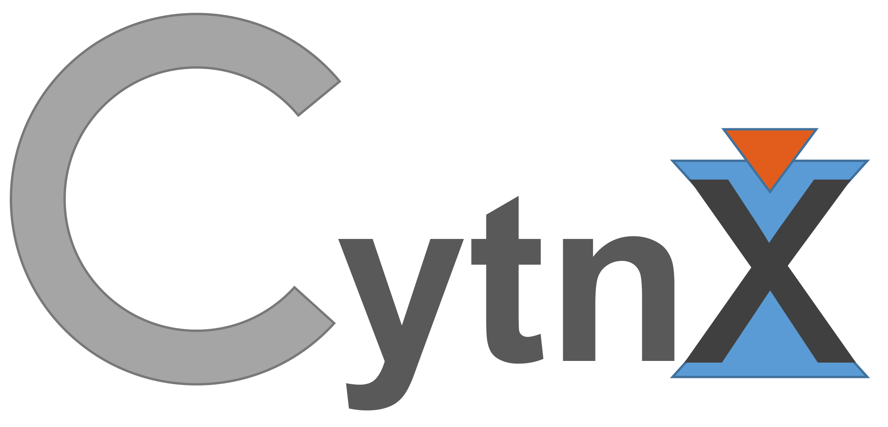

# Cytnx



## Requirements
    * Boost v1.53+ [check_deleted, atomicadd, intrusive_ptr]
    * C++11
    * lapack 
    * blas 
    * gcc v6+

    [CUDA support]
    * CUDA v10+
    * cuDNN

    [OpenMp support]
    * openmp

## ubuntu
    sudo apt-get install libboost-all-dev


## compile
    * compile
    $make -Bj4

    * turn on DEBUG mode:
    $make -Bj4 DEBUG_Enable=1

    * turn on OpenMp accelerate
    $make -Bj4 OMP_Enable=1 

    * turn on GPU accelerate
    $make -Bj4 GPU_Enable=1

    * turn on GPU+OpenMp accelerate
    $make -Bj4 GPU_Enable=1 OMP_Enable=1

    * compile python wrapper
    $make pyobj -Bj4 <args>

    <args> can be OMP_Enable, GPU_Enable, DEBUG_Enable.
   

## Objects:
    * Storage
    * Tensor
    * Bond
    * Accessor

## Feature:

### Python x C++
    Benefit from both side. 
    One can do simple prototype on python side 
    and easy transfer to C++ with small effort!


```c++
    // c++ version:
    #include "cytnx.hpp"
    cytnx::Tensor A({3,4,5},cytnx::Type.Double,cytnx::Device.cpu)

```
```python
    # python version:
    import cytnx
    A =  cytnx.Tensor((3,4,5),dtype=cytnx.Type.Double,device=cytnx.Device.cpu)

```


### 1. All the Storage and Tensor can now have mulitple type support. 
        The avaliable types are :

        | cytnx type       | c++ type             | Type object
        |------------------|----------------------|--------------------
        | cytnx_double     | double               | Type.Double
        | cytnx_float      | float                | Type.Float
        | cytnx_uint64     | uint64_t             | Type.Uint64
        | cytnx_uint32     | uint32_t             | Type.Uint32
        | cytnx_int64      | int64_t              | Type.Int64
        | cytnx_int32      | int32_t              | Type.Int32
        | cytnx_complex128 | std::complex<double> | Type.ComplexDouble
        | cytnx_complex64  | std::complex<float>  | Type.ComplexFloat


### 2. Storage
        * Memory container with GPU/CPU support. 
          maintain type conversions (type casting btwn Storages) 
          and moving btwn devices.
        * Generic type object, the behavior is very similar to python.

```c++
            Storage A(400,Type.Double);
            for(int i=0;i<400;i++)
                A.at<double>(i) = i;

            Storage B = A; // A and B share same memory, this is similar as python 
            
            Storage C = A.to(Device.cuda+0); 
```


### 3. Tensor
        * A tensor, API very similar to numpy and pytorch.
        * simple moving btwn CPU and GPU:

```c++
            Tensor A({3,4},Type.Double,Device.cpu); // create tensor on CPU (default)
            Tensor B({3,4},Type.Double,Device.cuda+0); // create tensor on GPU with gpu-id=0


            Tensor C = B; // C and B share same memory.

            // move A to gpu
            Tensor D = A.to(Device.cuda+0);

            // inplace move A to gpu
            A.to_(Device.cuda+0);
```
        * Type conversion in between avaliable:
```c++
            Tensor A({3,4},Type.Double);
            Tensor B = A.astype(Type.Uint64); // cast double to uint64_t
```

        * vitual swap and permute. All the permute and swap will not change the underlying memory
        * Use Contiguous() when needed to actual moving the memory layout.
```c++
            Tensor A({3,4,5,2},Type.Double);
            A.permute({0,3,1,2}); // this will not change the memory, only the shape info is changed.
            cout << A.is_contiguous() << endl; // this will be false!

            A.Contiguous_(); // call Configuous() to actually move the memory.
            cout << A.is_contiguous() << endl; // this will be true!
```

        * access single element using .at
```c++
            Tensor A({3,4,5},Type.Double);
            double val = A.at<double>({0,2,2});
```

        * access elements with python slices similarity:
```c++
            typedef Accessor ac;
            Tensor A({3,4,5},Type.Double);
            Tensor out = A.get_elems({ac(0),ac::all(),ac::range(1,4)}); 
            // equivalent to python: out = A[0,:,1:4]
```


## Avaliable linear-algebra function (Keep updating):

      func    |   inplace | CPU | GPU  | callby tn 
    ----------|-----------|-----|------|-----------
      Add     |   x       |  Y  |  Y   |    Y
      Sub     |   x       |  Y  |  Y   |    Y
      Mul     |   x       |  Y  |  Y   |    Y
      Div     |   x       |  Y  |  Y   |    Y
      +,+=[tn]|   x       |  Y  |  Y   |    Y (Add_)
      -,-=[tn]|   x       |  Y  |  Y   |    Y (Sub_)
      *,*=[tn]|   x       |  Y  |  Y   |    Y (Mul_)
      /,/=[tn]|   x       |  Y  |  Y   |    Y (Div_)
      Svd     |   x       |  Y  |  Y   |    Y
      Inv     |   Inv_    |  Y  |  Y   |    Y
      Conj    |   Conj_   |  Y  |  Y   |    Y 
      Exp     |   Exp_    |  Y  |  Y   |    Y
      Eigh    |   x       |  Y  |  Y   |    Y 

 
## Generators 

    Tensor: zeros(), ones(), arange()
    

     
## Example
    
    See test.cpp for using C++ .
    See test.py for using python  

## Author

    Kai-Hsin Wu kaihsinwu@gmail.com 


