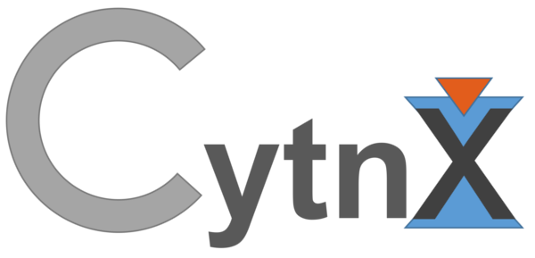

# Cytnx [](https://github.com/kaihsin/Cytnx/actions/workflows/ci-cmake_tests.yml) [](https://codecov.io/gh/kaihsin/Cytnx) [](https://scan.coverity.com/projects/kaihsin-cytnx)
[](https://anaconda.org/kaihsinwu/cytnx) [](https://anaconda.org/kaihsinwu/cytnx)



## Install 
See The following user guide for install and using of cytnx:

[https://kaihsinwu.gitlab.io/Cytnx_doc/install.html](https://kaihsinwu.gitlab.io/Cytnx_doc/install.html)

## Intro slide
[Cytnx_v0.5.pdf (dated 07/25/2020)](https://drive.google.com/file/d/1vuc_fTbwkL5t52glzvJ0nNRLPZxj5en6/view?usp=sharing)

## News
    [v0.7.7] 
 
## Stable Version:
[v0.7.7](https://github.com/kaihsin/Cytnx/tree/v0.7.7)

## Known issues:
    v0.7.7

    v0.7.6
        
    v0.7.4/5
    1. [Pending][GPU] iArithmentic need GPU impl. 

    v0.7.3
    1. [Pending][GPU] Get/Set elements on GPU is still down. 
     


## Current dev Version:
    v0.7.8


    v0.7.7
    1. [Enhance][WARNING] rowrank option now has default value when converting from Tensor. Which is half number of the bonds. Notice that the order of argument are changed between (rowrank) and (is_diag)!    
    2. [Fix] Svd will have issue associate to changing of rowrank/is_diag order.
    3. [Enhance] Internal Syntax format change to clang format. 
    4. [Change] USE_OMP option gives openmp access only for in-house implementation. Any linalg funciton calling MKL will be parallel. 
    
     

    v0.7.6
    1. [Enhance] Adding alias BD_IN=BD_KET, BD_BRA=BD_OUT, BD_NONE=BD_REG. 
    2. [New] Add Contracts for multiple UniTensors contraction.  
    3. [Fix] cytnx.__cpp_lib__ for some version of cmake and conda install, libpath is lib64 instead of lib.  
    4. [Optimize] SparseUniTensor contiguous (moving elements)
    5. [Optimize] cytnx_error_* will now evaluate the clause first, and then instance the following strings.
    6. [Enhance] Add Global bool variable User_debug, which when set to false some checking will be skipped, which increasing the execution speed
    7. [Enhance] Add Network.getOptimalOrder()  

    v0.7.5
    1. [Fix] ICPC cannot compile issue
    2. [Fix] openblas wrapper of zscal has wrong format, cscal,sscal not wrapped (using mkl is not affected)
    3. [Enhance] auto_install.py
    4. [Enhance] add vec_cast utility.
    5. [Fix] Svd_truncate with err does not properly truncate the values.
    6. [Fix] MatVec dgemv reversed argument.
    7. [New] Add Histogram2d class in stat tools 
    8. [Enhance] Add SparseUniTensor.Save / .Load 
    9. [Enhance] Add vec_fromfile / vec_tofile in utility.
    10. [Enhance] Adding omp parallel for SparseUniTensor moving elements, and L1-optimized. 
    11. [New] Add Storage.vector<>() for converting Storage to std::vector.
    
    v0.7.4
    1. [Enhance] Lanczos_ER Lanczos_Gnd not convergence with maxiter will now gives warning instead of error. 
    2. [Enhance] Arithmetic of UniTensor(&)constant now preserve the label of input UniTensor. 
    3. [New][experiment] Add MPS class with two variant: iMPS, RegularMPS. 
    4. [New][experiment] Add MPO class. 
    5. [Enhance] Add UniTensor.relabel
    6. [Enhance] Add Network.FromString 
    7. [New][experiment] DMRG API         
    8. [New][experiment] Add MPS Save/Load, and can now have different phys_dim for each site.
    9. [Fix] SparseUniTensor.permute does not properly update contiguous status when rowrank argument is given.
    10. [Enhance] get_block(_)/put_block(_) by qnums now have a new argument "force" to get blocks from non-braket_form UniTensor.
    11. [New] Add SparseUniTensor contract 
    12. [New] Add SparseUniTensor linalg::Svd support. 
    13. [Enhance] SparseUniTensor print info, add "contiguous" status.
    14. [Enhance] Add print_info for Symmetry descriptor
    15. [Enhance] Add UniTensor.syms() 
    16. [Fix] Tensor.set when one of accessor is Singl will cause error. 
    17. [Enhance] SparseUniTensor diag x diag, diag x dense are finished. 
    18. [Fix] SparseUniTensor when diag permutation issue.  
    19. [Fix] Sort does not return out Tensor.
    20. [Fix] Tproxy.item() does not get correct element. 
    21. [Fix] Bug for Svd on SparseUniTensor vT is being set by U
    22. [New][experiment] Svd_truncate for SparseUniTensor
    23. [New] add Bond.redirect(), Bond.retype()
    24. [Fix] SparseUniTensor.permute() does not properly update braket_form
    25. [Fix] SparseUniTensor.set_rowrank should track _inner_rowrank not _rowrank bug. 
    26. [Enhance] Add UniTensor.change_label() <- [Removed!!] use relabel(s)()  
    27. [Fix] Svd_truncate when one of the block has only dim=1 should fill-in the dangling dimension. 
    28. [New][experiment] iTEBD with U1 symmetry example for Heisenberg chain
    29. [Change] v0.7.4 [26.] replace change_label() with relabel. Now only have set_label(s) and relabel(s) with *_label() have by_label option.  
    30. [Enhance] Add Accessor option Qns, qns()
    31. [Change] Trace now by default trace axis =0 and axis=1 if no argument specify. 
    32. [Fix] Compare of two Bonds will now also check qnums.
    33. [New][experiment] SparseUniTensor.Trace() now support rank-2 symmetric UniTensor -> scalar
    34. [New][experiment] Contract of SparseUniTensor with two SUT with same labels -> scalar is now avaliable
    35. [Fix] DMRG initialize does not properly normalize the init state.  
    36. [New] Scalar.conj(), Scalar.real(), Scalar.imag(), Scalar.maxval(dtype), Scalar.minval(dtype)
    37. [Enhance] Lanczos internal now written with single general function.
    38. [Enhance] Storage.append() now accept Scalar
    39. [Enhance][Fix] Fix inplace Arithmetic between Tensor +=(-=,*=,/=) Tensor with both non-contiguous leads to inconsistent memory alignment. 
    40. [Enhance] from 39. add iAdd(), iDiv(), iMul(), iSub(), this can be called by user but is not recommended. 
    41. [Enhance] Modify DMRG kernel for generic UniTensor as state. 
    42. [New][experiment] Add Lanczos_Gnd_Ut() which accept Tin as UniTensor
    43. [New][experiment] LinOp now add an matvec option for UniTensor => UniTensor, which can be used together with Lanczos_Gnd_Ut
    44. [Change] Remove LinOp with custom function support, inheritance is forced. 
    45. [Enhance] add Tensor.at() without template. 
    46. [Change][Enhance] Remove UniTensor.get_elem/set_elem, unify them with at(). 
    47. [Fix] Trace for SparseUniTensor with is_diag=True. 
    48. [New][experiment] MPS.Norm()
    49. [Fix] Lanczos_Gnd_Ut when input dimension is only 2 now check if the beta=0. 
    50. [New] Add DMRG U1 example.     
    51. [Change] Behavior change for Svd_truncate. SparseUniTensor the keepdim can exceed the current dimension of UniTensor, in such case it is equivalent to Svd.
    52. [New] Add UniTensor.Norm() 
    53. [New][experiment] add MPS.Init_Msector(), which initialize the state with specify total magnetization. 
    54. [Enhance] Add additional feature Svd_truncate with truncation_err (err) and return_err option for Ten
    55. [Enhance] Add additional feature Svd_truncate with truncation_err (err) and return_err option for DUTen
    56. [Enhance] Add python dmrg example for using tn_algo  


    v0.7.3
    1. [Fix] bug for Get slice does not reduce when dim=1. 
    2. [Enhance] checking the memory alloc failing for EL.  
    3. [Change] remove Tensor init assignment op from initializer_list, for conflict with UniTensor init.    
    4. [Enhance] print information for Symmetric UniTensor.
    5. [Enhance] linalg::ExpM/ExpH support for symmetric UniTensor.
    6. [Enhance] add UniTensor.get_blocks_qnums() for corresponding qnums for current blocks. 
    7. [Enhance][Safety] add UniTensor.get_blocks_(silent=false) with "silent" option by default pop-up a warning when UniTensor is non-contiguous.   
    8. [Enhance] add operator* and operator*= for combineBond. 
    9. [Enhance] add support for Symmetric UniTensor with is_diag=true.
    10. [Fix] remove the dtype & device option for arange(Nelem). Use .astype() .to() instead. 
    11. [Fix] reshape() without postfix const causing error when reshape with const Tensor. 
    12. [Enhance][Experiment] add Lstsq for least square calculation. [PR] 
    13. [Fix][C++] minor issue related to laterial argument passing by variables cannot properly resolved on C++ 
    14. [Enhance] Diag now support rank-1 Tensor as input for constructing a diagonal tensor with input as diagonal elements.
    15. [Enhance] Add c++ example for DMRG (Ke)
    16. [Fix] Bug fixed in DMRG code and updated to the latest features. 
    17. [Fix] Bug in UniTensor do svd with rowrank=1 and the first rank has dimension=1.        
    18. [Enhance] add Scalar: abs, opeartor<, operator>, operator<=, operator>=
    19. [Fix] #31 cd, cf internal swiching error for Lanczos_ER.
    20. [Enhance] add specialization for Tensor iarithmetic with Sproxy.
    21. [Fix] #31 cftcf Mul internal memcpy with wrong unit size. 
    22. [Fix] #31 type accessing now partially via Scalar, so no conflict will occur when ovld matvec() gives mismatched input and output type. 
    23. [Fix] Tensor / Storage set element with Sproxy or Scalar is now available. 
    24. [Fix] Lanczos_Gnd on f type accessing now partially via Scalar, so no conflict will occur when ovld matvec() gives mismatched input and output type.

    v0.7.2 
    1. [Enhance] Add Tensor.set with Scalar
    2. [Enhance][C++] Add Tensor initialize assignment op from initializer_list
    3. [Enhance][C++] Add Storage initialize assignment op from vector & initializer list  
    4. [Fix] bug for set partial elements on Tensor with slicing issue. 
    5. [Fix][DenseUniTensor] set_rowrank cannot set full rank issue #24 


    v0.7.1
    1. [Enhance] Finish UniTensor arithmetic. 
    2. [Fix] bug when using Tensor.get() accessing only single element 
    3. [Enhance] Add default argument is_U = True and is_vT = True for Svd_truncate() python API 


    v0.7
    1. [Enhance] add binary op. -Tensor.    
    2. [Enhance] New introduce Scalar class, generic scalar placeholder. 
    3. [Enhance][expr] Storage.at(), Storage.back(), Storage.get_item() can now without specialization. The return is Scalar class.
    4. [Enhance] Storage.get_item, Storage.set_item        
    5. [Enhance] Scalar, iadd,isub,imul,idiv  
    6. [Important] Storage.resize will match the behavior of vector, new elements are set to zero!
    7. [Enhance] Scalar +,-,*,/ finished
    8. [Enhance] add Histogram class and stat namespace.    
    9. [Enhance] add fstream option for Tofile
    10. [Enhance] return self when UniTensor.set_name
    11. [Enhance] return self when UniTensor.set_label(s)
    12. [Enhance] return self when UniTensor.set_rowrank
    13. [Fatal!][Fix] fix bug of wrong answer in Tensor slice for non-contiguous Tensor, with faster internal kernel
    14. [Warning] Slice of GPU Tensor is now off-line for further inspection. 
    15. [Fix] bug causing crash when print non-contiguous Uint64 Tensor    
    16. [Fatal!][Fix] fix bug of wrong answer in Tensor set-element with slice for non-contiguous Tensor. 
    17. [Enhance] Network on the fly construction.
    18. [Enhance] Scalar: Add on TN. TN.item()
    19. [Fix] bug in Mod interanlly calling Cpr fixed.    
    20. [Enhance] All operation related to TN <-> Scalar
    21. [Enhance] Reduce RTTR overhead. 
 


## API Documentation:

[https://kaihsin.github.io/Cytnx/docs/html/index.html](https://kaihsin.github.io/Cytnx/docs/html/index.html)

## User Guide [under construction!]:

[Cytnx User Guide](https://kaihsinwu.gitlab.io/Cytnx_doc/)


## Objects:
    * Storage   [binded]
    * Tensor    [binded]
    * Accessor  [c++ only]
    * Bond      [binded] 
    * Symmetry  [binded] 
    * CyTensor [binded] 
    * Network   [binded] 

## Feature:

### Python x C++
    Benefit from both side. 
    One can do simple prototype on python side 
    and easy transfer to C++ with small effort!


```c++
    // c++ version:
    #include "cytnx.hpp"
    cytnx::Tensor A({3,4,5},cytnx::Type.Double,cytnx::Device.cpu)
```


```python
    # python version:
    import cytnx
    A =  cytnx.Tensor((3,4,5),dtype=cytnx.Type.Double,device=cytnx.Device.cpu)
```


### 1. All the Storage and Tensor can now have mulitple type support. 
        The avaliable types are :

        | cytnx type       | c++ type             | Type object
        |------------------|----------------------|--------------------
        | cytnx_double     | double               | Type.Double
        | cytnx_float      | float                | Type.Float
        | cytnx_uint64     | uint64_t             | Type.Uint64
        | cytnx_uint32     | uint32_t             | Type.Uint32
        | cytnx_uint16     | uint16_t             | Type.Uint16
        | cytnx_int64      | int64_t              | Type.Int64
        | cytnx_int32      | int32_t              | Type.Int32
        | cytnx_int16      | int16_t              | Type.Int16
        | cytnx_complex128 | std::complex<double> | Type.ComplexDouble
        | cytnx_complex64  | std::complex<float>  | Type.ComplexFloat
        | cytnx_bool       | bool                 | Type.Bool

### 2. Storage
        * Memory container with GPU/CPU support. 
          maintain type conversions (type casting btwn Storages) 
          and moving btwn devices.
        * Generic type object, the behavior is very similar to python.

```c++
            Storage A(400,Type.Double);
            for(int i=0;i<400;i++)
                A.at<double>(i) = i;

            Storage B = A; // A and B share same memory, this is similar as python 
            
            Storage C = A.to(Device.cuda+0); 
```


### 3. Tensor
        * A tensor, API very similar to numpy and pytorch.
        * simple moving btwn CPU and GPU:

```c++
            Tensor A({3,4},Type.Double,Device.cpu); // create tensor on CPU (default)
            Tensor B({3,4},Type.Double,Device.cuda+0); // create tensor on GPU with gpu-id=0


            Tensor C = B; // C and B share same memory.

            // move A to gpu
            Tensor D = A.to(Device.cuda+0);

            // inplace move A to gpu
            A.to_(Device.cuda+0);
```
        * Type conversion in between avaliable:
```c++
            Tensor A({3,4},Type.Double);
            Tensor B = A.astype(Type.Uint64); // cast double to uint64_t
```

        * vitual swap and permute. All the permute and swap will not change the underlying memory
        * Use Contiguous() when needed to actual moving the memory layout.
```c++
            Tensor A({3,4,5,2},Type.Double);
            A.permute_(0,3,1,2); // this will not change the memory, only the shape info is changed.
            cout << A.is_contiguous() << endl; // this will be false!

            A.contiguous_(); // call Configuous() to actually move the memory.
            cout << A.is_contiguous() << endl; // this will be true!
```

        * access single element using .at
```c++
            Tensor A({3,4,5},Type.Double);
            double val = A.at<double>(0,2,2);
```

        * access elements with python slices similarity:
```c++
            typedef Accessor ac;
            Tensor A({3,4,5},Type.Double);
            Tensor out = A(0,":","1:4"); 
            // equivalent to python: out = A[0,:,1:4]
            
```

### 4. UniTensor
        * extension of Tensor, specifically design for Tensor network simulation. 

        * See Intro slide for more details
```c++
            Tensor A({3,4,5},Type.Double);
            UniTensor tA = UniTensor(A,2); // convert directly.

            UniTensor tB = UniTensor({Bond(3),Bond(4),Bond(5)},{},2); // init from scratch. 
```


## Examples
    
    See example/ folder or documentation for how to use API
    See example/iTEBD folder for implementation on iTEBD algo.
    See example/DMRG folder for implementation on DMRG algo.
    See example/iDMRG folder for implementation on iDMRG algo.
    See example/HOTRG folder for implementation on HOTRG algo for classical system.
    See example/ED folder for implementation using LinOp & Lanczos. 


## Avaliable linear-algebra function (Keep updating):

      func        |   inplace | CPU | GPU  | callby tn   | Tn | CyTn (xlinalg)
    --------------|-----------|-----|------|-------------|----|-------
      Add         |   x       |  Y  |  Y   |    Y        | Y  |   Y
      Sub         |   x       |  Y  |  Y   |    Y        | Y  |   Y
      Mul         |   x       |  Y  |  Y   |    Y        | Y  |   Y
      Div         |   x       |  Y  |  Y   |    Y        | Y  |   Y
      Cpr         |   x       |  Y  |  Y   |    Y        | Y  |   x
    --------------|-----------|-----|------|-------------|----|-------
      +,+=[tn]    |   x       |  Y  |  Y   |    Y (Add_) | Y  |   Y
      -,-=[tn]    |   x       |  Y  |  Y   |    Y (Sub_) | Y  |   Y
      *,*=[tn]    |   x       |  Y  |  Y   |    Y (Mul_) | Y  |   Y
      /,/=[tn]    |   x       |  Y  |  Y   |    Y (Div_) | Y  |   Y
      ==[tn]      |   x       |  Y  |  Y   |    Y (Cpr_) | Y  |   x 
    --------------|-----------|-----|------|-------------|----|-------
      Svd         |   x       |  Y  |  Y   |    Y        | Y  |   Y
     *Svd_truncate|   x       |  Y  |  Y   |    N        | Y  |   Y
      InvM        |   InvM_   |  Y  |  Y   |    Y        | Y  |   N
      Inv         |   Inv _   |  Y  |  Y   |    Y        | Y  |   N
      Conj        |   Conj_   |  Y  |  Y   |    Y        | Y  |   Y
    --------------|-----------|-----|------|-------------|----|-------
      Exp         |   Exp_    |  Y  |  Y   |    Y        | Y  |   N
      Expf        |   Expf_   |  Y  |  Y   |    Y        | Y  |   N
      Eigh        |   x       |  Y  |  Y   |    Y        | Y  |   N
     *ExpH        |   x       |  Y  |  Y   |    N        | Y  |   Y
     *ExpM        |   x       |  Y  |  N   |    N        | Y  |   Y
    --------------|-----------|-----|------|-------------|----|-------
      Matmul      |   x       |  Y  |  Y   |    N        | Y  |   N
      Diag        |   x       |  Y  |  Y   |    N        | Y  |   N
    *Tensordot    |   x       |  Y  |  Y   |    N        | Y  |   N
     Outer        |   x       |  Y  |  Y   |    N        | Y  |   N 
     Vectordot    |   x       |  Y  | .Y   |    N        | Y  |   N 
    --------------|-----------|-----|------|-------------|----|-------
      Tridiag     |   x       |  Y  |  N   |    N        | Y  |   N
     Kron         |   x       |  Y  |  N   |    N        | Y  |   N
     Norm         |   x       |  Y  |  Y   |    Y        | Y  |   N
    *Dot          |   x       |  Y  |  Y   |    N        | Y  |   N 
     Eig          |   x       |  Y  |  N   |    N        | Y  |   N 
    --------------|-----------|-----|------|-------------|----|-------
     Pow          |   Pow_    |  Y  |  Y   |    Y        | Y  |   Y 
     Abs          |   Abs_    |  Y  |  N   |    Y        | Y  |   N 
     Qr           |   x       |  Y  |  N   |    N        | Y  |   Y 
     Qdr          |   x       |  Y  |  N   |    N        | Y  |   Y 
     Det          |   x       |  Y  |  N   |    N        | Y  |   N
    --------------|-----------|-----|------|-------------|----|-------
     Min          |   x       |  Y  |  N   |    Y        | Y  |   N 
     Max          |   x       |  Y  |  N   |    Y        | Y  |   N 
    *Trace        |   x       |  Y  |  N   |    Y        | Y  |   Y
     Mod          |   x       |  Y  |  Y   |    Y        | Y  |   Y 
    Matmul_dg     |   x       |  Y  |  Y   |    N        | Y  |   N 
    --------------|-----------|-----|------|-------------|----|-------
    *Tensordot_dg |   x       |  Y  |  Y   |    N        | Y  |   N

    iterative solver:
     
        Lanczos_ER           
    

    * this is a high level linalg 
    
    ^ this is temporary disable
    
    . this is floating point type only
 
## Container Generators 

    Tensor: zeros(), ones(), arange(), identity(), eye()

## Physics category 

    Tensor: pauli(), spin()
    
     
## Random 
      func        | Tn  | Stor | CPU | GPU  
    -----------------------------------------------------
    *Make_normal() |  Y  |  Y   | Y   |  Y
    *Make_uniform() |  Y  |  Y   | Y   |  N
    ^normal()      |  Y  |  x   | Y   |  Y
    ^uniform()      |  Y  |  x   | Y   |  N

    * this is initializer
    ^ this is generator

    [Note] The difference of initializer and generator is that initializer is used to initialize the Tensor, and generator generates a new Tensor.
     

## Developer

    Kai-Hsin Wu (Boston Univ.) kaihsinwu@gmail.com 


## Contributors

    Ying-Jer Kao (NTU, Taiwan): setuptool, cmake
    Yen-Hsin Wu (NTU, Taiwan): Network optimization
    Yu-Hsueh Chen (NTU, Taiwan): example, and testing
    Po-Kwan Wu (OSU): Icon optimization    
    Wen-Han Kao (UMN, USA) : testing of conda install 
    Ke Hsu (NTU, Taiwan): Lstsq, linalg funcitons and examples  

## References

    * example/DMRG:
        https://www.tensors.net/dmrg

    * hptt library:
        https://github.com/springer13/hptt


## Acknowledgement
    KHW whould like to thanks for the following contributor(s) for invaluable contribution to the library

    * PoChung Chen  (NCHU, Taiwan) : testing, and bug reporting


