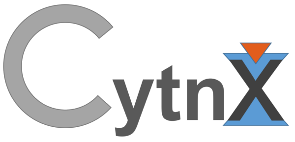

# Cytnx



## Intro slide
[Cytnx_v0.5.2a.pdf](https://drive.google.com/file/d/1tfruYcfNxtSR0bwJv0WQMnNKwcAeehuT/view?usp=sharing)

## Stable Version:
    [v0.5.1 pre-release](https://github.com/kaihsin/Cytnx/tree/v0.5.1a)

## Current dev Version:
    v0.5.2

## What's new:
    v0.5.2
    1. add Trace and Trace_ for CyTensor.
    2. fix bug in Network.Launch does not return the output CyTensor
    3. Add Network.PrintNet, and ostream support.
    4. Add Network.Diagram() for plot the tensor network diagram (python only)    
    5. Add support for floating type Vectordot on GPU. 
    6. Fix bug in to from Anytype to ComplexFloat. 
    7. Add QR for CPU.
    8. Add identity() and it's alias function eye(). 
    9. Add physics namespace/submodule
    10. Add physics::spin() for generating Spin-S representation. 
    11. Add physics::pauli() for pauli matrix.
    12. Add ExpM() for generic matrix (CPU only)
    13. Fix bug in python slice, and reverse range slice.
    14. Enhance optional Kron padding scheme
    15. Fix bug in CyTensor contract/Contract(A,B) for tensors with no common label
    16. Enhance error message in Network
    17. Add Min(), Max() (CPU only)
    18. Fix bug in Abs. 
    19. Fix bug in Div i32td.    
    20. [Feature] Add optimal contraction order calculation in Network
    21. Fix SparseCyTensor contiguous address wrong calculation. 
    22. Support at() directly from SparseCyTensor.
    23. Add Transpose, Dagger to CyTensor. For tagged CyTensor, Transpose/Dagger will reverse the direction of all bonds.
    24. Add xlinalg.Svd, xlinalg.Svd_truncate support for tagged CyTensor.
    25. Fix redundant print in optimal contraction order
    26. Add CyTensor.tag() for DenseCyTensor (regular type) directly convert to CyTensor with direction (tagged type)
    27. Add SparseCyTensor.at (currently only floating point type) 
    28. SparseCyTensor.ele_exists. 
    29. SparseCyTensor.Transpose, Conj. 
    30. Symmetry.reverse_rule, Bond.calc_reverse_qnums
    31. Fix Tensor.numpy from GPU bug.
    32. Fix Tensor.setitem/getitem pybind bug.
    33. SparseCyTensor.get_elem/set_elem (currently floating type only (complex)) 
    34. Add xlinalg::ExpH, xlinalg::ExpM, xlinalg::Trace (ovld of CyTensor.Trace)
    35. support Mul/Div operation on SparseCyTensor 
    36. Add Tensor.flatten();
    37. Add Network.Savefile. Network.PutCyTensors
    38. [Feature] Tensor can now use unify operator[] to get and set elements as python API
    39. fix ambiguous error message in Tensor arithmetic.
    40. fix bug in xlinalg::Svd
    41. fix bug in physics::pauli
    42. fix bug in CyTensor.set_label checking element.
    43. Add xlinalg::Hosvd (currently CyTensor only)
    44. change argument of init CyTensor rowrank->Rowrank
    45. Add PESS example 
    46. Add support for Norm to generic rank-N Tensor
    47. Add @ operator in python API for shorthand of linalg::Dot
    48. Add DMRG example
    49. C++ API can now have accessor.size() < rank()
    50. Remove redundant output of Inv.
    51. Add Pow, Pow_ for CyTensor.
    52. Add Symmetry.Save/Load
    53. Symmetry/Tensor/Storage/Bond/CyTensor Save/Load re-invented for more simple usage


    v0.5.1a
    1. add Norm() for CPU and GPU, add to call by Tn
    2. add Dot() for CPU and GPU, with unify API for Vec-Vec/Mat-Vec/Mat-Mat/Ten-Vec product.
    3. add Tensor.rank() 
    4. [Feature] support Tensor <-> numpy.ndarray
    5. add random::Make_uniform()
    6. Fix bug in Svd_truncate that will change the underlying block for contiguous CyTensor. 
    7. Fix bug in Tensor->numpy if the underlying Tensor is non-contiguous. 
    8. Add Eig.
    9. Add real() imag() for Tensor. 
    10. Enhance python API, Storage & Tensor are now iterable.
    11. Fix buf in Conj and Conj_, for both C++ and python
    12. Fix bug python inplace call return ID Conj_, Inv_, Exp_
    13. Add Conj, Conj_ for CyTensor
    14. Fix non-inplace Arithmetic for non-contiguous tensor. 
    15. Add [trial version] Trace. 
    16. Add Pow, Pow_ for cpu. 
    17. Add Abs, Abs_ for cpu.

    v0.5.0a
    1. Add .imag() .real() for Storage. 
    2. Add xlinalg under cytnx_extension for algebra on CyTensor
    3. Add xlinalg::Svd()  
    4. Change linalg::Eigh() to match numpy 
    5. fix Diag uninitialize elemets bug
    6. add linalg::ExpH()
    7. add random::Make_normal()
    8. add iTEBD example for both C++ and python @ example/iTEBD

## Version log
    v0.4
    1. remove Otimes, add Kron and Outer 
    2. Add Storage append, capacity, pre-alloc 32x address
    3. Tensor can now allow redundant dimension (e.g. shape = (1,1,1,1,1...) 
    4. Add Storage.from_vector, directly convert the C++ vector to Storage
    5. Add more intruisive way to get slices for Tensor in C++, using operator[]
    6. Add Tensor.append for rank-1 Tensor    
    7. Add Exp() Expf() Exp\_() Expf\_()
    8. Change UniTensor to CyTensor 
    9. Guarded CyTensor, Bond, Symmetry and Network class with cytnx_extension namespace (cytnx_extension submodule in python).  

## Documentation:

[https://kaihsin.github.io/Cytnx/docs/html/index.html](https://kaihsin.github.io/Cytnx/docs/html/index.html)

## conda install  
    [Currently Linux only]

    * without CUDA
      python 3.6: conda install -c kaihsinwu cytnx_36
      python 3.7: conda install -c kaihsinwu cytnx_37

    * with CUDA
      python 3.6: conda install -c kaihsinwu cytnx_cuda_36
      python 3.7: conda install -c kaihsinwu cytnx_cuda_37


## docker image with MKL 
  [https://hub.docker.com/r/kaihsinwu/cytnx_mkl](https://hub.docker.com/r/kaihsinwu/cytnx_mkl)
    
    * To run:

    $docker pull kaihsinwu/cytnx_mkl
    $docker run -ti kaihsinwu/cytnx_mkl

    * Note:
    
    Once docker image is run, the user code can be compile (for example) with:

    $g++-6 -std=c++11 -O3 <your.code.cpp> /opt/cytnx/libcytnx.so

    Or, directly using python API, by import cytnx in python script:

```python
    from cytnx import *
```

## Requirements
    * Boost v1.53+ [check_deleted, atomicadd, intrusive_ptr]
    * C++11
    * lapack 
    * blas 
    * gcc v4.8.5+ (recommand v6+) (required -std=c++11) 

    [CUDA support]
    * CUDA v10+
    * cuDNN

    [OpenMp support]
    * openmp

    [Python]
    * pybind11 2.2.4
    * numpy >= 1.15 

    [MKL]
    * icpc (if using with CUDA, v18- should be used)
    

## ubuntu
    sudo apt-get install libboost-all-dev libblas-dev liblapack-dev make curl g++-6 libomp-dev 


## Install 
    1.) create a build folder, and cd to the folder
        $mkdir build

        $cd build

    2.) resolving the dependency 

        $cmake [flags (optional)] <Cytnx repo folder>

        [Note] there are several customize flags format as (-D<flag name>).

        * USE_ICPC (default = off)
            
            The default compiler is g++-6. 
            
        * USE_CUDA (default = off)

            If USE_CUDA=1, the code will compile with GPU support.

        * USE_MKL (default = off)

            If USE_MKL=off, the code will compile with system LAPACK/BLAS library. 

        * CMAKE_INSTALL_PREFIX (default is /usr/local)
    
            Set the install target path.
        
    3.) compile by running:
       
        $make -Bj4

    4.) install to the target path.
        
        $make install


## Objects:
    * Storage   [binded]
    * Tensor    [binded]
    * Accessor  [c++ only]
    * Bond      [binded] 
    * Symmetry  [binded] 
    * CyTensor [binded] 
    * Network   [binded] 

## Feature:

### Python x C++
    Benefit from both side. 
    One can do simple prototype on python side 
    and easy transfer to C++ with small effort!


```c++
    // c++ version:
    #include "cytnx.hpp"
    cytnx::Tensor A({3,4,5},cytnx::Type.Double,cytnx::Device.cpu)
```


```python
    # python version:
    import cytnx
    A =  cytnx.Tensor((3,4,5),dtype=cytnx.Type.Double,device=cytnx.Device.cpu)
```


### 1. All the Storage and Tensor can now have mulitple type support. 
        The avaliable types are :

        | cytnx type       | c++ type             | Type object
        |------------------|----------------------|--------------------
        | cytnx_double     | double               | Type.Double
        | cytnx_float      | float                | Type.Float
        | cytnx_uint64     | uint64_t             | Type.Uint64
        | cytnx_uint32     | uint32_t             | Type.Uint32
        | cytnx_uint16     | uint16_t             | Type.Uint16
        | cytnx_int64      | int64_t              | Type.Int64
        | cytnx_int32      | int32_t              | Type.Int32
        | cytnx_int16      | int16_t              | Type.Int16
        | cytnx_complex128 | std::complex<double> | Type.ComplexDouble
        | cytnx_complex64  | std::complex<float>  | Type.ComplexFloat
        | cytnx_bool       | bool                 | Type.Bool

### 2. Storage
        * Memory container with GPU/CPU support. 
          maintain type conversions (type casting btwn Storages) 
          and moving btwn devices.
        * Generic type object, the behavior is very similar to python.

```c++
            Storage A(400,Type.Double);
            for(int i=0;i<400;i++)
                A.at<double>(i) = i;

            Storage B = A; // A and B share same memory, this is similar as python 
            
            Storage C = A.to(Device.cuda+0); 
```


### 3. Tensor
        * A tensor, API very similar to numpy and pytorch.
        * simple moving btwn CPU and GPU:

```c++
            Tensor A({3,4},Type.Double,Device.cpu); // create tensor on CPU (default)
            Tensor B({3,4},Type.Double,Device.cuda+0); // create tensor on GPU with gpu-id=0


            Tensor C = B; // C and B share same memory.

            // move A to gpu
            Tensor D = A.to(Device.cuda+0);

            // inplace move A to gpu
            A.to_(Device.cuda+0);
```
        * Type conversion in between avaliable:
```c++
            Tensor A({3,4},Type.Double);
            Tensor B = A.astype(Type.Uint64); // cast double to uint64_t
```

        * vitual swap and permute. All the permute and swap will not change the underlying memory
        * Use Contiguous() when needed to actual moving the memory layout.
```c++
            Tensor A({3,4,5,2},Type.Double);
            A.permute_({0,3,1,2}); // this will not change the memory, only the shape info is changed.
            cout << A.is_contiguous() << endl; // this will be false!

            A.contiguous_(); // call Configuous() to actually move the memory.
            cout << A.is_contiguous() << endl; // this will be true!
```

        * access single element using .at
```c++
            Tensor A({3,4,5},Type.Double);
            double val = A.at<double>({0,2,2});
```

        * access elements with python slices similarity:
```c++
            typedef Accessor ac;
            Tensor A({3,4,5},Type.Double);
            Tensor out = A.get({ac(0),ac::all(),ac::range(1,4)}); 
            // equivalent to python: out = A[0,:,1:4]
            
```

## Example
    
    See example/ folder or documentation for how to use API
    See test.cpp for using C++ .
    See test.py for using python  


## Avaliable linear-algebra function (Keep updating):

      func        |   inplace | CPU | GPU  | callby tn   | Tn | CyTn (xlinalg)
    --------------|-----------|-----|------|-------------|----|-------
      Add         |   x       |  Y  |  Y   |    Y        | Y  |   Y
      Sub         |   x       |  Y  |  Y   |    Y        | Y  |   Y
      Mul         |   x       |  Y  |  Y   |    Y        | Y  |   Y
      Div         |   x       |  Y  |  Y   |    Y        | Y  |   Y
      Cpr         |   x       |  Y  |  Y   |    Y        | Y  |   x
      +,+=[tn]    |   x       |  Y  |  Y   |    Y (Add_) | Y  |   Y
      -,-=[tn]    |   x       |  Y  |  Y   |    Y (Sub_) | Y  |   Y
      *,*=[tn]    |   x       |  Y  |  Y   |    Y (Mul_) | Y  |   Y
      /,/=[tn]    |   x       |  Y  |  Y   |    Y (Div_) | Y  |   Y
      ==[tn]      |   x       |  Y  |  Y   |    Y (Cpr_) | Y  |   x 
      Svd         |   x       |  Y  |  Y   |    Y        | Y  |   Y
     *Svd_truncate|   x       |  Y  |  Y   |    N        | Y  |   Y
      Inv         |   Inv_    |  Y  |  Y   |    Y        | Y  |   N
      Conj        |   Conj_   |  Y  |  Y   |    Y        | Y  |   Y
      Exp         |   Exp_    |  Y  |  Y   |    Y        | Y  |   N
      Expf        |   Expf_   |  Y  |  Y   |    Y        | Y  |   N
      Eigh        |   x       |  Y  |  Y   |    Y        | Y  |   N
     *ExpH        |   x       |  Y  |  Y   |    N        | Y  |   Y
     *ExpM        |   x       |  Y  |  N   |    N        | Y  |   Y
      Matmul      |   x       |  Y  |  Y   |    N        | Y  |   N
      Diag        |   x       |  Y  |  Y   |    N        | Y  |   N
    *Tensordot    |   x       |  Y  |  Y   |    N        | Y  |   N
     Outer        |   x       |  Y  |  Y   |    N        | Y  |   N 
     Vectordot    |   x       |  Y  | .Y   |    N        | Y  |   N 
      Tridiag     |   x       |  Y  |  N   |    N        | Y  |   N
     Kron         |   x       |  Y  |  N   |    N        | Y  |   N
     Norm         |   x       |  Y  |  Y   |    Y        | Y  |   N
    *Dot          |   x       |  Y  |  Y   |    N        | Y  |   N 
     Eig          |   x       |  Y  |  N   |    N        | Y  |   N 
     Pow          |   Pow_    |  Y  |  N   |    Y        | Y  |   Y 
     Abs          |   Abs_    |  Y  |  N   |    N        | Y  |   N 
     QR           |   x       |  Y  |  N   |    N        | Y  |   N 
     Min          |   x       |  Y  |  N   |    N        | Y  |   N 
     Max          |   x       |  Y  |  N   |    N        | Y  |   N 
    *Trace        |   x       |  Y  |  N   |    Y        | Y  |   Y
    
    * this is a high level linalg 
    
    ^ this is temporary disable
    
    . this is floating point type only
 
## Container Generators 

    Tensor: zeros(), ones(), arange(), identity(), eye()

## Physics category 

    Tensor: pauli(), spin()
    
     
## Random 
      func        | Tn  | Stor | CPU | GPU  
    -----------------------------------------------------
    *Make_normal() |  Y  |  Y   | Y   |  Y
    *Make_uniform() |  Y  |  Y   | Y   |  N
    ^normal()      |  Y  |  x   | Y   |  Y

    * this is initializer
    ^ this is generator

    [Note] The difference of initializer and generator is that initializer is used to initialize the Tensor, and generator generates a new Tensor.
     

## Developer

    Kai-Hsin Wu kaihsinwu@gmail.com 
    Yen-Hsin Wu 
    Yu-Hsueh Chen

## References

    * example/DMRG:
        https://www.tensors.net/dmrg

## Acknowledgement
    KHW whould like to thanks for the following contributor(s) for invaluable contribution to the library

    * PoChung Chen  (NCHU, Taiwan) : testing, and bug reporting
    * Yu-Hsueh Chen (NTU, Taiwan)  : testing, and bug reporting 


