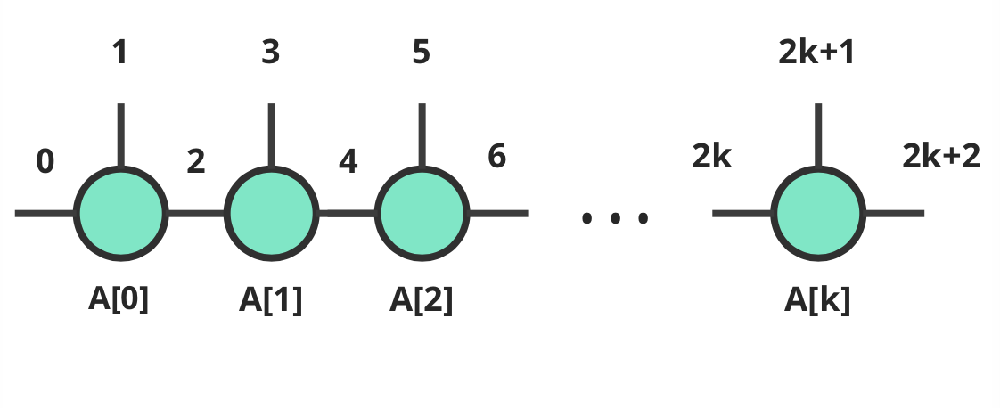
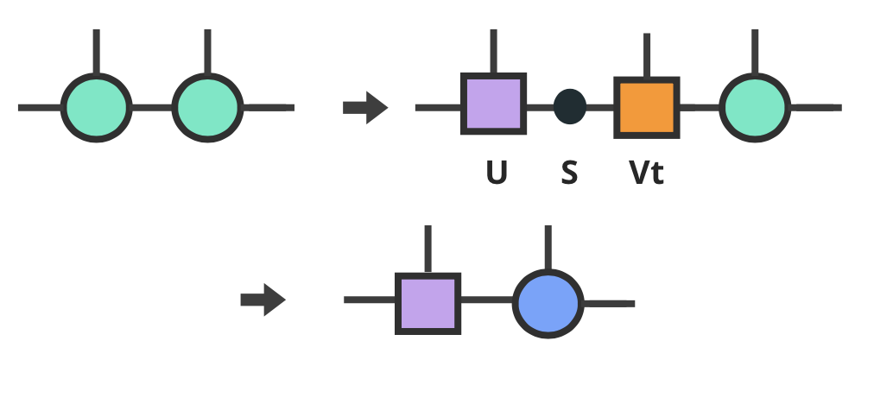
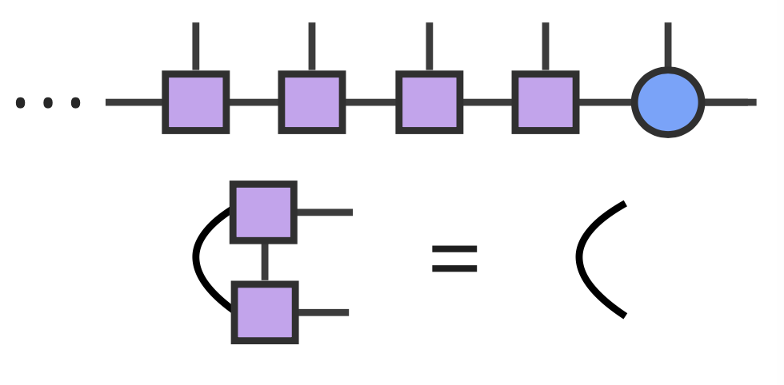
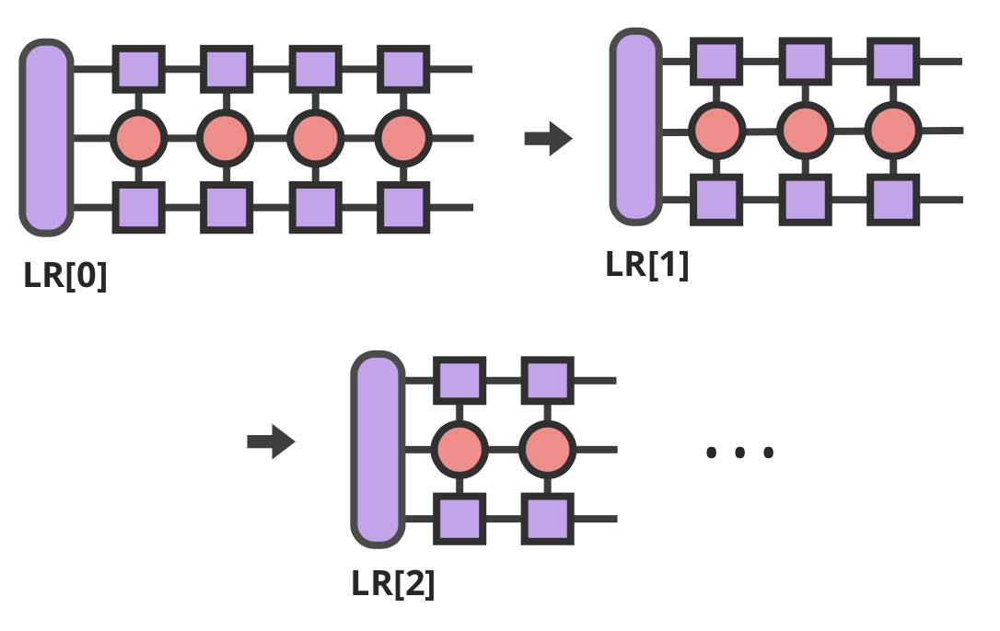
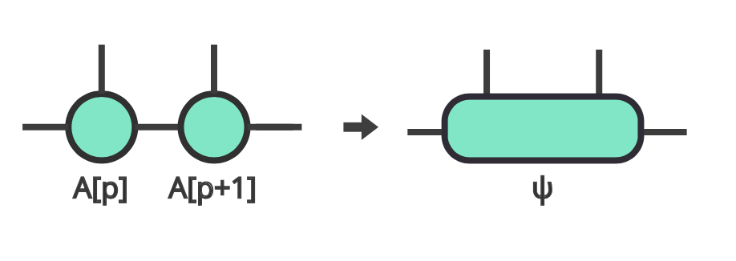
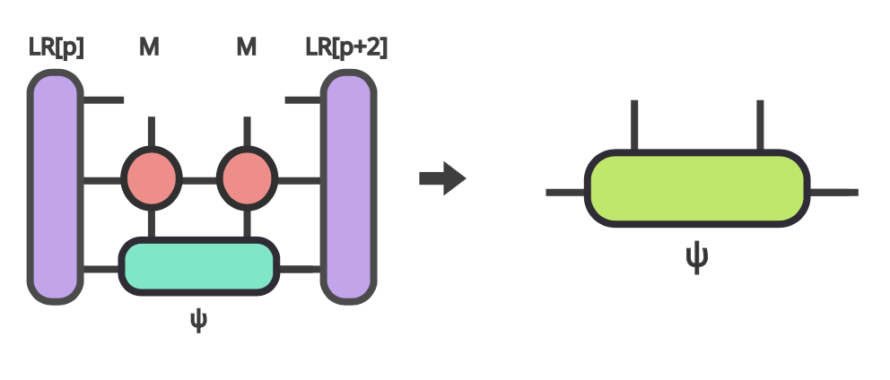
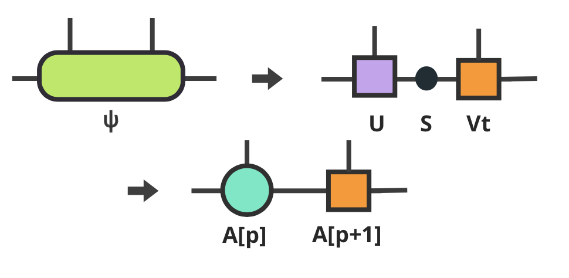
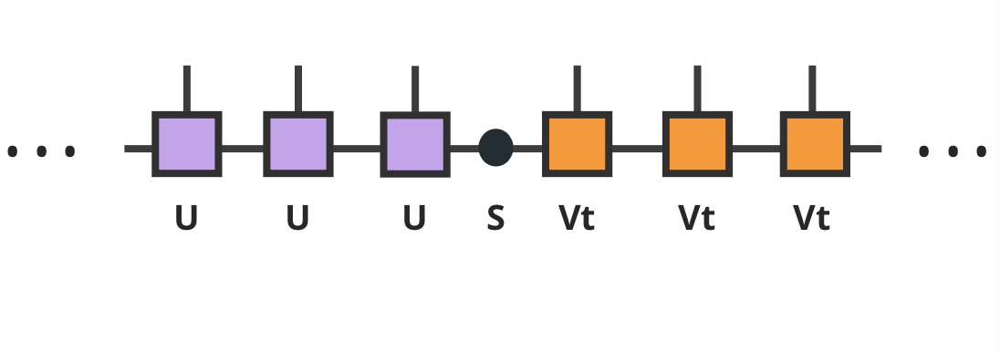
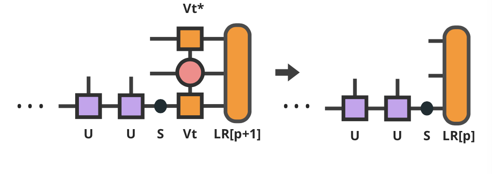
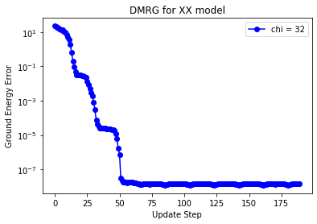

DMRG
------------
**Author : j9263178, Kai-Hsin Wu**

The density matrix renormalization group (DMRG) is one of the powerful algorithm for study quantum systems. 
The algorithm is especially useful in study 1D systems, while the extension to study 2D systems are also possible. The original formulation :cite:`whitedmrg` of DMRG is based on the desity matrix, and had been later-on being re-formulated with the concept of matrix product state (MPS) :cite:`SCHOLLWOCK201196`. 

In the following, we are going use the MPS language for explaination. There are two important objects Matrix product state (MPS) and Matrix product operator (MPO) which we will explain them in a moment. 

Using 1D spin-1/2 XY model as an example system, we are going to introduce how to use Cytnx to implement the DMRG algorithm, and benchmark our results with the exact analytic solution avaliable via bethe ansatz. 

The model-- XY chain
****************************************

Before introduce the algorithm, let's start with the system that we are going to study. Consider the XY model where the Hamiltonian defines as:

.. math::

    H = \sum^N_{j=0} S^x_j \cdot  S^x_{j+1} + S^y_j \cdot S^y_{j+1}

where :math:`S^{x}_j` and :math:`S^{y}_j` are the spin-1/2 operators at site **j**. One can also written the model in terms of the raising/lowering operator :math:`S^{\pm}` as

.. math::
    
    H = \sum^N_{j=1} \frac{1}{2} \left( S^+_jS^-_{j+1} + S^+_{j+1}S^-_{j} \right)

Basic components
*************************

1. Matrix product state (MPS):
 
   Our major goal in this example is, of course, to get the ground state. The state :math:`|\Psi>` is represent in terms of the MPS, which is variational wave function written in an effieient way to represent a many-body wave function. The tensor notation are shown in following figure (a)

2. Matrix product operator (MPO):
 
   The concept of MPO is actually quite simple, for which it is just the way we decompose our many-body Hamiltonian into local operators *M* (on each site) In our XY model, we define the MPO (on each site *j*) as: 
 
.. math::
    
    M_j = \begin{bmatrix}
    I & S^-_j & S^+_j & 0 \\ 
    0 &  0 &  0 & S^+_j\\ 
    0 &  0&   0& S^-_j \\ 
    0 & 0 & 0 & I 
    \end{bmatrix}

with the left and right boundary:

.. math::

    L = \begin{bmatrix}
    1\\ 
    0\\ 
    0\\ 
    0
    \end{bmatrix} 

.. math::

    R = \begin{bmatrix}
    0\\ 
    0\\ 
    0\\ 
    1
    \end{bmatrix}

which is shown in the following figure (b). One can easily verify that succesive product of number of **M** operators  along with the left and right boundaries gives the desire Hamitonian of the model.

.. image:: image/MPSMPO.png
    :width: 400
    :align: center

Implementation
************************************

For simplicity, we only present python code here, c++ code can be found in the Cytnx/example/DMRG/.
First, Let's set some parameters for the initialization and simulation.

* In python:

.. code-block:: python
    :linenos:

    chi = 32;
    Nsites = 20;
    numsweeps = 4 # number of DMRG sweeps
    maxit = 2 # iterations of Lanczos method
    krydim = 4 # dimension of Krylov subspace

Now, we initialize our MPO as follows

* In python:

.. code-block:: python
    :linenos:

    d = 2 #physical dimension
    s = 0.5 #spin-half
    sx = cytnx.physics.spin(0.5,'x')
    sy = cytnx.physics.spin(0.5,'y')
    sp = sx+1j*sy
    sm = sx-1j*sy

    eye = cytnx.eye(d)
    M = cytnx.zeros([4, 4, d, d])
    M[0,0] = M[3,3] = eye
    M[0,1] = M[2,3] = 2**0.5*sp.real()
    M[0,2] = M[1,3] = 2**0.5*sm.real()
    M = cytnx.UniTensor(M,0)

    L0 = cytnx.UniTensor(cytnx.zeros([4,1,1]),0) #Left boundary
    R0 = cytnx.UniTensor(cytnx.zeros([4,1,1]),0) #Right boundary
    L0.get_block_()[0,0,0] = 1.; R0.get_block_()[3,0,0] = 1.

.. Hint::
    
    Instead of just Tensor, UniTensors are created so that we can apply Contract and Network functions on them later to save our labor. At the last line, get_block_() is used to get the Tensor itself stored in the UniTensor so that we can assess the element by [:, :, :].

Having the MPO defined, we also need the matrix product state (MPS):

* In python:

.. code-block:: python
    :linenos:

    A = [None for i in range(Nsites)]
    A[0] = cytnx.UniTensor(cytnx.random.normal([1, d, min(chi, d)], 0., 1.),2)
    for k in range(1,Nsites):
        dim1 = A[k-1].shape()[2]; dim2 = d;
        dim3 = min(min(chi, A[k-1].shape()[2] * d), d ** (Nsites - k - 1));
        A[k] = cytnx.UniTensor(cytnx.random.normal([dim1, dim2, dim3],0.,1.),2)
        A[k].set_labels([2*k,2*k+1,2*k+2])

The result MPS would look like a tensor train, stored in the list A:

The dim3 of each tensor may look a little bit tricky, but we are simply comparing the "maximum dimension needed to span the information for the left part" and that of the right part, while we also want the disired dim3 not larger than our bond dimension.

.. Hint::
    
    The alternative way to assign dim3 is min(chi, d ** (k+1), d ** (Nsites - k - 1))

Now we are ready for the main algorithm, the setup step is to make the whole MPS into right othogonal form:

* In python:

.. code-block:: python
    :linenos:
    
    LR = [None for i in range(Nsites+1)] 
    LR[0]  = L0
    LR[-1] = R0

    for p in range(Nsites - 1):

        s, A[p] ,vt = cytnx.linalg.Svd(A[p])
        A[p+1] = cytnx.Contract(cytnx.Contract(s,vt),A[p+1])

        anet = cytnx.Network("L_AMAH.net")
        anet.PutUniTensors(["L","A","A_Conj","M"],[LR[p],A[p],A[p].Conj(),M],is_clone=False);
        LR[p+1] = anet.Launch(optimal=True);

    _,A[-1] = cytnx.linalg.Svd(A[-1],is_U=True,is_vT=False) ## last one.

From left to right, we decompose each tensor into its U, s and vT, then "throw" the s and vT part into next tensor:

The othogonal form of the MPS looks like:

the other thing we do is to obtain our "boundaries" and store them in LR (so that we can use them in the upcoming two-sites update step) the Network
that do this job is specified in the "L_AMAH.net" file:

* L_AMAH.net:

.. code-block:: python
    :linenos:

    L: ;-2,-1,-3
    A: -1,-4;1
    M: ;-2,0,-4,-5
    A_Conj: -3,-5;2
    TOUT: ;0,1,2

we load it, put tensors in, then call "Launch", all the four tensors got contracted properly and optimally, in the for loop, the whole process looks like following:

.. Hint::

    At the line 14, we perform SVD on the last tensor but only save the U part, this is the case since the shape of the original tensor is (A[Nsites-2].shape[2], 1, 1), 
    what we get from SVD is 1*1 matrix (or a number) for both s and Vt, moreover, these two numbers are just identity, so U is all we need.

Now we are ready for the "sweep" step:

* In python:

.. code-block:: python
    :linenos:

    for p in range(Nsites-2,-1,-1): 

        dim_l = A[p].shape()[0];
        dim_r = A[p+1].shape()[2];

        psi = cytnx.Contract(A[p],A[p+1]) ## contract

        lbl = psi.labels() ## memorize label
        psi_T = psi.get_block_();
        psi_T.flatten_() ## flatten to 1d

        psi_T, Entemp = optimize_psi(psi_T, (LR[p],M,M,LR[p+2]), maxit, krydim)
        psi_T.reshape_(dim_l,d,d,dim_r) ## convert psi back to 4-leg form 
        psi = cytnx.UniTensor(psi_T,2);    
        psi.set_labels(lbl);
        Ekeep.append(Entemp);
        
        new_dim = min(dim_l*d, dim_r*d,chi)
        s,A[p],A[p+1] = cytnx.linalg.Svd_truncate(psi,new_dim)

        slabel = s.labels()
        s = s/s.get_block_().Norm().item() 
        s.set_labels(slabel)

        A[p] = cytnx.Contract(A[p],s) ## absorb s into next neighbor

        # update LR from right to left:
        anet = cytnx.Network("R_AMAH.net")
        anet.PutUniTensors(["R","B","M","B_Conj"],[LR[p+2],A[p+1],M,A[p+1].Conj()],is_clone=False)
        LR[p+1] = anet.Launch(optimal=True)
        
        print('Sweep[r->l]: %d/%d, Loc:%d,Energy: %f'%(k,numsweeps,p,Ekeep[-1]))

    A[0].set_rowrank(1)
    _,A[0] = cytnx.linalg.Svd(A[0],is_U=False, is_vT=True)

There are lots of things happening here, let's break it up a bit, from right to left, the first thing we do is constract two tensors A[p] and A[p+1]:

We call this result psi, which means an eigenvector to be optimized.
The "optimized" means to use it as a initial (trial) state for the Lanczos algorithm, and replaced it by the output of it, which will be approximately the lowerest eigenstate of the Hamitonian.
But what's the Hamitonian here? It is obtained by the following projector.net network:

* projector.net:

.. code-block:: python
    :linenos:

    psi: ;-1,-2,-3,-4
    L: ;-5,-1,0
    R: ;-7,-4,3
    M1: ;-5,-6,-2,1
    M2: ;-6,-7,-3,2
    TOUT: ;0,1,2,3

    
the whole thing looks like this:

The opertion of acting Hamitonian on a state turns out to be a linear operation, we can natually implement a LinOp class

* In python:

.. code-block:: python
    :linenos:

    class Hxx(cytnx.LinOp):

    def __init__(self, anet, shapes, psidim):
        cytnx.LinOp.__init__(self,"mv", psidim, cytnx.Type.Double, cytnx.Device.cpu)
        self.anet = anet
        self.shapes = shapes

    def matvec(self, v):
        v_ = v.clone()
        psi_u = cytnx.UniTensor(v_, 0) ## share memory, no copy
        psi_u.reshape_(*self.shapes)
        self.anet.PutUniTensor("psi",psi_u,False);
        out = self.anet.Launch(optimal=True).get_block_() # get_block_ without copy
        out.flatten_() ## only change meta, without copy.
        return out

which stores a network in itself and do the contraction job for the input vector(state).
We then pass this linear operation to the Lanczos algorithm to use as the operation of optimization. So we have the optimize_psi function:

* In python:

.. code-block:: python
    :linenos:

    def optimize_psi(psivec, functArgs, maxit=2, krydim=4):

        L,M1,M2,R = functArgs
        pshape = [L.shape()[1],M1.shape()[2],M2.shape()[2],R.shape()[1]]

        anet = cytnx.Network("projector.net")
        anet.PutUniTensor("M2",M2)
        anet.PutUniTensors(["L","M1","R"],[L,M1,R],False)

        H = Hxx(anet, pshape, len(psivec))
        energy, psivec = cytnx.linalg.Lanczos_ER(H, maxiter = 4, CvgCrit = 9999999999, Tin = psivec, max_krydim = krydim)

        return psivec, energy[0].item()

Where we constructed the network (put tensors in) then pass it to our linear operation H.
So we get our energy and ground state for a two-sites system, after some re-labeling (this is important for the UniTensor to be contracted properly) and reshape, 
we have the next few steps:

* In python:
  
.. code-block:: python
    :linenos:

    new_dim = min(dim_l*d, dim_r*d,chi)
    s,A[p],A[p+1] = cytnx.linalg.Svd_truncate(psi, new_dim)

    slabel = s.labels()
    s = s/s.get_block_().Norm().item() 
    s.set_labels(slabel)

    A[p] = cytnx.Contract(A[p],s) ## absorb s into next neighbor

We do the SVD for the ground state we just obtained, then let the left hand side site keep the U and s, while the other site became Vt :

What we are doing is simply restore the othogonality of the whole MPS, it worthy to note that in the intermediate the whole MPS are put into the Schimit decomposition form:

remember that the right hand side vTs are obtained after we do the optimization, those are immediately used to get the transfer matrice, with the network

* R_AMAH.net:

.. code-block:: python
    :linenos:

    R: ;-2,-1,-3
    B: 1;-4,-1
    M: ;0,-2,-4,-5
    B_Conj: 2;-5,-3
    TOUT: ;0,1,2

graphically it looks like:

So our Hamitonian is also updated, by the vT from the optimized two-side states, this is acutally the key mechanism for DMRG to work.

.. Hint::
    
    The Svd_truncate is used to limit the tensor size, followed by a normalization on singular values, which is the physical requirement for the state of the whole system to be in the Schimit form.

The for loop is finished, now we arrived at the left end of the system, with the last two line

* In python:

.. code-block:: python
    :linenos:

    A[0].set_rowrank(1)
    _,A[0] = cytnx.linalg.Svd(A[0],is_U=False, is_vT=True)

looks like the same as we did for the right-end site in the beginning, this time we saves the vT, the purpose of the 
set_rowrank(1) is to preserve the shape of A[0], if the the rowrank is 2, tensor U will be the one to have three legs, but not our desired vT.

We can now sweep to the right again, the code is pretty much the same as we went through, with few modifications. So we are done! With the other loop to control the number of times we sweep, we get the full DMRG sweep code:

* In python:

.. code-block:: python
    :linenos:

    ## DMRG sweep
    ##>>>>>>>>>>>>>>>>>>>>>>>>>>>>>>>>>>>>>>>>>>>>>>>>>>>>>>>>>>>>>>>>>

    Ekeep = []

    for k in range(1, numsweeps+2):   

        for p in range(Nsites-2,-1,-1): 
            #print(p)

            dim_l = A[p].shape()[0];
            dim_r = A[p+1].shape()[2];

            psi = cytnx.Contract(A[p],A[p+1]) ## contract

            lbl = psi.labels() ## memorize label
            psi_T = psi.get_block_(); psi_T.flatten_() ## flatten to 1d

            psi_T, Entemp = optimize_psi(psi_T, (LR[p],M,M,LR[p+2]), maxit, krydim)
            psi_T.reshape_(dim_l,d,d,dim_r) ## convert psi back to 4-leg form 
            psi = cytnx.UniTensor(psi_T,2);    
            psi.set_labels(lbl);
            Ekeep.append(Entemp);
            
            new_dim = min(dim_l*d,dim_r*d,chi)

            s,A[p],A[p+1] = cytnx.linalg.Svd_truncate(psi,new_dim)

            # s = s.Div(s.get_block_().Norm().item()) 
            # s.Div_(s.get_block_().Norm().item()) // a bug : cannot use
            slabel = s.labels()
            s = s/s.get_block_().Norm().item() 
            s.set_labels(slabel)

            A[p] = cytnx.Contract(A[p],s) ## absorb s into next neighbor

            # A[p].print_diagram()
            # A[p+1].print_diagram()

            # update LR from right to left:
            anet = cytnx.Network("R_AMAH.net")
            anet.PutUniTensors(["R","B","M","B_Conj"],[LR[p+2],A[p+1],M,A[p+1].Conj()],is_clone=False)
            LR[p+1] = anet.Launch(optimal=True)
            
            print('Sweep[r->l]: %d/%d, Loc:%d,Energy: %f'%(k,numsweeps,p,Ekeep[-1]))

        A[0].set_rowrank(1)
        _,A[0] = cytnx.linalg.Svd(A[0],is_U=False, is_vT=True)

        for p in range(Nsites-1):
            dim_l = A[p].shape()[0]
            dim_r = A[p+1].shape()[2]

            psi = cytnx.Contract(A[p],A[p+1]) ## contract
            lbl = psi.labels() ## memorize label
            psi_T = psi.get_block_(); psi_T.flatten_() ## flatten to 1d
            psi_T, Entemp = optimize_psi(psi_T, (LR[p],M,M,LR[p+2]), maxit, krydim)
            psi_T.reshape_(dim_l,d,d,dim_r)## convert psi back to 4-leg form 
            psi = cytnx.UniTensor(psi_T,2); psi.set_labels(lbl);
            Ekeep.append(Entemp);
            
            new_dim = min(dim_l*d,dim_r*d,chi)

            s,A[p],A[p+1] = cytnx.linalg.Svd_truncate(psi,new_dim)

            # s = s/s.get_block_().Norm().item()
            slabel = s.labels()
            s = s/s.get_block_().Norm().item() 
            s.set_labels(slabel)

            A[p+1] = cytnx.Contract(s,A[p+1]) ## absorb s into next neighbor.

            anet = cytnx.Network("L_AMAH.net")
            anet.PutUniTensors(["L","A","A_Conj","M"],[LR[p],A[p],A[p].Conj(),M],is_clone=False);
            LR[p+1] = anet.Launch(optimal=True);

            print('Sweep[l->r]: %d of %d, Loc: %d,Energy: %f' % (k, numsweeps, p, Ekeep[-1]))

        A[-1].set_rowrank(2)
        _,A[-1] = cytnx.linalg.Svd(A[-1],is_U=True,is_vT=False) ## last one.
        print('done : %d'% k)

Results
************************************

Fortunately, the exact result for our model can be easily calculated, so that we can examine our algorithm, as follows

* In python:

.. code-block:: python
    :linenos:

    #### Compare with exact results (computed from free fermions)
    from numpy import linalg as LA
    # import matplotlib.pyplot as plt
    H = np.diag(np.ones(Nsites-1),k=1) + np.diag(np.ones(Nsites-1),k=-1)
    D = LA.eigvalsh(H)
    EnExact = 2*sum(D[D < 0])

    ##### Plot results
    plt.figure(1)
    plt.yscale('log')
    plt.plot(range(len(Ekeep)), np.array(Ekeep) - EnExact, 'b', label="chi = %d"%(chi), marker = 'o')
    plt.legend()
    plt.title('DMRG for XX model')
    plt.xlabel('Update Step')
    plt.ylabel('Ground Energy Error')
    plt.show()

For the 20 sites system, the result is:

.. bibliography:: ref.dmrg.bib
    :cited:

