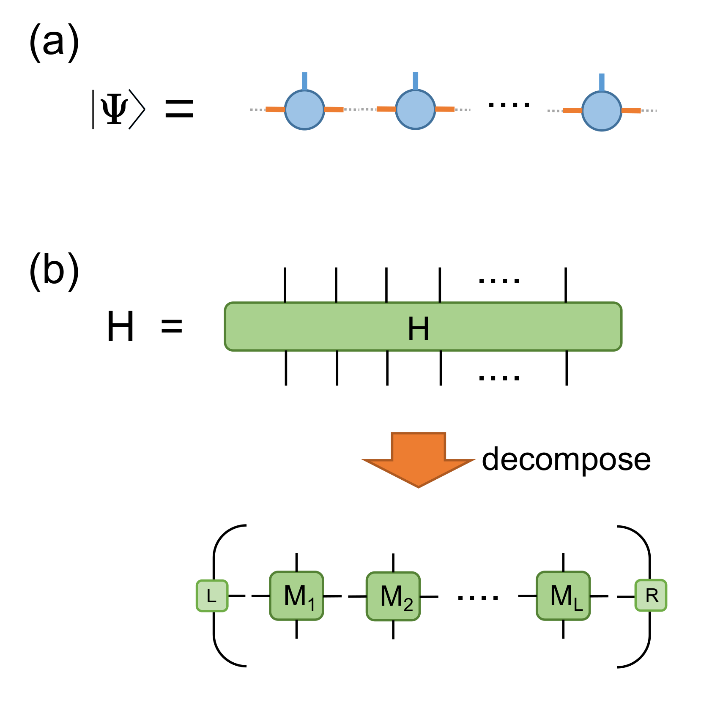

.. _SectionDMRG:

DMRG
------------
**By : Ke Hsu, Kai-Hsin Wu**

The density matrix renormalization group (DMRG) is one of the powerful algorithm for study quantum systems. 
The algorithm is especially useful in study 1D systems, while the extension to study 2D systems are also possible. The original formulation :cite:`whitedmrg` of DMRG is based on the desity matrix, and had been later-on being re-formulated with the concept of matrix product state (MPS) :cite:`SCHOLLWOCK201196`. 

In the following, we are going use the MPS language for explaination. There are two important objects Matrix product state (MPS) and Matrix product operator (MPO) which we will explain them in a moment. 

Using 1D spin-1/2 XY model as an example system, we are going to introduce how to use Cytnx to implement the DMRG algorithm, and benchmark our results with the exact analytic solution avaliable via bethe ansatz. 

The model-- XY chain
****************************************

Before introduce the algorithm, let's start with the system that we are going to study. Consider the XY model where the Hamiltonian defines as:

.. math::

    H = \sum^N_{j=0} S^x_j \cdot  S^x_{j+1} + S^y_j \cdot S^y_{j+1}

where :math:`S^{x}_j` and :math:`S^{y}_j` are the spin-1/2 operators at site **j**. One can also written the model in terms of the raising/lowering operator :math:`S^{\pm}` as

.. math::
    
    H = \sum^N_{j=1} \frac{1}{2} \left( S^+_jS^-_{j+1} + S^+_{j+1}S^-_{j} \right)

Basic components
*************************

1. Matrix product state (MPS):
 
   Our major goal in this example is, of course, to get the ground state. The state :math:`|\Psi>` is represent in terms of the MPS, which is variational wave function written in an effieient way to represent a many-body wave function. The tensor notation are shown in following figure (a)

2. Matrix product operator (MPO):
 
   The concept of MPO is actually quite simple, for which it is just the way we decompose our many-body Hamiltonian into local operators *M* (on each site) In our XY model, we define the MPO (on each site *j*) as: 
 
.. math::
    
    M_j = \begin{bmatrix}
    I & S^-_j & S^+_j & 0 \\ 
    0 &  0 &  0 & S^+_j\\ 
    0 &  0&   0& S^-_j \\ 
    0 & 0 & 0 & I 
    \end{bmatrix}

with the left and right boundary:

.. math::

    L = \begin{bmatrix}
    1\\ 
    0\\ 
    0\\ 
    0
    \end{bmatrix} 

.. math::

    R = \begin{bmatrix}
    0\\ 
    0\\ 
    0\\ 
    1
    \end{bmatrix}

which is shown in the following figure (b). One can easily verify that succesive product of number of **M** operators  along with the left and right boundaries gives the desire Hamitonian of the model.

Preparing the MPO
********************

Now, let's first prepare the MPO, **M**. Here, the **d** is the physical bond dimension. For spin-half it is **d=2**. **s** is the spin, for spin-half **s=0.5**. Here, since we have translational invariant, so all **M_j** for each site *j* will be the same. Thus, we only need to define a single **M** operator.  

**L0** and **R0** are the left and right boundary as mentioned previously. 

* In Python:

.. code-block:: python
    :linenos:
    
    d = 2 #physical dimension
    s = 0.5 #spin-half

    sx = cytnx.physics.spin(0.5,'x')
    sy = cytnx.physics.spin(0.5,'y')
    sp = sx+1j*sy
    sm = sx-1j*sy

    eye = cytnx.eye(d)
    M = cytnx.zeros([4, 4, d, d])
    M[0,0] = M[3,3] = eye
    M[0,1] = M[2,3] = 2**0.5*sp.real()
    M[0,2] = M[1,3] = 2**0.5*sm.real()
    M = cytnx.UniTensor(M,0)

    L0 = cytnx.UniTensor(cytnx.zeros([4,1,1]), rowrank = 0) #Left boundary
    R0 = cytnx.UniTensor(cytnx.zeros([4,1,1]), rowrank = 0) #Right boundary
    L0[0,0,0] = 1.; R0[3,0,0] = 1.

.. Note:: 

    Here, we first provide the Matrix *data* via **Tensor**, and convert then to **UniTensor**, which gives enhanced functionality (such as labels for each bond). 

At this moment, let's print out to show what **M**, **L0** and **R0** looks like:

* In Python:

.. code-block:: python 
    :linenos:

    M.print_diagram()
    L0.print_diagram()
    R0.print_diagram()

Output >> 

.. code-block:: text

    -----------------------
    tensor Name : 
    tensor Rank : 4
    block_form  : false
    is_diag     : False
    on device   : cytnx device: CPU
                -------------      
               /             \     
               |           4 |____ 0  
               |             |     
               |           4 |____ 1  
               |             |     
               |           2 |____ 2  
               |             |     
               |           2 |____ 3  
               \             /     
                -------------      
    -----------------------
    tensor Name : 
    tensor Rank : 3
    block_form  : false
    is_diag     : False
    on device   : cytnx device: CPU
                -------------      
               /             \     
               |           4 |____ 0  
               |             |     
               |           1 |____ 1  
               |             |     
               |           1 |____ 2  
               \             /     
                -------------      
    -----------------------
    tensor Name : 
    tensor Rank : 3
    block_form  : false
    is_diag     : False
    on device   : cytnx device: CPU
                -------------      
               /             \     
               |           4 |____ 0  
               |             |     
               |           1 |____ 1  
               |             |     
               |           1 |____ 2  
               \             /     
                -------------     

Preparing the MPS and enviroments
***********************************

Next, we are going to prepare our variational ansatz (MPS). Here, **chi** is the *virtual bond* dimension, and **Nsites** is the number of sites. 

* In Python:

.. code-block:: python
    :linenos:
        
    # MPS, chi is virtual bond dimension
    chi = 32
    Nsites = 20
    lbls = [] # List for storing the MPS labels
    A = [None for i in range(Nsites)]
    A[0] = cytnx.UniTensor(cytnx.random.normal([1, d, min(chi, d)], 0., 1.), rowrank = 2)
    A[0].relabels_(["0","1","2"])
    lbls.append(["0","1","2"]) # store the labels for later convinience.

    for k in range(1,Nsites):
        dim1 = A[k-1].shape()[2]; dim2 = d
        dim3 = min(min(chi, A[k-1].shape()[2] * d), d ** (Nsites - k - 1))
        A[k] = cytnx.UniTensor(cytnx.random.normal([dim1, dim2, dim3],0.,1.), rowrank = 2)

        lbl = [str(2*k),str(2*k+1),str(2*k+2)]
        A[k].relabels_(lbl)
        lbls.append(lbl) # store the labels for later convinience.

The resulting MPS would look like a tensor train, stored in the list A:

The dim3 of each tensor may look a little bit tricky, but we are simply comparing the "maximum dimension needed to span the information for the left part" and that of the right part, while we also want the disired dim3 not larger than our bond dimension.

.. Hint::
    
    The alternative way to assign dim3 is min(chi, d ** (k+1), d ** (Nsites - k - 1))

The MPS created at this moment are not physically sound. The one more thing we need to do is to make these MPS state into so called *canonical form*, for which we achieve this by iteratively performing svd and get it's left (or right, depending on how you do it.) unitary matrix. 
Here, we do it from left to right, and we decompose each tensor into its U, s and vT, then "throw" the s and vT part into next tensor, until the mps becomes its *left normal form*:

The othogonal form of the MPS looks like:

Further more, as a naive implementation, here, at the same time we also store all the *left and right enviroments* **LR**, assocate to each site just for convenience. These include contracting 4 tensors **L**, **M**, **A** and :math:`A^\dagger`. 

Here, the contraction can be easily performed using **cytnx.Network** with the contraction graph defined by the *network file* (L_AMAH.net) as following:

* L_AMAH.net:

.. code-block:: python
    :linenos:

    L: -2,-1,-3
    A: -1,-4,1
    M: -2,0,-4,-5
    A_Conj: -3,-5,2
    TOUT: 0,1,2

we load it, put tensors in, then call "Launch", all the four tensors got contracted properly and optimally, in the for loop, the whole process looks like following:

The full implementation looks like:

* In Python:

.. code-block:: python
    :linenos:
    

    LR = [None for i in range(Nsites+1)] 
    LR[0]  = L0
    LR[-1] = R0

    for p in range(Nsites - 1):

        ## Changing to canonical form site by site:
        s, A[p] ,vt = cytnx.linalg.Gesvd(A[p])
        A[p+1] = cytnx.Contract(cytnx.Contract(s,vt),A[p+1])

        ## Calculate enviroments:
        anet = cytnx.Network("L_AMAH.net")
        anet.PutUniTensors(["L","A","A_Conj","M"],[LR[p],A[p],A[p].Conj(),M])
        LR[p+1] = anet.Launch()

        # Recover the original MPS labels
        A[p].relabels_(lbls[p]) 
        A[p+1].relabels_(lbls[p+1])

    _,A[-1] = cytnx.linalg.Gesvd(A[-1],is_U=True,is_vT=False) ## last one.
    A[-1].relabels_(lbls[-1]) # Recover the original MPS labels

.. Hint::

    In the line 20, we perform SVD on the last tensor but only save the U part, this is the case since the shape of the original tensor is (A[Nsites-2].shape[2], 1, 1), 
    what we get from SVD is 1*1 matrix (or a number) for both s and Vt, moreover, these two numbers are just identity, so U is all we need.

Optimization of MPS (update sweep)
************************************

Now we are ready for describing the main DMRG algorithm that optimize our MPS, the way we are going to do this, is so called "sweeping" update. First, we provide the full code for a single sweep process: 

* In Python:

.. code-block:: python
    :linenos:

    numsweeps = 4 # number of DMRG sweeps
    maxit = 2 # iterations of Lanczos method

    for p in range(Nsites-2,-1,-1): 
        dim_l = A[p].shape()[0]
        dim_r = A[p+1].shape()[2]
        new_dim = min(dim_l*d,dim_r*d,chi)

        psi = cytnx.Contract(A[p],A[p+1]) # contract
        psi, Entemp = optimize_psi(psi, (LR[p],M,M,LR[p+2]), maxit, krydim)

        psi.set_rowrank_(2) # maintain rowrank to perform the svd
        s,A[p],A[p+1] = cytnx.linalg.Svd_truncate(psi,new_dim)
        A[p+1].relabels_(lbls[p+1]); # set the label back to be consistent

        s = s/s.Norm().item() # normalize s

        A[p] = cytnx.Contract(A[p],s) # absorb s into next neighbor
        A[p].relabels_(lbls[p]); # set the label back to be consistent

        # update LR from right to left:
        anet = cytnx.Network("R_AMAH.net")
        anet.PutUniTensors(["R","B","M","B_Conj"],[LR[p+2],A[p+1],M,A[p+1].Conj()])
        LR[p+1] = anet.Launch()
        
        print('Sweep[r->l], Loc:%d,Energy: %f'%(p,Ekeep[-1]))

    A[0].set_rowrank_(1) # maintain rowrank to perform the svd
    _,A[0] = cytnx.linalg.Gesvd(A[0],is_U=False, is_vT=True)
    A[0].relabels_(lbls[0]); # set the label back to be consistent

There are lots of things happening here, let's break it up a bit, from right to left, the first thing we do is to contract two tensors A[p] and A[p+1]:

Generally, the idea is pretty simple, for each local two sites, one contract the left and right enviroments :math:`L_{j}` and :math:`R_{j+3}` with local MPOs :math:`M_{j}` and :math:`M_{j+1}`. We call this the local operator :math:`H_{loc}`. 

The lowest eigen vector of this operator will be our optimized *local* state, which we call this **psi**. Of course, one can performs eigH directly with this :math:`H_{loc}` to get the local optimized state. However, the computational and memory cost are very high, and it's not pratical to do so espectially when virtual bond dimension is large. 

Instead, we use iterative solver (Lanczos method) to get our ground state, and use the **A[p]** and **A[p+1]** as our initial trial state for performing Lanczos with our local operator :math:`H_{loc}`.
 
The :math:`H_{loc}` is obtained by the following projector.net network:

* projector.net:

.. code-block:: python
    :linenos:

    psi: -1,-2,-3,-4
    L: -5,-1,0
    R: -7,-4,3
    M1: -5,-6,-2,1
    M2: -6,-7,-3,2
    TOUT: 0,1,2,3
    
which in tensor notation looks like this:

To ultilize the Lanczos function, the opertion of acting Hamitonian (which involves contraction using a network) is implemented using LinOp class (See Iterative Solver section for furtuer details). 

* In Python:

.. code-block:: python
    :linenos:

    class Hxx(cytnx.LinOp):

        def __init__(self, anet, psidim):
            cytnx.LinOp.__init__(self,"mv", psidim, cytnx.Type.Double, cytnx.Device.cpu)
            self.anet = anet

        def matvec(self, v):
            lbl = v.labels()
            self.anet.PutUniTensor("psi",v)
            out = self.anet.Launch()
            out.relabels_(lbl)
            return out

.. Hint::
    the class itself contain this projector network and do the contraction job for the input vector(state).
    We then pass this linear operation to the Lanczos algorithm to use as the operation of optimization. 

So now the optimize_psi function looks like:

* In Python:

.. code-block:: python
    :linenos:

    def optimize_psi(psi, functArgs, maxit=2, krydim=4):

        L,M1,M2,R = functArgs
        anet = cytnx.Network("projector.net")
        anet.PutUniTensors(["L","M1","M2","R"],[L,M1,M2,R])

        H = Hxx(anet, psi.shape()[0]*psi.shape()[1]*psi.shape()[2]*psi.shape()[3])
        energy, psivec = cytnx.linalg.Lanczos(Hop = H, method = "Gnd", Maxiter = 4, CvgCrit = 9999999999, Tin = psi)

        return psivec, energy[0].item()

Where we constructed the network (put tensors in) then pass it to our linear operation H.

Now, we get our energy and ground state for a two-sites system, after some re-labeling (in order to contract UniTensor) and reshape, 
we have to make our psi into the canonical form, for which we do the SVD for the ground state we just obtained, then let the left hand side site keep the U and s, while the other site became Vt. The intermediate bond are truncated such that the maximum virtual bond dimension is limited to **chi**. 

* In Python:
  
.. code-block:: python
    :linenos:

    new_dim = min(dim_l*d,dim_r*d,chi)

    psi.set_rowrank_(2) # maintain rowrank to perform the svd
    s,A[p],A[p+1] = cytnx.linalg.Svd_truncate(psi,new_dim)
    A[p+1].relabels_(lbls[p+1]); # set the label back to be consistent

    s = s/s.Norm().item() # normalize s

    A[p] = cytnx.Contract(A[p],s) # absorb s into next neighbor
    A[p].relabels_(lbls[p]); # set the label back to be consistent

remember that the right hand side vTs are obtained after we do the optimization, those are immediately used to calculate the updated right enviroment using the network

* R_AMAH.net:

.. code-block:: python
    :linenos:

    R: -2,-1,-3
    B: 1,-4,-1
    M: 0,-2,-4,-5
    B_Conj: 2,-5,-3
    TOUT: 0,1,2

graphically it looks like:

So our enviroments are also updated by the vT from the optimized two-side states.

.. Hint::
    
    The Svd_truncate is used to limit the tensor size, followed by a normalization on singular values, which is the physical requirement for the state of the whole system to be in the Schimit form.

The for loop is finished, now we arrived at the left end of the system, with the last two line

* In Python:

.. code-block:: python
    :linenos:
        
    A[0].set_rowrank_(1)
    _,A[0] = cytnx.linalg.Gesvd(A[0],is_U=False, is_vT=True)
    A[0].relabels_(lbls[0]); #set the label back to be consistent

looks like the same as we did for the right-end site in the beginning, this time we saves the vT, the purpose of the 
set_rowrank_(1) is only for the convenience of calling Svd/Svd_truncate in the next sweeping procedure from left to right. 

We can now sweep from left to the right. The code is pretty much the same as we went through, with only a few modifications. 

So we are done! With the other loop to control the number of times we sweep, we get the full DMRG sweep code:

* In Python:

.. code-block:: python
    :linenos:

    # DMRG sweep
        
    Ekeep = [] # For storing the energy

    for k in range(1, numsweeps+1):   

        for p in range(Nsites-2,-1,-1): 
            dim_l = A[p].shape()[0]
            dim_r = A[p+1].shape()[2]
            new_dim = min(dim_l*d,dim_r*d,chi)

            psi = cytnx.Contract(A[p],A[p+1]) # contract
            psi, Entemp = optimize_psi(psi, (LR[p],M,M,LR[p+2]), maxit)
            Ekeep.append(Entemp)
            
            psi.set_rowrank_(2) # maintain rowrank to perform the svd
            s,A[p],A[p+1] = cytnx.linalg.Svd_truncate(psi,new_dim)
            A[p+1].relabels_(lbls[p+1]); # set the label back to be consistent

            s = s/s.Norm().item() # normalize s

            A[p] = cytnx.Contract(A[p],s) # absorb s into next neighbor
            A[p].relabels_(lbls[p]); # set the label back to be consistent

            # update LR from right to left:
            anet = cytnx.Network("R_AMAH.net")
            anet.PutUniTensors(["R","B","M","B_Conj"],[LR[p+2],A[p+1],M,A[p+1].Conj()])
            LR[p+1] = anet.Launch()
            
            print('Sweep[r->l]: %d/%d, Loc: %d,Energy: %f' % (k, numsweeps, p, Ekeep[-1]))

        A[0].set_rowrank_(1)
        _,A[0] = cytnx.linalg.Gesvd(A[0],is_U=False, is_vT=True)
        A[0].relabels_(lbls[0]); #set the label back to be consistent

        for p in range(Nsites-1):
            dim_l = A[p].shape()[0]
            dim_r = A[p+1].shape()[2]
            new_dim = min(dim_l*d,dim_r*d,chi)

            psi = cytnx.Contract(A[p],A[p+1]) ## contract
            psi, Entemp = optimize_psi(psi, (LR[p],M,M,LR[p+2]), maxit)
            Ekeep.append(Entemp)

            psi.set_rowrank_(2) # maintain rowrank to perform the svd
            s,A[p],A[p+1] = cytnx.linalg.Svd_truncate(psi,new_dim)
            A[p].relabels_(lbls[p]); #set the label back to be consistent

            s = s/s.Norm().item() # normalize s

            A[p+1] = cytnx.Contract(s,A[p+1]) ## absorb s into next neighbor.
            A[p+1].relabels_(lbls[p+1]); #set the label back to be consistent

            # update LR from left to right:
            anet = cytnx.Network("L_AMAH.net")
            anet.PutUniTensors(["L","A","A_Conj","M"],[LR[p],A[p],A[p].Conj(),M])
            LR[p+1] = anet.Launch()

            print('Sweep[l->r]: %d/%d, Loc: %d,Energy: %f' % (k, numsweeps, p, Ekeep[-1]))

        A[-1].set_rowrank_(2)
        _,A[-1] = cytnx.linalg.Gesvd(A[-1],is_U=True,is_vT=False) ## last one.
        A[-1].relabels_(lbls[-1]); #set the label back to be consistent

Compare DMRG Results
************************************

Here, we plot the energy as a function of iteration. We see that after iterations, the energy successfully converge to a value that is consistent with the exact solution. 

* In Python:

.. code-block:: python
    :linenos:

    #### Compare with exact results (computed from free fermions)
    from numpy import linalg as LA
    # import matplotlib.pyplot as plt
    H = np.diag(np.ones(Nsites-1),k=1) + np.diag(np.ones(Nsites-1),k=-1)
    D = LA.eigvalsh(H)
    EnExact = 2*sum(D[D < 0])

    ##### Plot results
    plt.figure(1)
    plt.yscale('log')
    plt.plot(range(len(Ekeep)), np.array(Ekeep) - EnExact, 'b', label="chi = %d"%(chi), marker = 'o')
    plt.legend()
    plt.title('DMRG for XX model')
    plt.xlabel('Update Step')
    plt.ylabel('Ground Energy Error')
    plt.show()

For the 20 sites system, the result is:

.. image:: image/dmrg_res.png
    :width: 450
    :align: center

.. bibliography:: ref.dmrg.bib
    :cited:

