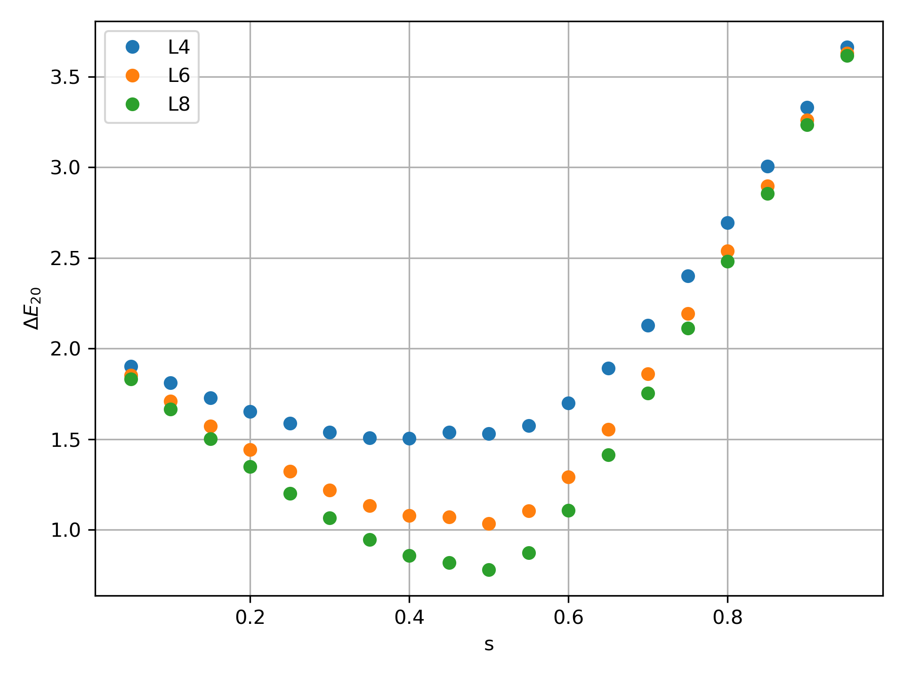

.. _SectionED:

Exact Diagonalization
----------------------
Consider the example of a 1D transverse field Ising model with Hamiltonain defines as 

.. math::

    H = J\sum_{\left<ij\right>}\sigma^{z}_i\sigma^{z}_j - H_x\sum_i \sigma^{x}_i

where :math:`\left<ij\right>` denotes nearest neighbor interaction, and :math:`\sigma^{x,z}` is the pauli-matrices. 

The model undergoes a phase transition  at :math:`H_x^c/J = 1` with avoid level crossing. For further information, see *insert url!*

Here, we are interesting to observe this avoid level crossing where the gap closes with increasing system size. For this, we want to get the low-level energy spectrums.

Generally, the native way to calculate the energy specturm of this Hamiltonian is through the product of local pauli-matrices. However, the size of this many-body Hamiltonian growth exponentially with size of chain :math:`L` as :math:`2^{L}`. It is not pratical to store this large Hamiltonain. 

Notice that this many-body Hamiltonain is very sparse, with lots of elements equal to zero. Thus it is very useful to use LinOp to represent this Hamiltonain, and call **Lanczos_ER** to get the low-level energies. 

Bit representation of basis states
************************************

First thing we want to do is to represent the basis states using bit-representation. 
Here, let's choose the :math:`z` -basis.
For example:

.. math::

    | \uparrow\uparrow\uparrow \cdots \uparrow\downarrow > = \mathrm{bit}(000...01) = \mathrm{int}(1)

    | \uparrow\uparrow\uparrow \cdots \downarrow\downarrow > = \mathrm{bit}(000...11) = \mathrm{int}(3)

This each configuration (basis state) can be identify with a integer ID. 

Now, since we want to consider the Hamiltonian as *operation* that acting on the input vector and mapping to the output vector, we can think of pauli-matrices :math:`\sigma^{x,z}` acting on the basis state, and map from input state to output state with coefficient :math:`c` as :math:`c|\psi_{out}> = \sigma^{x,z}|\psi_{in}>` .

For example:

.. math::

    J\sigma_0^{z}\sigma_1^{z} | \uparrow\uparrow\uparrow \cdots \uparrow\downarrow > = -J | \uparrow\uparrow\uparrow \cdots \uparrow\downarrow > 

    H_x\sigma_0^{x} | \uparrow\uparrow\uparrow \cdots \uparrow\downarrow > = H_x | \uparrow\uparrow\uparrow \cdots \uparrow\uparrow > 

The first example, :math:`J\sigma_0^{z}\sigma_1^{z}` map from basis with ID=1 to ID=1 with coefficient :math:`-J`, which is a diagonal elements in the many body Hamiltonian.
The second example which :math:`H_x\sigma_0^{x}` operate on state with ID=1 resulting as a state with ID=0 and corresponding coefficient :math:`H_x`, which is a off-diagonal elements in the many-body Hamiltonian.

With aformentioned rule, we are now ready to implement the TFIM Hamiltonian using **LinOp** class. 

Implementation
*****************

1. Let's inherit the **LinOp** class, and implement the aformentioned mapping in the overload of **matvec**:

* In python:

.. code-block:: python
    :linenos:

    import cytnx as cy

    class Hising(cy.LinOp):

        def __init__(self,L,J,Hx):
            cy.LinOp.__init__(self,"mv",2**L,cy.Type.Double,cy.Device.cpu)
            ## custom members:
            self.J  = J
            self.Hx = Hx
            self.L  = L

        def SzSz(self,i,j,ipt_id):
            return ipt_id,(1. - 2.*(((ipt_id>>i)&0x1)^((ipt_id>>j)&0x1)))

        def Sx(self,i,ipt_id):
            out_id = ipt_id^((0x1)<<i)
            return out_id,1.0

        ## let's overload this with custom operation:
        def matvec(self,v):
            out = cy.zeros(v.shape()[0],v.dtype(),v.device());
            for a in range(v.shape()[0]):
                for i in range(self.L):
                    oid,amp = self.SzSz(i,(i+1)%self.L,a)
                    out[oid] += amp*self.J*v[a]

                    oid,amp = self.Sx(i,a)
                    out[oid] += amp*(-self.Hx)*v[a]
            return out
 

* In C++:

.. code-block:: c++
    :linenos:

    namespace cy=cytnx;
    class Hising: public cy::LinOp{

        public:
            cytnx_double J,Hx;
            cytnx_uint32 L;

        Hising(cytnx_uint32 L, cytnx_double J, cytnx_double Hx):
            cy::LinOp("mv",pow(2,L),Type.Double,Device.cpu) //rememeber to invoke base class constructor
        {
            //custom members
            this->J  = J;
            this->Hx = Hx;
            this->L  = L;
        }

        double SzSz(const cytnx_uint32 &i, const cytnx_uint32 &j, const cytnx_uint32 &ipt_id, cytnx_uint32 &out_id){
            out_id = ipt_id;
            return (1. - 2.*(((ipt_id>>i)&0x1)^((ipt_id>>j)&0x1)));
        }

        double Sx(const cytnx_uint32 &i, const cytnx_uint32 &ipt_id, cytnx_uint32 &out_id){
            out_id = ipt_id^((0x1)<<i);
            return 1.0;
        }

        // let's overload this with custom operation:
        Tensor matvec(const Tensor &v) override{
            auto out = zeros(v.shape()[0],v.dtype(),v.device());
            cytnx_uint32 oid;
            double amp;

            for(cytnx_uint32 a=0; a<v.shape()[0];a++){
                for(cytnx_uint32 i=0; i<this->L; i++){
                    amp = this->SzSz(i,(i+1)%this->L,a,oid);
                    out(oid) += amp*this->J*v(a);

                    amp = this->Sx(i,a,oid);
                    out(oid) += amp*(-this->Hx)*v(a);
                }
            }
            return out;
        }
    };

 
Note that here, we defone two member functions **SzSz()** and  **Sx()** that operate on site :math:`i,j` with basis ID :math:`ipt_id` and return the output basis ID and corresponding coefficients. 

Inside the overload **matvec**, we then traversal all the basis states coefficients in input vector **v**, and using **SzSz()** and **Sx()** to calculate the mapping to the output vector **out**. 

The class constructor takes three arguments: **L**, the size of ising chain; **J**, the ZZ coupling and **Hx**, the transverse field.

.. Hint::

    Here, we consider periodic boundary condition, you can modify the boundary condition or adding additional terms by properly modify the **matvec**. 

2. Now, we can then using Lanczos method to get the low-level energy spectrum of this Hamiltonian. Since we are interesting in the property of avoid level crossing, let's get the lowest 3 energy states. 

* In Python:

.. code-block:: python
    :linenos:

    L = 4
    J = -1
    Hx = 0.3
    H = Hising(L,J,Hx)
    v = cy.ones(16)
    print(cy.linalg.Lanczos(H,Tin=v,method='ER',k=3,max_krydim=2))

* In C++:

.. code-block:: c++
    :linenos:

    cytnx_uint32 L = 4;
    double J = -1;
    double Hx = 0.3;
    auto H = Hising(L,J,Hx);
    cout << cy::linalg::Lanczos_ER(&H,3) << endl;

Output>>

.. code-block:: text

    Total elem: 3
    type  : Double (Float64)
    cytnx device: CPU
    Shape : (3)
    [-4.09296e+00 -4.08806e+00 -8.29256e-01 ]

    Total elem: 48
    type  : Double (Float64)
    cytnx device: CPU
    Shape : (16,3)
    [[-6.98371e-01 9.23730e-02 -6.99613e-01 ]
     [-5.41014e-02 -2.44076e-01 -5.13407e-02 ]
     [-5.41014e-02 -2.44076e-01 -5.13407e-02 ]
     [-1.58618e-02 -3.53197e-01 -4.22330e-08 ]
     [-5.41014e-02 -2.44076e-01 -5.13407e-02 ]
     [-8.02201e-03 -6.06493e-02 -1.74782e-08 ]
     [-1.58618e-02 -3.53197e-01 -3.78828e-08 ]
     [-5.41017e-02 -2.44076e-01 5.13405e-02 ]
     [-5.41014e-02 -2.44076e-01 -5.13407e-02 ]
     [-1.58618e-02 -3.53197e-01 -3.79224e-08 ]
     [-8.02201e-03 -6.06493e-02 -1.71013e-08 ]
     [-5.41017e-02 -2.44076e-01 5.13405e-02 ]
     [-1.58618e-02 -3.53197e-01 -4.22106e-08 ]
     [-5.41017e-02 -2.44076e-01 5.13405e-02 ]
     [-5.41017e-02 -2.44076e-01 5.13405e-02 ]
     [-6.98374e-01 9.23730e-02 6.99610e-01 ]]

Simulation Results
************************************

    Here, we show the result using the aformentioned implementation. We define a common parameter :math:`s` such that :math:`J = -s` and :math:`Hx=(1-s)`, and we plot the second gap :math:`\Delta E_{20}` that shows the avoid level crossing:

The :math:`L` here is the system size.
    

.. Hint::
    
    The complete example code can be found in Github repo under example/ED folder.

