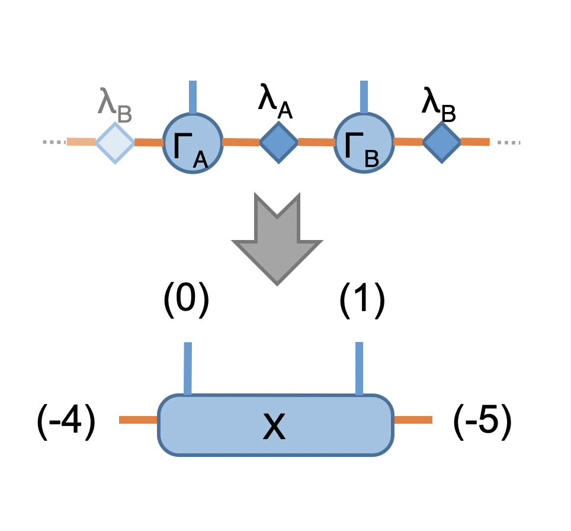
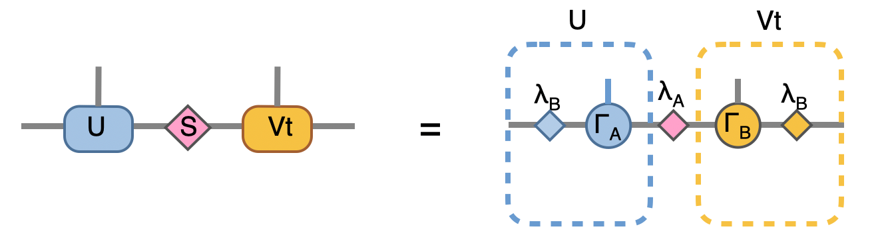

iTEBD
------------
**By : Hsu Ke, Kai-Hsin Wu**

Time evolution block decimation is one of the most simple and sucessful Tensor network method :cite:`itebd-vidal`. The core concept of this algorithm is to use the imaginary time evolution to find the best variational ansatz, usually in terms of Matrix product state (MPS). 

Here, we use a 1D transverse field Ising model (TFIM) as a simple example to show how to implement iTEBD algorithm in Cytnx and get the infinite system size (variational) ground state. 

Consider the Hamiltonain of TFIM:

.. math::

    H = J\sum_{ij} \sigma^{z}_i\sigma^{z}_j - H_x\sum_i \sigma^{x}_i

where :math:`\sigma^{x,z}` are the pauli matrices. 
The infinite size ground state can be represent by MPS as variational ansatz, where the *virtual bonds* dimension :math:`\chi` effectively controls the number of variational parameters (shown as orange bonds), and the *physical bonds* dimension :math:`d` is the real physical dimension (shown as the blue bonds. Here, for Ising spins :math:`d=2`). 

Because the system has translational invariant, thus it is legit to choose unit-cell consist with two sites, and the infinite system ground state can be represented with only two sites MPS with local tensors :math:`\Gamma_A` and :math:`\Gamma_B` associate with the schmit basis and :math:`\lambda_A`, :math:`\lambda_B` are the diagonal matrices of Schmidt coefficients as shown in the following:

Let's first create this two-site  MPS wave function (here, we set virtual bond dimension :math:`\chi = 10` as example)

* In Python

.. code-block:: python
    :linenos:

    import cytnx

    chi = 10
    A = cytnx.UniTensor([cytnx.Bond(chi),cytnx.Bond(2),cytnx.Bond(chi)],labels=['a','0','b']); 
    B = cytnx.UniTensor(A.bonds(),rowrank=1,labels=['c','1','d']);                                
    cytnx.random.Make_normal(B.get_block_(),0,0.2); 
    cytnx.random.Make_normal(A.get_block_(),0,0.2); 
    A.print_diagram()
    B.print_diagram()
    #print(A)
    #print(B)
    la = cytnx.UniTensor([cytnx.Bond(chi),cytnx.Bond(chi)],labels=['b','c'],is_diag=True)
    lb = cytnx.UniTensor([cytnx.Bond(chi),cytnx.Bond(chi)],labels=['d','e'],is_diag=True)
    la.put_block(cytnx.ones(chi));
    lb.put_block(cytnx.ones(chi));
    la.print_diagram()
    lb.print_diagram()

.. * In C++

.. .. code-block:: c++
..     :linenos:

..     #include "cytnx.hpp"
..     using namespace cytnx;

..     unsigned int chi = 10;
..     bool is_diag = true;
..     auto A = UniTensor({Bond(chi),Bond(2),Bond(chi)},{"a","0","b"},-1,Type.Double,Device.cpu,is_diag);
..     auto B = UniTensor(A.bonds(),{"c","1","d"},-1,Type.Double,Device.cpu,is_diag);
..     random::Make_normal(B.get_block_(),0,0.2);
..     random::Make_normal(A.get_block_(),0,0.2);
..     A.print_diagram();
..     B.print_diagram();

..     auto la = UniTensor({Bond(chi),Bond(chi)},{"b","c"},-1,Type.Double,Device.cpu,true);
..     auto lb = UniTensor({Bond(chi),Bond(chi)},{"d","e"},-1,Type.Double,Device.cpu,true);
..     la.put_block(ones(chi));
..     lb.put_block(ones(chi));

..     la.print_diagram();
..     lb.print_diagram();

Output >>

.. code-block:: text
    
    -----------------------
    tensor Name : 
    tensor Rank : 3
    block_form  : false
    is_diag     : False
    on device   : cytnx device: CPU
                -------------      
               /             \     
        -1 ____| 10        2 |____ 0  
               |             |     
               |          10 |____ -2 
               \             /     
                -------------      
    -----------------------
    tensor Name : 
    tensor Rank : 3
    block_form  : false
    is_diag     : False
    on device   : cytnx device: CPU
                -------------      
               /             \     
        -3 ____| 10        2 |____ 1  
               |             |     
               |          10 |____ -4 
               \             /     
                -------------      
    -----------------------
    tensor Name : 
    tensor Rank : 2
    block_form  : false
    is_diag     : True
    on device   : cytnx device: CPU
                -------------      
               /             \     
        -2 ____| 10       10 |____ -3 
               \             /     
                -------------      
    -----------------------
    tensor Name : 
    tensor Rank : 2
    block_form  : false
    is_diag     : True
    on device   : cytnx device: CPU
                -------------      
               /             \     
        -4 ____| 10       10 |____ -5 
               \             /     
                -------------      

Here, we use **random::Make_normal** to initialize the elements of UniTensor *A* and *B* with normal distribution as initial MPS wavefuncion. 
The *la*, *lb* are the weight matrix (schmit coefficients), hence only diagonal elements contains non-zero values. Thus, we set **is_diag=True** to only store diagonal entries. 
We then initialize the elements to be all one for this weight matrices. 

.. Note::
    
    In general, there are other ways you can set-up a trial initial MPS wavefunction, as long as not all the elements are zero. 

Imaginary time evolution
*************************
To optimize the MPS for the ground state wave function, in TEBD, we perform imaginary time evolution with Hamiltonian :math:`H` with evolution operator :math:`e^{\tau H}`. 
The manybody Hamiltonian is then decomposed into local two-sites evolution operator (or sometimes also called gate in quantum computation language) via 
Trotter-Suzuki decomposition, where :math:`U = e^{\tau H} \approx e^{\delta \tau H_{a}}e^{\delta \tau H_{b}} \cdots = U_a U_b`, :math:`U_{a,b} = e^{\delta \tau H_{a,b}}` are the local evolution operators with :math:`H_a` and :math:`H_b` are the local two sites operator:

.. math::

    H_{a,b} = J\sigma^{z}_{A,B}\sigma^{z}_{B,A} - \frac{H_x}{2}(\sigma^{x}_A + \sigma^{x}_B) 

This is equivalent as acting theses two-site gates consecutively on the MPS, which in terms of tensor notation looks like following Figure(a):

Since we represent this infinite system MPS using the translational invariant, the Figure(a) can be further simplified into two step. 
First, acting :math:`U_a` as shown in Figure(1) then acting :math:`U_b` as shown in Figure(2). This two procedures then repeat until the energy is converged. 

Here, let's construct this imaginary time evolution operator with parameter :math:`J=-1`, :math:`H_x = -0.3` and (imaginary) time step :math:`\delta \tau = 0.1`

* In Python 

.. code-block:: python 
    :linenos:

    J = -1.0
    Hx = -0.3
    dt = 0.1

    ## Create single site operator
    Sz = cytnx.physics.pauli("z").real()
    Sx = cytnx.physics.pauli("x").real()
    I = cytnx.eye(2)
    print(Sz)
    print(Sx)

    ## Construct the local Hamiltonian
    TFterm = cytnx.linalg.Kron(Sx,I) + cytnx.linalg.Kron(I,Sx)
    ZZterm = cytnx.linalg.Kron(Sz,Sz)
    H = Hx*TFterm + J*ZZterm
    print(H)

    ## Build Evolution Operator
    eH = cytnx.linalg.ExpH(H,-dt) ## or equivantly ExpH(-dt*H)
    eH.reshape_(2,2,2,2)
    U = UniTensor(eH, rowrank = 2)
    U.print_diagram()

.. * In C++

.. .. code-block:: c++
..     :linenos:

..     double J = -1.0;
..     double Hx = -0.3;
..     double dt = 0.1;

..     // Create single site operator
..     auto Sz = physics::pauli('z').real();
..     auto Sx = physics::pauli('x').real();
..     auto I  = eye(2);
..     cout << Sz << endl;
..     cout << Sx << endl;

..     // Construct the local Hamiltonian
..     auto TFterm = linalg::Kron(Sx,I) + linalg::Kron(I,Sx);
..     auto ZZterm = linalg::Kron(Sz,Sz);
..     auto H = Hx*TFterm + J*ZZterm;
..     cout << H << endl;

..     // Build Evolution Operator
..     // [Note] eH is cytnx.Tensor and U is UniTensor.
..     auto eH = linalg::ExpH(H,-dt); //or equivantly ExpH(-dt*H)
..     eH.reshape_(2,2,2,2);
..     auto U = UniTensor(eH,2);
..     U.print_diagram();

Output>>

.. code-block:: text

    Total elem: 4
    type  : Double (Float64)
    cytnx device: CPU
    Shape : (2,2)
    [[1.00000e+00 0.00000e+00 ]
     [0.00000e+00 -1.00000e+00 ]]

    Total elem: 4
    type  : Double (Float64)
    cytnx device: CPU
    Shape : (2,2)
    [[0.00000e+00 1.00000e+00 ]
     [1.00000e+00 0.00000e+00 ]]

    Total elem: 16
    type  : Double (Float64)
    cytnx device: CPU
    Shape : (4,4)
    [[-1.00000e+00 3.00000e-01 3.00000e-01 0.00000e+00 ]
     [3.00000e-01 1.00000e+00 0.00000e+00 3.00000e-01 ]
     [3.00000e-01 0.00000e+00 1.00000e+00 3.00000e-01 ]
     [0.00000e+00 3.00000e-01 3.00000e-01 -1.00000e+00 ]]

    -----------------------
    tensor Name : 
    tensor Rank : 4
    block_form  : false
    is_diag     : False
    on device   : cytnx device: CPU
                -------------      
               /             \     
         0 ____| 2         2 |____ 2  
               |             |     
         1 ____| 2         2 |____ 3  
               \             /     
                -------------      

.. Note::

    1. Since :math:`U_a` and :math:`U_b` have the same content(matrix elements) but acting on different sites, we only need to define a single UniTensor. 
    2. Here as a simple example, we directly convert a **cytnx.Tensor** to **cytnx.UniTensor**, which we don't impose any bra-ket constrain (direction of bonds). In general, it is also possible to give bond direction (which we refering to *tagged*) that constrain the bonds to be more physical. See Github example/iTEBD/iTEBD_tag.py for demonstration. 
    3. In general, the accurate ground state can be acquired with a higher order Trotter-Suzuki expansion, and with decreasing :math:`\delta \tau` along the iteraction. (See :cite:`itebd-vidal` for further details), Here, for demonstration, we use fixed value of :math:`\delta \tau`. 
    
.. Tip::

    Here, **physics.pauli** returns complex type **cytnx.Tensor**. Since we know pauli-z and pauli-x should be real, we use *.real()* to get the real part. 

Update procedure
******************
Now we have prepared the initial trial wavefunction in terms of MPS with two sites unit cell and the time evolution operator, we are ready to use the aformentioned scheme to find the (variational) ground state MPS. 
At the beginning of each iteration, we evaluate the energy expectation value :math:`\langle \psi | H | \psi  \rangle / \langle \psi | \psi  \rangle`, and check the convergence, the network is straightforward:

* In Python 

.. code-block:: python 
    :linenos:

    A.relabels_(["a","0","b"]);
    B.relabels_(["c","1","d"]);
    la.relabels_(["b","c"]);
    lb.relabels_(["d","e"]);

    ## contract all
    X = cytnx.Contract(cytnx.Contract(A,la),cytnx.Contract(B,lb))
    lb_l = lb.relabel(old_label=lb.get_index('e'), new_label=X.labels()[0])
    X = cytnx.Contract(lb_l,X)

    ## X =
    #           (0)  (1)
    #            |    |     
    #  (d) --lb-A-la-B-lb-- (e) 
    #
    # X.print_diagram()
    Xt = X.clone()

    ## calculate norm and energy for this step
    # Note that X,Xt contract will result a rank-0 tensor, which can use item() toget element
    XNorm = cytnx.Contract(X,Xt).item()
    XH = cytnx.Contract(X,H)
    XH.relabels_(["d","e","0","1"]) ;
    
    
    XHX = cytnx.Contract(Xt,XH)
    XHX = XHX.item() ## rank-0
    E = XHX/XNorm

    # print(E)
    ## check if converged.
    if(np.abs(E-Elast) < CvgCrit):
        print("[Converged!]")
        break
    print("Step: %d Enr: %5.8f"%(i,Elast))
    Elast = E

.. * In C++

.. .. code-block:: c++ 
..     :linenos:

..     A.relabels_({"a","0","b"}); 
..     B.relabels_({"c","1","d"}); 
..     la.relabels_({"b","c"}); 
..     lb.relabels_({"d","e"}); 

..     // contract all
..     UniTensor X = cyx::Contract(cyx::Contract(A,la),cyx::Contract(B,lb));
..     auto lbl_l = lb.relabel_("e","a"); 
..     X = cyx::Contract(lb_l,X);

..     UniTensor Xt = X.clone();
    
..     //> calculate norm and energy for this step
..     // Note that X,Xt contract will result a rank-0 tensor, which can use item() toget element
..     Scalar XNorm = cyx::Contract(X,Xt).item();
..     UniTensor XH = cyx::Contract(X,H);

..     XH.relabels_({"d","e","0","1"});
..     Scalar XHX = cyx::Contract(Xt,XH).item(); 
..     double E = double(XHX/XNorm);

..     //> check if converged.
..     if(abs(E-Elast) < CvgCrit){
..         cout << "[Converged!]" << endl;
..         break;
..     }
..     cout << "Step: " << i << "Enr: " << Elast << endl;
..     Elast = E;

in the next step we perform the two-sites imaginary time evolution, using the operator (or "gate") eH we defined above:

we also performed SVD for the XeH here, this put the MPS into mixed canonical form and have a Schimit decomposition of the whole state where the singular values are simply the Schimit coefficients. The **Svd_truncate** is called such that the intermediate bonds with label (-6) and (-7) are properly truncate to the maximum virtual bond dimension **chi**. 

* In Python 

.. code-block:: python 
    :linenos:

    ## Time evolution the MPS
    XeH = cytnx.Contract(X,eH)
    XeH.permute_(["d","2","3","e"])
    XeH.set_rowrank(2)
    la,A,B = cytnx.linalg.Svd_truncate(XeH,chi)
    Norm = cytnx.linalg.Norm(la.get_block_()).item()
    la *= 1./Norm

.. * In C++

.. .. code-block:: c++ 
..     :linenos:

..     //> Time evolution the MPS
..     UniTensor XeH = cyx::Contract(X,eH);
..     XeH.permute_({"d","2","3","e"});

..     XeH.set_Rowrank(2);
..     vector<UniTensor> out = cyx::xlinalg::Svd_truncate(XeH,chi);
..     la = out[0]; A = out[1]; B = out[2];
..     la.normalize_(); //normalize

Note that we directly store the SVD results into A, B and la, this can be seen by comparing to our original MPS configuration:

to recover to orignial form, we put :math:`\lambda_B^{-1} \lambda_B` on both ends, which abosorb two :math:`\lambda_B^{-1}`:

Now we have the envolved :math:`\Gamma_A`, :math:`\Gamma_B` and :math:`\lambda_A`. Using the translation symmetry, we shift the whole chain to left by just exchange the :math:`Gamma` and :math:`\lambda` pair and arrived at the new MPS for next iteration to update B-A sites using :math:`U_b`. 

* In Python 

.. code-block:: python 
    :linenos:

    lb_inv = 1./lb

    lb_inv.relabels_([B.labels()[2],A.labels()[0]]);
   
    A = cytnx.Contract(lb_inv,A)
    B = cytnx.Contract(B,lb_inv)

    # translation symmetry, exchange A and B site
    A,B = B,A
    la,lb = lb,la

.. * In C++

.. .. code-block:: c++ 
..     :linenos:
    
..     UniTensor lb_inv = 1./lb;

..     lb_inv.relabels_({"e","d"}); 
..     A = cyx.Contract(lb_inv,A);
..     B = cyx.Contract(B,lb_inv);

..     //> translation symm, exchange A and B site
..     UniTensor tmp = A;
..     A = B; B = tmp;

..     tmp = la;
..     la = lb; lb = tmp;

Let's put everything together in a loop for iteration:

* In Python 

.. code-block:: python 
    :linenos:

    for i in range(10000):

        A.relabels_(["a","0","b"]);
        B.relabels_(["c","1","d"]);
        la.relabels_(["b","c"]);
        lb.relabels_(["d","e"]);

        ## contract all
        X = cytnx.Contract(cytnx.Contract(A,la),cytnx.Contract(B,lb))
        lb_l = lb.relabel(old_label=lb.get_index('e'), new_label=X.labels()[0])
        X = cytnx.Contract(lb_l,X)

        Xt = X.clone()

        ## calculate norm and energy for this step
        # Note that X,Xt contract will result a rank-0 tensor, which can use item() toget element
        XNorm = cytnx.Contract(X,Xt).item()
        XH = cytnx.Contract(X,H)
        XH.relabels_(["d","e","0","1"]);
        
        
        XHX = cytnx.Contract(Xt,XH)
        XHX = XHX.item() ## rank-0
        E = XHX/XNorm

        ## check if converged.
        if(np.abs(E-Elast) < CvgCrit):
            print("[Converged!]")
            break
        print("Step: %d Enr: %5.8f"%(i,Elast))
        Elast = E

        ## Time evolution the MPS
        XeH = cytnx.Contract(X,eH)
        XeH.permute_(["d","2","3","e"])

        ## Do Svd + truncate
        XeH.set_rowrank(2)
        la,A,B = cytnx.linalg.Svd_truncate(XeH,chi)

        Norm = cytnx.linalg.Norm(la.get_block_()).item()
        la *= 1./Norm

        lb_inv = 1./lb
        lb_inv.relabels_([B.labels()[2],A.labels()[0]]);
    
        A = cytnx.Contract(lb_inv,A)
        B = cytnx.Contract(B,lb_inv)
        # translation symmetry, exchange A and B site
        A,B = B,A
        la,lb = lb,la

.. * In C++

.. .. code-block:: c++ 
..     :linenos:
    
..     //> Evov:
..     double Elast = 0;
    
..     for(unsigned int i=0;i<10000;i++){

..         A.relabels_({"a","0","b"}); 
..         B.relabels_({"c","1","d"}); 
..         la.relabels_({"b","c"}); 
..         lb.relabels_({"d","e"}); 

..         // contract all
..         UniTensor X = cyx::Contract(cyx::Contract(A,la),cyx::Contract(B,lb));
..         auto lbl_l = lb.relabel_("e","a"); 
..         X = cyx::Contract(lb_l,X);

..         UniTensor Xt = X.clone();
        
..         //> calculate norm and energy for this step
..         // Note that X,Xt contract will result a rank-0 tensor, which can use item() toget element
..         Scalar XNorm = cyx::Contract(X,Xt).item();
..         UniTensor XH = cyx::Contract(X,H);

..         XH.relabels_({"d","e","0","1"});
..         Scalar XHX = cyx::Contract(Xt,XH).item(); 
..         double E = double(XHX/XNorm);

..         //> check if converged.
..         if(abs(E-Elast) < CvgCrit){
..             cout << "[Converged!]" << endl;
..             break;
..         }
..         cout << "Step: " << i << "Enr: " << Elast << endl;
..         Elast = E;

..         //> Time evolution the MPS
..         UniTensor XeH = cyx::Contract(X,eH);
..         XeH.permute_({"d","2","3","e"});

..         //> Do Svd + truncate
..         XeH.set_rowrank(2);
..         vector<UniTensor> out = cyx::xlinalg::Svd_truncate(XeH,chi);
..         la = out[0]; A = out[1]; B = out[2];
..         la.normalize_(); //normalize
        

..         // de-contract the lb tensor , so it returns to 
..         //             
..         //            |     |     
..         //       --lb-A'-la-B'-lb-- 
..         //
..         // again, but A' and B' are updated 
        
..         UniTensor lb_inv = 1./lb;
..         lb_inv.relabels_({"e","d"});
..         A = cyx::Contract(lb_inv,A);
..         B = cyx::Contract(B,lb_inv);

    
..         //> translation symm, exchange A and B site
..         UniTensor tmp = A;
..         A = B; B = tmp;

..         tmp = la;
..         la = lb; lb = tmp;
..     }

.. bibliography:: ref.itebd.bib
    :cited:
