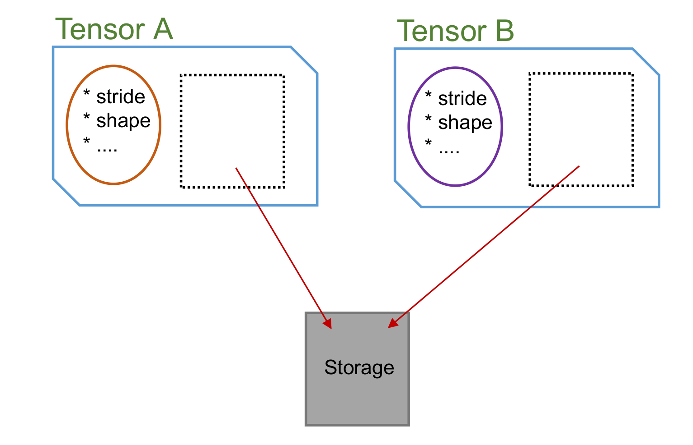
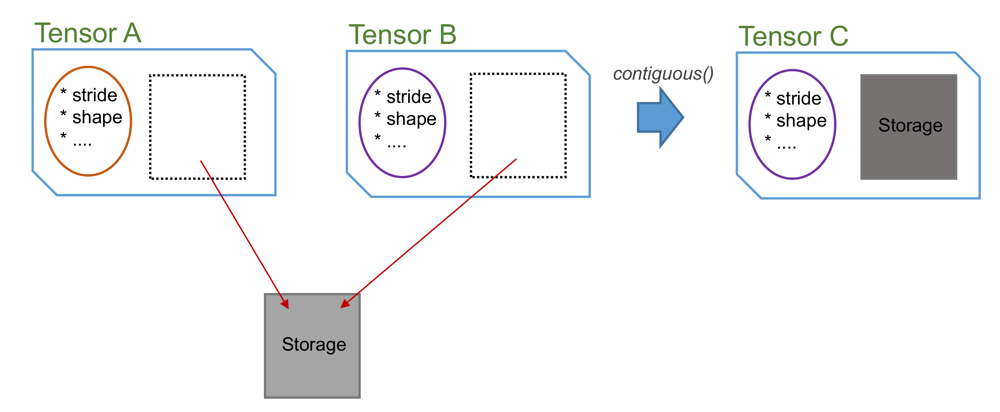

When will data be copied?
--------------------------
There are 2 operations of **cytnx.Tensor** that user need to be careful about: **permute** and **reshape** These 2 operations are stratigically designed to avoid the redundant copy as much as possible. **cytnx.Tensor** follows the same discipline as **numpy.array** and **torch.Tensor** on these 2 operation. 

The following figure shows the strucutre of the Tensor object:

.. image:: image/Tnbasic.png
    :width: 500
    :align: center

Two important concepts need to be brought up: the Tensor **object** itself, and the things that inside Tensor object. Each Tensor object contains two ingredients: 

    1. the **meta** that describe all the attributes of the Tensor 
    2. a **Storage** that contains the data (elements) that store in the memory. 

Reference & Copy of object 
****************************
If you are familiar with python, then one of the most important feature in python 101 is the *referencing* of objects. All the cytnx objects follow the same behavior:

* In python:

.. code-block:: python 
    :linenos:
    
    A = cytnx.zeros([3,4,5])
    B = A

    print(B is A)

* In C++:

.. code-block:: c++
    :linenos:

    auto A = cytnx::zeros({3,4,5});
    auto B = A;

    cout << is(B,A) << endl;

* output:

.. code-block:: text
    
    True

Here, **B** is a reference of **A**, so essentially **B** and **A** are the same object. We can use **is** checks if two objects are the same. Since they are the same object, all the change made to **B** will affect **A** as well.  

To really create a copy of **A**, we can use **clone()**. **clone()** creates a new object with same meta and a new allocated **Storage** that has the same elemenets as storage of **A**:

* In python:

.. code-block:: python
    :linenos:
    
    A = cytnx.zeros([3,4,5])
    B = A.clone()
    
    print(B is A)

* In c++:

.. code-block:: c++
    :linenos:

    auto A = cytnx::zeros({3,4,5});
    auto B = A.clone();

    cout << is(B,A) << endl;

* output:

.. code-block:: text

    False

Permute 
******************************

Now let's take a look on what happened if we performs **permute()** on a Tensor:

* In python:

.. code-block:: python
    :linenos:
    
    A = cytnx.zeros([2,3,4])
    B = A.permute(0,2,1)
    
    print(A)
    print(B)

    print(B is A)

* In c++:

.. code-block:: c++
    :linenos:

    auto A = cytnx::zeros({2,3,4})
    auto B = A.permute(0,2,1);

    cout << A << endl;
    cout << B << endl;

    cout << is(B,A) << endl;

* output:

.. code-block:: text

    Total elem: 24
    type  : Double (Float64)
    cytnx device: CPU
    Shape : (2,3,4)
    [[[0.00000e+00 0.00000e+00 0.00000e+00 0.00000e+00 ]
      [0.00000e+00 0.00000e+00 0.00000e+00 0.00000e+00 ]
      [0.00000e+00 0.00000e+00 0.00000e+00 0.00000e+00 ]]
     [[0.00000e+00 0.00000e+00 0.00000e+00 0.00000e+00 ]
      [0.00000e+00 0.00000e+00 0.00000e+00 0.00000e+00 ]
      [0.00000e+00 0.00000e+00 0.00000e+00 0.00000e+00 ]]]

    Total elem: 24
    type  : Double (Float64)
    cytnx device: CPU
    Shape : (2,4,3)
    [[[0.00000e+00 0.00000e+00 0.00000e+00 ]
      [0.00000e+00 0.00000e+00 0.00000e+00 ]
      [0.00000e+00 0.00000e+00 0.00000e+00 ]
      [0.00000e+00 0.00000e+00 0.00000e+00 ]]
     [[0.00000e+00 0.00000e+00 0.00000e+00 ]
      [0.00000e+00 0.00000e+00 0.00000e+00 ]
      [0.00000e+00 0.00000e+00 0.00000e+00 ]
      [0.00000e+00 0.00000e+00 0.00000e+00 ]]]

    False

We see **A** and **B** now are two different objects (as it should be, they have different shape!). Now let's see what happened if we try to change the element in **A**:

* In python:

.. code-block:: python
    :linenos:
    
    A[0,0,0] = 300

    print(A)
    print(B)
    
* In c++:

.. code-block:: c++
    :linenos:

    A(0,0,0) = 300;

    cout << A << endl;
    cout << B << endl;    

* output:

.. code-block:: text

    Total elem: 24
    type  : Double (Float64)
    cytnx device: CPU
    Shape : (2,3,4)
    [[[3.00000e+02 0.00000e+00 0.00000e+00 0.00000e+00 ]
      [0.00000e+00 0.00000e+00 0.00000e+00 0.00000e+00 ]
      [0.00000e+00 0.00000e+00 0.00000e+00 0.00000e+00 ]]
     [[0.00000e+00 0.00000e+00 0.00000e+00 0.00000e+00 ]
      [0.00000e+00 0.00000e+00 0.00000e+00 0.00000e+00 ]
      [0.00000e+00 0.00000e+00 0.00000e+00 0.00000e+00 ]]]

    Total elem: 24
    type  : Double (Float64)
    cytnx device: CPU
    Shape : (2,4,3)
    [[[3.00000e+02 0.00000e+00 0.00000e+00 ]
      [0.00000e+00 0.00000e+00 0.00000e+00 ]
      [0.00000e+00 0.00000e+00 0.00000e+00 ]
      [0.00000e+00 0.00000e+00 0.00000e+00 ]]
     [[0.00000e+00 0.00000e+00 0.00000e+00 ]
      [0.00000e+00 0.00000e+00 0.00000e+00 ]
      [0.00000e+00 0.00000e+00 0.00000e+00 ]
      [0.00000e+00 0.00000e+00 0.00000e+00 ]]]

Notice that the element in **B** is also changed! So what actually happend? When we call **permute()**, a new object is created that has different *meta*, but two objects actually shares the *same* data storage! There is NO copy of data made:

We can use **Tensor.same_data()** to check if two objects shares the same memory content:

* In python:

.. code-block:: python
    :linenos:
    
    print(B.same_data(A))
    
* In c++:

.. code-block:: c++
    :linenos:

    cout << B.same_data(A) << endl;

* output:

.. code-block:: text
    
    True

As you can see, **permute()** never create duplicate memeory storage. 

Contiguous
********************
Now, let's talk about **contiguous**. In the above example, we see that **permute()** create a new Tensor object with different *meta* but share the same memory storage. The **B** Tensor, which after the permutation its memory layout is no-longer the same as it's shape. The Tensor in this status is called **non-contiguous**. We can use **is_contiguous()** to check if a Tensor is in this status. 

 
* In python:

.. code-block:: python
    :linenos:
    
    A = cytnx.zeros([2,3,4])
    B = A.permute(0,2,1)
    
    print(A.is_contiguous())
    print(B.is_contiguous())

* In c++:

.. code-block:: c++
    :linenos:

    auto A = cytnx::zeros({2,3,4})
    auto B = A.permute(0,2,1);

    cout << A.is_contiguous() << endl;
    cout << B.is_contiguous() << endl;

* output:

.. code-block:: text

    True
    False

We can make a contiguous Tensor **C** that has the same shape of **B** by calling **contiguous()**, which requires moving of the elements in the memory content to their right place that match the shape of Tensor. 

.. code-block:: python
    :linenos:
    
    C = B.contiguous()

    print(C)
    print(C.is_contiguous())

    print(C.same_data(B))
     

* In c++:

.. code-block:: c++
    :linenos:

    auto C = B.contiguous()

    cout << C << endl;
    cout << C.is_contiguous() << endl;
    
    cout << C.same_data(B) << endl;
 

* output:

.. code-block:: text

    Total elem: 24
    type  : Double (Float64)
    cytnx device: CPU
    Shape : (2,4,3)
    [[[0.00000e+00 0.00000e+00 0.00000e+00 ]
      [0.00000e+00 0.00000e+00 0.00000e+00 ]
      [0.00000e+00 0.00000e+00 0.00000e+00 ]
      [0.00000e+00 0.00000e+00 0.00000e+00 ]]
     [[0.00000e+00 0.00000e+00 0.00000e+00 ]
      [0.00000e+00 0.00000e+00 0.00000e+00 ]
      [0.00000e+00 0.00000e+00 0.00000e+00 ]
      [0.00000e+00 0.00000e+00 0.00000e+00 ]]]

    True
    False

.. hint::
    
    We can also make **B** itself to be contiguous by calling **B.contiguous_()**. But notice that this will make a new internal stoarge of **B**, so after calling **B.contiguous_()**, **B.same_data(A)** will be false!

.. note::

    calling **contiguous()** on a Tensor that is already in contiguous status will return itself, and no new object is created!

.. toctree::
