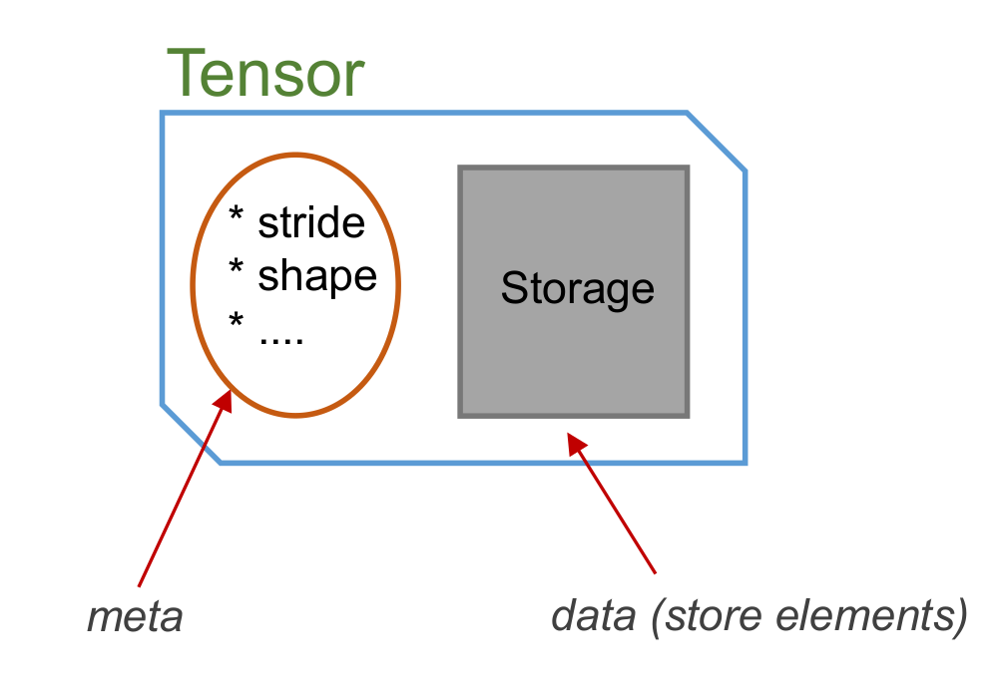

When will data be copied?
--------------------------
There are two elementary operations of **cytnx.Tensor** that are very important: **permute** and **reshape**. These two operations are strategically designed to avoid redundant copy operations as much as possible. **cytnx.Tensor** follows the same principles as **numpy.array** and **torch.Tensor** concerning these two operations. 

The following figure shows the structure of a Tensor object:

Two important concepts need to be distinguished: the Tensor **object** itself, and the things that are stored inside a Tensor object. Each Tensor object contains two ingredients: 

    1. The **meta** contains all the data that describe the attributes of the Tensor, like the shape and the number of elements.
    2. A **Storage** that contains the data (the actual tensor elements) which are stored in memory. 

Reference to & Copy of objects
******************************
One of the most important features in Python is the *referencing* of objects. All the Cytnx objects follow the same behavior:

* In Python:

.. code-block:: python 
    :linenos:
    
    A = cytnx.zeros([3,4,5])
    B = A

    print(B is A)

* In C++:

.. literalinclude:: ../../../code/cplusplus/guide_codes/3_8_1_ex1.cpp
    :language: c++
    :linenos:

Output>>

.. code-block:: text
    
    True

Here, **B** is a reference to **A**, so essentially **B** and **A** are the same object. We can use **is** to check if two objects are the same. Since they are the same object, all changes made to **B** will affect **A** as well.  

To really create a copy of **A**, we can use the **clone()** method. **clone()** creates a new object with copied meta data and a newly allocated **Storage** with the same content as the Storage of **A**:

* In Python:

.. code-block:: python
    :linenos:
    
    A = cytnx.zeros([3,4,5])
    B = A.clone()
    
    print(B is A)

* In C++:

.. literalinclude:: ../../../code/cplusplus/guide_codes/3_8_1_ex2.cpp
    :language: c++
    :linenos:

Output>>

.. code-block:: text

    False

Permute 
******************************

Now let us take a look at what happens if we perform a **permute()** operation on a Tensor:

* In Python:

.. code-block:: python
    :linenos:
    
    A = cytnx.zeros([2,3,4])
    B = A.permute(0,2,1)
    
    print(A)
    print(B)

    print(B is A)

* In C++:

.. literalinclude:: ../../../code/cplusplus/guide_codes/3_8_2_ex1.cpp
    :language: c++
    :linenos:

Output>>

.. code-block:: text

    Total elem: 24
    type  : Double (Float64)
    cytnx device: CPU
    Shape : (2,3,4)
    [[[0.00000e+00 0.00000e+00 0.00000e+00 0.00000e+00 ]
      [0.00000e+00 0.00000e+00 0.00000e+00 0.00000e+00 ]
      [0.00000e+00 0.00000e+00 0.00000e+00 0.00000e+00 ]]
     [[0.00000e+00 0.00000e+00 0.00000e+00 0.00000e+00 ]
      [0.00000e+00 0.00000e+00 0.00000e+00 0.00000e+00 ]
      [0.00000e+00 0.00000e+00 0.00000e+00 0.00000e+00 ]]]

    Total elem: 24
    type  : Double (Float64)
    cytnx device: CPU
    Shape : (2,4,3)
    [[[0.00000e+00 0.00000e+00 0.00000e+00 ]
      [0.00000e+00 0.00000e+00 0.00000e+00 ]
      [0.00000e+00 0.00000e+00 0.00000e+00 ]
      [0.00000e+00 0.00000e+00 0.00000e+00 ]]
     [[0.00000e+00 0.00000e+00 0.00000e+00 ]
      [0.00000e+00 0.00000e+00 0.00000e+00 ]
      [0.00000e+00 0.00000e+00 0.00000e+00 ]
      [0.00000e+00 0.00000e+00 0.00000e+00 ]]]

    False

We see that **A** and **B** are now two different objects (as it should be, they have different shapes!). Now let's see what happens if we change an element in **A**:

* In Python:

.. code-block:: python
    :linenos:
    
    A[0,0,0] = 300

    print(A)
    print(B)
    
* In C++:

.. literalinclude:: ../../../code/cplusplus/guide_codes/3_8_2_ex2.cpp
    :language: c++
    :linenos:

Output>>

.. literalinclude:: ../../../code/cplusplus/outputs/3_8_2_ex2.out
    :language: text

Notice that the element in **B** is also changed! So what actually happened? When we called **permute()**, a new object was created, which has different *meta*, but the two Tensors actually share the *same* data storage! There is NO copy of the tensor elements in memory performed:

.. image:: image/Tnsdat.png
    :width: 500
    :align: center

We can use **Tensor.same_data()** to check if two objects share the same memory storage:

* In Python:

.. code-block:: python
    :linenos:
    
    print(B.same_data(A))
    
* In C++:

.. literalinclude:: ../../../code/cplusplus/guide_codes/3_8_2_ex3.cpp
    :language: c++
    :linenos:

Output>>

.. code-block:: text
    
    True

As you can see, **permute()** never copies the memory storage. 

Contiguous
********************
Next, let's have a look at the **contiguous** property. In the above example, we see that **permute()** created a new Tensor object with different *meta* but sharing the same memory storage. The memory layout of the **B** Tensor no longer corresponds to the tensors shape after the permutation. A Tensor in with this status is called **non-contiguous**. We can use **is_contiguous()** to check if a Tensor is with this status. 

 
* In Python:

.. code-block:: python
    :linenos:
    
    A = cytnx.zeros([2,3,4])
    B = A.permute(0,2,1)
    
    print(A.is_contiguous())
    print(B.is_contiguous())

* In C++:

.. literalinclude:: ../../../code/cplusplus/guide_codes/3_8_3_ex1.cpp
    :language: c++
    :linenos:

Output>>

.. code-block:: text

    True
    False

We can make a contiguous Tensor **C** that has the same shape as **B** by calling **contiguous()**. Creating such a contiguous Tensor requires moving the elements in memory to their right position, matching the shape of the Tensor. 

* In Python:

.. code-block:: python
    :linenos:
    
    C = B.contiguous()

    print(C)
    print(C.is_contiguous())

    print(C.same_data(B))
     

* In C++:

.. literalinclude:: ../../../code/cplusplus/guide_codes/3_8_3_ex2.cpp
    :language: c++
    :linenos:

Output>>

.. code-block:: text

    Total elem: 24
    type  : Double (Float64)
    cytnx device: CPU
    Shape : (2,4,3)
    [[[0.00000e+00 0.00000e+00 0.00000e+00 ]
      [0.00000e+00 0.00000e+00 0.00000e+00 ]
      [0.00000e+00 0.00000e+00 0.00000e+00 ]
      [0.00000e+00 0.00000e+00 0.00000e+00 ]]
     [[0.00000e+00 0.00000e+00 0.00000e+00 ]
      [0.00000e+00 0.00000e+00 0.00000e+00 ]
      [0.00000e+00 0.00000e+00 0.00000e+00 ]
      [0.00000e+00 0.00000e+00 0.00000e+00 ]]]

    True
    False

.. hint::
    
    1. We can also make **B** itself contiguous by calling **B.contiguous_()** (with underscore). Notice that this will create a new internal Storage for **B**, so after calling **B.contiguous_()**, **B.same_data(A)** will be false!
    2. Making a Tensor contiguous involves copying the elements in memory and can slow down the algorithm. Unnecessary calls of **Tensor.contiguous()** or **Tensor.contiguous_()** should therefore be avoided.

.. note::

    calling **contiguous()** on a Tensor that already has contiguous status will return itself, and no new object will be created!

Reshape
*****************

Reshape is an operation that combines/splits indices of a Tensor while keeping the same total number of elements. **Tensor.reshape()** always creates a new object, but whether the internal Storage is shared or not follows the rules:

1. If the Tensor object is in *contiguous* status, then only the *meta* is changed, and the Storage is shared 
2. If the Tensor object is in *non-contiguous* status, then the *contiguous()* will be called first before the *meta* will be changed.

.. toctree::
