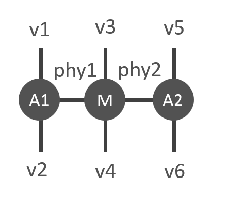

Contract(s)
=============
Contractions of two tensors can be done with **Contract()**. Using this function, indices with the same labels on the two tensors are contracted. **Contracts()** provides the same functionality for more than two tensors. In this case, the contraction order can additionally be specified.

Contract
------------------

The function **cytnx.Contract()** contracts all common labels of two UniTensors. For example:

* In Python:

.. literalinclude:: ../../../code/python/doc_codes/guide_contraction_contract_Contract.py
    :language: python
    :linenos:

Output >>

.. literalinclude:: ../../../code/python/outputs/guide_contraction_contract_Contract.out
    :language: text

Here we see that the labels **j** and **l** appear on both input tensors. Thus, they are contracted. Note that the bond dimensions of the contracted tensors must agree on both tensors.

In order to define which indices shall be contracted without changing the labels on the initial tensors, Cyntx provides the method **.relabels()**. It allows to set common labels on the indices to be contracted and distinct labels on the others. Also, the labels on the resulting tensor can be defined this way. See :ref:`Changing labels` for further details. Suppose that we only want to contract the index *j* in the previous example, but not sum over *l*. We can use **.relabels()** for this task:

* In Python:

.. literalinclude:: ../../../code/python/doc_codes/guide_contraction_contract_relabels.py
    :language: python
    :linenos:

Output >>

.. literalinclude:: ../../../code/python/outputs/guide_contraction_contract_relabels.out
    :language: text

The function **.relabels()** creates a copy of the initial UniTensor and changes the labels, while keeping the labels on the inital tensor unchanged. The actual data is shared between the old and new tensor, only the meta is independent.

Contracts
------------------
The function **Contracts** allows us to contract multiple UniTensors.

The first argument of this function is **TNs**, which is a list containing all UniTensors to be contracted. Contracts also provides the argument **order** to specify a desired contraction order, or the **optimal** option to use an auto-optimized contraction order.

Consider the following contraction task consisting of UniTensors **A1**, **A2** and **M**:

This corresponds to the Python program:

* In Python:

.. literalinclude:: ../../../code/python/doc_codes/guide_contraction_contract_Contracts.py
    :language: python
    :linenos:

Output >>

.. literalinclude:: ../../../code/python/outputs/guide_contraction_contract_Contracts.out
    :language: text

Note that the UniTensors' names have to be specified for an explicitly given contraction order. In this case we specified them in the constructor argument. The order *(M,(A1,A2))* indicates that first all common indices of *A1* and *A2* are contracted, then all common indices of the resulting tensor and *M*.

.. Note::
    All tensors contracted with `Contracts()` need to have unique tensor names. Use `UniTensor.set_name()` to specify the name of a tensor.
