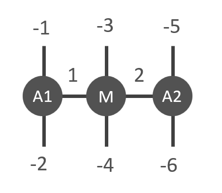

ncon
=============
Another way to contract tensors is by using **ncon**. This function was originally proposed for MATLAB :cite:`pfeifer2015ncon`. It has a syntax where the index connectivity and ordering of the indices on the resulting tensor are defined by integer values. Note that **ncon** requires the user to know the ordering of the bonds in a tensor. Labels are not made use of when using **ncon**.

For a tensor contraction with **ncon**, we first construct a labelled diagram of the desired network contraction. Indices are labelled by integer numbers:

    1. Each index that shall be contracted is labelled with a positive integer (typically starting with 1, but this is not required).
    2. External indices, which shall not be contracted, are labelled with sequential negative integers [-1,-2,-3,…]. These values define the index order of the final tensor, which has -1 as the first index, -2 as the second, ...

Following this, the **ncon** routine is called as:

.. py:function:: OutputTensor = ncon(tensor_list_in, connect_list_in, cont_order)
     
    :param list tensor_list_in: 1D array containing the tensors comprising the network
    :param list connect_list_in: 1D array of vectors. The kth element contains the integer index labels of the kth tensor in tensor_list_in. These integers are defined by the diagram. Their order must correspond to the ordering of indices on the corresponding tensor.
    :param list cont_order: a vector containing the positive integer labels of the diagram. It is used to specify the order in which **ncon** contracts the indices. Note that cont_order is an optional input that can be omitted if desired, in which case ncon will contract in ascending order of the integer values.

For example, we want to contract the following tensor network (as before with *Contracts()*) consisting of tensors **A1**, **A2** and **M**:

In the figure we labelled the internal bonds using unique positive numbers. External legs have negative integer values. This figure translates into an ncon call:

* In Python:

.. code-block:: python
    :linenos:

    # Creating A1, A2, M
    A1 = cytnx.UniTensor(cytnx.random.normal([2,8,8], mean=0., std=1., dtype=cytnx.Type.ComplexDouble));
    A2 = A1.Conj();
    M = cytnx.UniTensor(cytnx.ones([2,2,4,4]))
    
    # Calling ncon
    Res = cytnx.ncon([A1,M,A2],[[1,-1,-2],[1,2,-3,-4],[2,-5,-6]])
    Res.print_diagram()

Output >> 

.. code-block:: text

    -----------------------
    tensor Name : 
    tensor Rank : 6
    block_form  : False
    is_diag     : False
    on device   : cytnx device: CPU
             --------     
            /        \    
            |      8 |____ -1
            |        |    
            |      8 |____ -2
            |        |    
            |      4 |____ -3
            |        |    
            |      4 |____ -4
            |        |    
            |      8 |____ -5
            |        |    
            |      8 |____ -6
            \        /    
             --------     

We see that **ncon** accomplishes contractions similar to **Contracts** or a contraction **Network**. While the code becomes very compact with *ncon*, the user must take care of the correct index order of all tensors. 

.. bibliography:: ref.ncon.bib
    :cited: