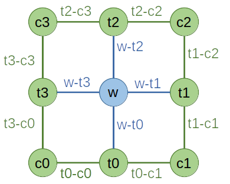

Network
========================

The **Network** object provides a skeleton of a Tensor network diagram. Users can write a *Network file*, which serves as the blue print of a TN structure. With a *Network* defined in such a way, multiple Tensors can be contracted at once. The contraction order can either be specified or automatically optimized by Cytnx. Furthermore, the tensor network can be printed to check the implementation.

*Network* is useful when we have to contract different tensors with the same connectivity many times. We can define the *Network* once and reuse it for several contractions. The contraction order can be optimized once after the first initialization with tensors. In proceeding steps this optimized order can be reused.

Network from .net file
--------------------------

We take a typical contraction in a corner transfer matrix algorithm as an example. The TN diagram is given by:

We implement the diagram as a .net file to represent the contraction task:

* ctm.net:

.. literalinclude:: ../../../code/ctm.net
    :language: text

Note that:

1. The labels above correspond to the diagram you draw, not the label attribute of UniTensor objects. Both label conventions can, but do not have to be the same.
   
2. Labels should be separated by ' , '. In TOUT, a ' ; ' separates the labels in rowspace and colspace.
   
3. TOUT specifies the output configuration, in this case we leave it blank since the result will be a scalar.
   
4. ORDER is optional and used to specify the contraction order manually.

Put UniTensors and Launch
--------------------------
We use the .net file to create a Network. Then, we can load instances of UniTensors:

* In Python:

.. code-block:: python
    :linenos:

    # initialize tensors
    w = cytnx.UniTensor(cytnx.random.normal([2,2,2,2], mean=0., std=1.))
    c0 = cytnx.UniTensor(cytnx.random.normal([8,8], mean=0., std=1.))
    c1 = cytnx.UniTensor(cytnx.random.normal([8,8], mean=0., std=1.))
    c2 = cytnx.UniTensor(cytnx.random.normal([8,8], mean=0., std=1.))
    c3 = cytnx.UniTensor(cytnx.random.normal([8,8], mean=0., std=1.))
    t0 = cytnx.UniTensor(cytnx.random.normal([8,2,8], mean=0., std=1.))
    t1 = cytnx.UniTensor(cytnx.random.normal([8,2,8], mean=0., std=1.))
    t2 = cytnx.UniTensor(cytnx.random.normal([8,2,8], mean=0., std=1.))
    t3 = cytnx.UniTensor(cytnx.random.normal([8,2,8], mean=0., std=1.))

    # initialize network object from ctm.net file
    net = cytnx.Network("ctm.net")

    # put tensors
    net.PutUniTensor("w",w)  
    net.PutUniTensor("c0",c0)
    net.PutUniTensor("c1",c1)
    net.PutUniTensor("c2",c2)
    net.PutUniTensor("c3",c3)
    net.PutUniTensor("t0",t0)
    net.PutUniTensor("t1",t1)
    net.PutUniTensor("t2",t2)  
    net.PutUniTensor("t3",t3)

    print(net)

* In C++:

.. literalinclude:: ../../../code/cplusplus/guide_codes/8_1_2_ex1.cpp
    :language: c++
    :linenos:

Output >> 

.. literalinclude:: ../../../code/cplusplus/outputs/8_1_2_ex1.out
    :language: text

To perform the contraction and get the outcome, we use the .Launch():

* In Python:

.. code-block:: python
    :linenos:

    Res = net.Launch(optimal = True)

* In C++:

.. literalinclude:: ../../../code/cplusplus/guide_codes/8_1_2_ex2.cpp
    :language: c++
    :linenos:

Here if the argument **optimal = True**, the contraction order is always auto-optimized.
If **optimal = False**, the specified ORDER in the .net file will be used. If ORDER is not specified, the order of the tensor definitions in the .net file is used.

.. Note::
    1. The auto-optimized contraction order obtained by calling **.Launch(optimal = True)** is saved in the Network object. If there is no need to re-optimize the order (i.e. the bond dimensions of the input tensors remain (approximately) the same.), we can put new tensors and call **.Launch()** again with **optimal = False**. In this case, the optimized order is reused, which avoids the overhead of recalculating the optimal order.
    2. The indices of the UniTensors to be put into the Network need to be ordered according to the indices in the .net file. Otherwise, the index order can be defined in PutTensor explicitly, see :ref:`PutUniTensor according to label ordering` below.

Network from string
--------------------------
Alternatively, we can implement the contraction directly in the program with FromString(): 

* In Python:

.. code-block:: python
    :linenos:

    net = cytnx.Network()
    net.FromString(["c0: t0-c0, t3-c0",\
                    "c1: t1-c1, t0-c1",\
                    "c2: t2-c2, t1-c2",\
                    "c3: t3-c3, t2-c3",\
                    "t0: t0-c1, w-t0, t0-c0",\
                    "t1: t1-c2, w-t1, t1-c1",\
                    "t2: t2-c3, w-t2, t2-c2",\
                    "t3: t3-c0, w-t3, t3-c3",\
                    "w: w-t0, w-t1, w-t2, w-t3",\
                    "TOUT:",\
                    "ORDER: ((((((((c0,t0),c1),t3),w),t1),c3),t2),c2)"])

This approach can be convenient if you do not want to maintain the .net files.

PutUniTensor according to label ordering
------------------------------------------

When we put a UniTensor into a Network, we can also specify its leg order according to a label ordering, this interface turns out to be convinient since users don't need to memorize look up the index of s desired leg. To be more specific, consider a example, we grab two three leg tensors **A1** and **A2**, they both have one leg that spans the physical space and the other two legs describe the virtual space (such tensors are often appearing as the building block tensors of matrix product state), we create the tensors and set the corresponding lebels as following:

* In Python:

.. code-block:: python
    :linenos:

    A1 = cytnx.UniTensor(cytnx.random.normal([2,8,8], mean=0., std=1., dtype=cytnx.Type.ComplexDouble));
    A1.relabels_(["phy","v1","v2"]);
    A2 = A1.Conj();
    A2.relabels_(["phy*","v1*","v2*"]);

The legs of these tensors are arranged such that the first leg is the physical leg (with dimension 2 for spin-half case for example) and the other two legs are the virtual ones (with dimension 8).

Now suppose somehow we want to contract these two tensors by its physical legs, we create the following Network:

.. .. code-block:: python
..     :linenos:

..     net = cytnx.Network()
..     net.FromString(["T0: v0in, phy, v0out",\
..                     "T1: v1in, phy, v1out",\
..                     "TOUT: v0in, v1in; v0out, v1out"])

* In Python:

.. code-block:: python
    :linenos:

    N = cytnx.Network()
    N.FromString(["A1: in1,phys,out1",\
                  "A2: in2,phys,out2",\
                  "TOUT: in1,in2;out1,out2"])

Note that in this Network the second leg of the two tensors are to be contracted. This is not consistent to the definition of **A1** and **A2** which are created such that their physical leg is the first one. We can call `PutUniTensor` and specify the labels though:

* In Python:

.. code-block:: python
    :linenos:

    N.PutUniTensor("A1",A1,["v1","phy","v2"])
    N.PutUniTensor("A2",A2,["v1*","phy*","v2*"])
    Res=N.Launch()
    Res.print_diagram()

Output >> 

.. code-block:: text

    -----------------------
    tensor Name : 
    tensor Rank : 4
    block_form  : False
    is_diag     : False
    on device   : cytnx device: CPU
                ---------     
               /         \    
       in1 ____| 8     8 |____ out1
               |         |    
       in2 ____| 8     8 |____ out2
               \         /    
                ---------     

So when calling `PutUniTensor()` we add the third argument which is a labels ordering. This will permute the tensor legs according to the given label ordering before putting them into the Network.

.. toctree::

