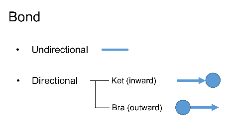

Bond
=======
A **Bond** is an object that represent the legs of a tensor. It carries informations such as direction, dimension and quantum numbers (if with Symmetry). 

There are in general two types of Bonds: **directional** and **undirectional** depending on whether the bond has direction (pointing inward to or outward from the tensor body) or not. The inward Bond is also defined as **Ket** type, and the outward Bond is defined as **Bra** type, which represent the *Braket* notation in the quantum mechanic: 

Let's introduce the complete API for constructing a Bond:

.. py:function:: Bond(dim, bd_type, in_qnums, in_syms)
     
    :param int dim: The dimension of the bond.
    :param bondType bd_type: The type (direction) of the bond, can be BD.REG--undirectional, BD.Ket--inward, BD.Bra--outward.
    :param List[List[int]] in_qnums: A size of *dim* List, each element is a List specifiy the quantum numbers for each dimension, the quantum numbers in this List correspond to the symmetries given in the next argument.
    :param List[Symmetry] in_syms: A list of Symmetry objects, specifying the symmetries of the bond.

Symmetry object
**********************

In Cytnx we have the Symmetry as object, it mainly contains the name, type, combine rule and the reverse rule of that symmetry, let's create a U1 symmetry and a Z_2 symmetry and print their info:

* In python:

.. code-block:: python
    :linenos:

    sym_u1 = Symmetry.U1()
    sym_z2 = Symmetry.Zn(2)
    print(sym_u1)
    print(sym_z2)
    
* In c++:

.. code-block:: c++
    :linenos:

    Symmetry sym_u1 = Symmetry::U1();
    Symmetry sym_z2 = Symmetry::Zn(2);

    cout << sym_u1 << endl;
    cout << sym_z2 << endl;

Output >>

.. code-block:: text

    --------------------
    [Symmetry]
    type : Abelian, U1
    combine rule : Q1 + Q2
    reverse rule : Q*(-1) 
    --------------------

    --------------------
    [Symmetry]
    type : Abelian, Z(2)
    combine rule : (Q1 + Q2)%2
    reverse rule : Q*(-1) 
    --------------------

Create the Bonds
********************

Follow the API introduced above, here we show a example creating two U1 bonds:

* In python:

.. code-block:: python
    :linenos:

    bd_sym_u1_a = Bond(4,BD_KET,[[0],[-4],[-2],[3]],[sym_u1])
    bd_sym_u1_b = Bond(4,BD_KET,[[0],[-4],[-2],[3]]) #default is U1 symmetry
    print(bd_sym_u1_a)
    print(bd_sym_u1_b)
    print(bd_sym_u1_a == bd_sym_u1_b, flush=True)

* In c++:

.. code-block:: c++
    :linenos:

    Bond bd_sym_u1_a = Bond(4,BD_KET,{{0},{-4},{-2},{3}},{sym_u1});
    Bond bd_sym_u1_b = Bond(4,BD_KET,{{0},{-4},{-2},{3}}); // default is U1 symmetry
    cout << bd_sym_u1_a << endl;
    cout << bd_sym_u1_b << endl;
    cout << (bd_sym_u1_a == bd_sym_u1_b) << endl;

Output >>

.. code-block:: text

    Dim = 4 |type: KET>     
    U1::  +0 -4 -2 +3

    Dim = 4 |type: KET>     
    U1::  +0 -4 -2 +3

    True

Let's create another U1 bond **bd_sym_u1_c**, and conbine it with **bd_sym_u1_a**:

* In python:

.. code-block:: python
    :linenos:

    bd_sym_u1_c = Bond(5,BD_KET,[[-1],[1],[2],[-2],[0]])
    print(bd_sym_u1_a)
    print(bd_sym_u1_c)

    bd_sym_all = bd_sym_u1_a.combineBond(bd_sym_u1_c)
    print(bd_sym_all)

* In c++:

.. code-block:: c++
    :linenos:

    Bond bd_sym_u1_c = Bond(5,BD_KET,{{-1},{1},{2},{-2},{0}});
    cout << bd_sym_u1_a << endl;
    cout << bd_sym_u1_c << endl;

    Bond bd_sym_all = bd_sym_u1_a.combineBond(bd_sym_u1_c);
    cout << bd_sym_all << endl;

Output >>

.. code-block:: text

    Dim = 4 |type: KET>     
    U1::  +0 -4 -2 +3

    Dim = 5 |type: KET>     
    U1::  -1 +1 +2 -2 +0

    Dim = 20 |type: KET>     
    U1::  -1 +1 +2 -2 +0 -5 -3 -2 -6 -4 -3 -1 +0 -4 -2 +2 +4 +5 +1 +3

Here we can observe the quantum numbers of **bd_sym_u1_a** combine with **bd_sym_u1_c** and generated 20 quantum numbers, respecting the combine rule (addition) of U1 symmetry.

.. toctree::

