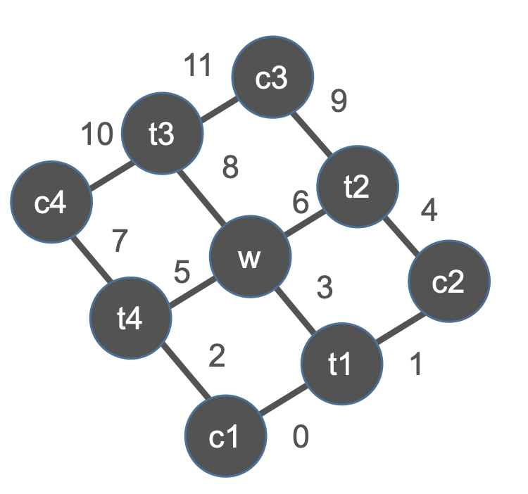

Network
==========
Network is a class for contracting UniTensors, it is useful when we have to perform the same large contraction task many times.
We can create configuration for the contraction task and put the "constant" UniTensors in at the initialization step of some algorithms, 
later when runing the sweeping or the iterative steps, we put the variational tensors in and launch the network to get the results.

Network from .net file
************************
Let's take the corner transfer matrix for example, first we draw the desired tensor network diagram:

We now convert the diagram to the .net file to represent the contraction task, which is straghtforward:

* ctm.net:

.. code-block:: text
    :linenos:

    c1: ;0,2
    t1: ;1,3,0
    c2: ;4,1
    t2: ;9,6,4
    c3: ;11, 9
    t3: ;10, 8, 11
    c4: ;7, 10
    t4: ;2,5,7
    w: ;3,6,8,5
    TOUT:
    ORDER: ((((((((c1,t1),c2),t4),w),t2),c4),t3),c3)

Note that:

1. The labels above correspond to the diagram you draw, not the label attribute of UniTensor object itself.
   
2. Labels should be seperated by ' , ', and ' ; ' seperate the labels in rowspace and colspace. In the above case all legs live in the colspace.
   
3. TOUT specify the output configuration, in this case we leave it blank since we will get a scalar outcome.
   
4. ORDER is optional and used to specify the contraction order manually.

Put UniTensors and Launch
**************************
To use, we simply create the Network object (at the same time we load the .net file), and put the UniTensors:

* In python:

.. code-block:: python
    :linenos:

    N = Network("ctm.net")
    N.PutUniTensor("c1",c1)
    N.PutUniTensor("c2",c2)
    print(N)
    N.PutUniTensor("c3",c3)
    # and so on...

* In C++:

.. code-block:: c++
    :linenos:

    Network N = Network("ctm.net");
    N.PutUniTensor("c1",c1);
    N.PutUniTensor("c2",c2);
    cout << N;
    N.PutUniTensor("c3",c3)
    // and so on...

Output >> 

.. code-block:: text

    ==== Network ====
    [o] c1 : ; 0 2 
    [x] t1 : ; 1 3 0 
    [o] c2 : ; 4 1 
    [x] t2 : ; 9 6 4 
    [x] c3 : ; 11 9 
    [x] t3 : ; 10 8 11 
    [x] c4 : ; 7 10 
    [x] t4 : ; 2 5 7 
    [x] w : ; 3 6 8 5 
    TOUT : ; 
    ORDER : ((((((((c1,t1),c2),t4),w),t2),c4),t3),c3)
    =================

To perform the contraction and get the outcome, we use the Launch():

* In python:

.. code-block:: python
    :linenos:

    Res = N.Launch(optimal = True)

* In C++:

.. code-block:: c++
    :linenos:

    UniTensor Res = N.Launch(true)

Note that if the argument optimal = True, the contraction ORDER is always auto-optimized.
If optimal = False, the specified ORDER in network file will be used, otherwise contract one by one in sequence.

Network from string
********************
Alternatively, we can implement the contraction directly in the program with FromString(): 

* In python:

.. code-block:: python
    :linenos:

    N = cytnx.Network()
    N.FromString(["c1: ;0, 2",\
                "t1: ;1, 3, 0",\
                "c2: ;4, 1",\
                "t2: ;9, 6, 4",\
                "c3: ;11, 9",\
                "t3: ;10, 8, 11",\
                "c4: ;7, 10",\
                "t4: ;2, 5, 7",\
                "w: ;3, 6, 8, 5",\
                "TOUT:",\
                "ORDER: ((((((((c1,t1),c2),t4),w),t2),c4),t3),c3)"])

This approach should be convenient when you don't want to maintain the .net file outside the program.

.. toctree::

