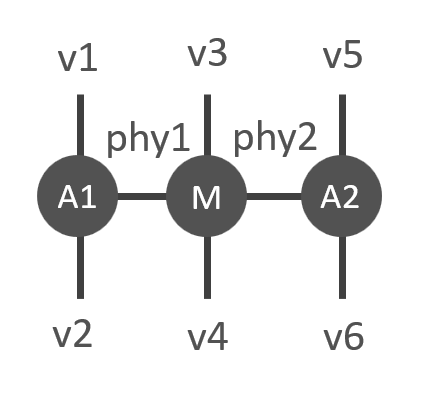
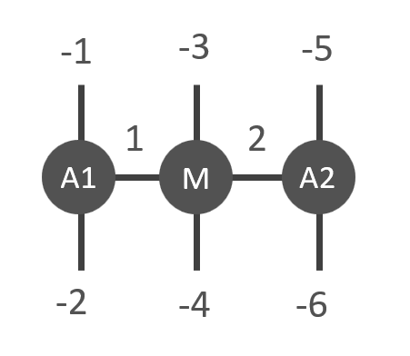

Contraction
==========
Cytnx provides rich UniTenosr contraction interfaces, in this section we introcuce several methods to contract a desired tensor network.

Contract()
------------------

For the contraction of two UniTensor, we have the function **cytnx.Contract()** to do the job, what it does is simply contract 
the common labels of two UniTensors. Here is a example:

* In python:

.. code-block:: python
    :linenos:

    A = cytnx.UniTensor(cytnx.ones([3,3,3]), rowrank = 1)
    A.set_labels([1,2,3])

    B = cytnx.UniTensor(cytnx.ones([3,3,3,3]), rowrank = 2)
    B.set_labels([2,3,4,5])

    C = cytnx.Contract(A, B)

    A.print_diagram()
    B.print_diagram()
    C.print_diagram()

Output >> 

.. code-block:: text

    -----------------------
    tensor Name : 
    tensor Rank : 3
    block_form  : false
    is_diag     : False
    on device   : cytnx device: CPU
             -------------      
            /             \     
      1 ____| 3         3 |____ 2  
            |             |     
            |           3 |____ 3  
            \             /     
             -------------      
    -----------------------
    tensor Name : 
    tensor Rank : 4
    block_form  : false
    is_diag     : False
    on device   : cytnx device: CPU
             -------------      
            /             \     
      2 ____| 3         3 |____ 4  
            |             |     
      3 ____| 3         3 |____ 5  
            \             /     
             -------------     
    -----------------------
    tensor Name : 
    tensor Rank : 3
    block_form  : false
    is_diag     : False
    on device   : cytnx device: CPU
             -------------      
            /             \     
      1 ____| 3         3 |____ 4  
            |             |     
            |           3 |____ 5  
            \             /     
             -------------   

Here we see that legs from two UniTensors with same labels **2** and **3** are contracted.

Often we have to change the labels of UniTensors in order to do the desired contraction, to reduce the inconvinence of maintaining
labels, we provide **.relabels()** to relabel the UniTensors, this in fact return us a copy of UniTensor to do the contraction job,
while the labels of the original UniTensor itself are preserved. Here is the example:

* In python:

.. code-block:: python
    :linenos:

    A = cytnx.UniTensor(cytnx.ones([3,3,3]), rowrank = 1)
    A.set_labels([1,2,3])
    At = A.relabels([-1,-2,-3])

    B = cytnx.UniTensor(cytnx.ones([3,3,3]), rowrank = 1)
    B.set_labels([4,5,6])
    Bt = B.relabels([-3,-4,-5])

    C = cytnx.Contract(At, Bt)

    A.print_diagram()
    B.print_diagram()
    C.print_diagram()

Output >> 

.. code-block:: text

    -----------------------
    tensor Name : 
    tensor Rank : 3
    block_form  : false
    is_diag     : False
    on device   : cytnx device: CPU
             -------------      
            /             \     
      1 ____| 3         3 |____ 2  
            |             |     
            |           3 |____ 3  
            \             /     
             -------------      
    -----------------------
    tensor Name : 
    tensor Rank : 3
    block_form  : false
    is_diag     : False
    on device   : cytnx device: CPU
             -------------      
            /             \     
      3 ____| 3         3 |____ 4  
            |             |     
            |           3 |____ 5  
            \             /     
             -------------      
    -----------------------
    tensor Name : 
    tensor Rank : 4
    block_form  : false
    is_diag     : False
    on device   : cytnx device: CPU
             -------------      
            /             \     
      1 ____| 3         3 |____ 2  
            |             |     
            |           3 |____ 4  
            |             |     
            |           3 |____ 5  
            \             /     
             -------------   

Note that in this example, two UniTensors **A** and **B** have no labels in common, but we somehow want to contract them while
preserving their labels, that's the reason why we use **.relabels** here.

Contracts()
------------------
The function **Contracts** allow us to contract multiple Unitensors, this function take one argument which is a list contains UniTensors to be contracted,
consider the following contraction task consists of UniTensors **A1**, **A2** and **M**:

translate to the code we have:

* In python:

.. code-block:: python
    :linenos:

    # Creating A1, A2, M
    A1 = cytnx.UniTensor(cytnx.ones([2,8,8]))
    A2 = cytnx.UniTensor(cytnx.ones([2,8,8]))
    M = cytnx.UniTensor(cytnx.ones([2,2,4,4]))

    # Assign labels
    A1.set_labels(["phy1","v1","v2"])
    M.set_labels(["phy1","phy2","v3","v4"])
    A2.set_labels(["phy2","v5","v6"])

    # Use Contracts
    res = cytnx.Contracts([A1,M,A2])

ncon()
------------------
The **ncon** is a useful function to reduce users' programming effort required to implement a tesnor network contraction. The function automatically performing a desired sequence of permutes, reshapes and matrix multiplications required to evaluate a tensor network.
To use ncon, we first make a labelled diagram of the desired network contraction such that:
Each internal index (index to be contracted) is labelled with a unique positive integer (typically sequential integers starting from 1, although this is not necessary).

External indices of the diagram (if there are any) are labelled with sequential negative integers [-1,-2,-3,…] which denote the desired index order on the final tensor (with -1 as the first index, -2 as the second etc).

Following this, the **ncon** routine is called as follows,

.. py:function:: OutputTensor = ncon(tensor_list_in, connect_list_in, cont_order)
     
    :param list tensor_list_in: 1D array containing the tensors comprising the network
    :param list connect_list_in: 1D array of vectors, where the kth element is a vector of the integer labels from the diagram on the kth tensor from tensor_list_in (ordered following the corresponding index order on this tensor).
    :param list cont_order: a vector containing the positive integer labels from the diagram, used to specify order in which **ncon** contracts the indices. Note that cont_order is an optional input that can be omitted if desired, in which case ncon will contract in ascending order of index lab.

For example, we want to contract the following tesnor network (again) consists of tensors **A1**, **A2** and **M**:

In the figure we labelled the internal leg using the unique positive numbers and extermal legs the negative ones, translate this figure
to the ncon function calling we have:

* In python:

.. code-block:: python
    :linenos:

    # Creating A1, A2, M
    A1 = cytnx.UniTensor(cytnx.ones([2,8,8]))
    A2 = cytnx.UniTensor(cytnx.ones([2,8,8]))
    M = cytnx.UniTensor(cytnx.ones([2,2,4,4]))

    # Calling ncon
    res = cytnx.ncon([A1,M,A2],[[1,-1,-2],[1,2,-3,-4],[2,-5,-6]])

We see that **ncon** accomplish the similar thing as **Contracts**, just now the labeling of the UniTensors in the network 
is incorporated into the function argument thus make the code more compact.

Network()
------------------

Network is a class for contracting UniTensors, it is useful when we have to perform the same large contraction task many times.
We can create configuration for the contraction task and put the "constant" UniTensors in at the initialization step of some algorithms, 
later when runing the sweeping or the iterative steps, we put the variational tensors in and launch the network to get the results.

Network from .net file
************************
Let's take the corner transfer matrix for example, first we draw the desired tensor network diagram:

.. image:: image/ctm.png
    :width: 300
    :align: center

We now convert the diagram to the .net file to represent the contraction task, which is straghtforward:

* ctm.net:

.. code-block:: text
    :linenos:

    c1: 0,2
    t1: 1,3,0
    c2: 4,1
    t2: 9,6,4
    c3: 11, 9
    t3: 10, 8, 11
    c4: 7, 10
    t4: 2,5,7
    w: 3,6,8,5
    TOUT:
    ORDER: ((((((((c1,t1),c2),t4),w),t2),c4),t3),c3)

Note that:

1. The labels above correspond to the diagram you draw, not the label attribute of UniTensor object itself.
   
2. Labels should be seperated by ' , ', and ' ; ' seperate the labels in rowspace and colspace. In the above case all legs live in the colspace.
   
3. TOUT specify the output configuration, in this case we leave it blank since we will get a scalar outcome.
   
4. ORDER is optional and used to specify the contraction order manually.

Put UniTensors and Launch
**************************
To use, we simply create the Network object (at the same time we load the .net file), and put the UniTensors:

* In python:

.. code-block:: python
    :linenos:

    N = Network("ctm.net")
    N.PutUniTensor("c1",c1)
    N.PutUniTensor("c2",c2)
    print(N)
    N.PutUniTensor("c3",c3)
    # and so on...

* In C++:

.. code-block:: c++
    :linenos:

    Network N = Network("ctm.net");
    N.PutUniTensor("c1",c1);
    N.PutUniTensor("c2",c2);
    cout << N;
    N.PutUniTensor("c3",c3)
    // and so on...

Output >> 

.. code-block:: text

    ==== Network ====
    [o] c1 : 0 2 
    [x] t1 : 1 3 0 
    [o] c2 : 4 1 
    [x] t2 : 9 6 4 
    [x] c3 : 11 9 
    [x] t3 : 10 8 11 
    [x] c4 : 7 10 
    [x] t4 : 2 5 7 
    [x] w : 3 6 8 5 
    TOUT : ; 
    ORDER : ((((((((c1,t1),c2),t4),w),t2),c4),t3),c3)
    =================

To perform the contraction and get the outcome, we use the Launch():

* In python:

.. code-block:: python
    :linenos:

    Res = N.Launch(optimal = True)

* In C++:

.. code-block:: c++
    :linenos:

    UniTensor Res = N.Launch(true)

Note that if the argument optimal = True, the contraction ORDER is always auto-optimized.
If optimal = False, the specified ORDER in network file will be used, otherwise contract one by one in sequence.

Network from string
********************
Alternatively, we can implement the contraction directly in the program with FromString(): 

* In python:

.. code-block:: python
    :linenos:

    N = cytnx.Network()
    N.FromString(["c1: 0, 2",\
                "t1: 1, 3, 0",\
                "c2: 4, 1",\
                "t2: 9, 6, 4",\
                "c3: 11, 9",\
                "t3: 10, 8, 11",\
                "c4: 7, 10",\
                "t4: 2, 5, 7",\
                "w: 3, 6, 8, 5",\
                "TOUT:",\
                "ORDER: ((((((((c1,t1),c2),t4),w),t2),c4),t3),c3)"])

This approach should be convenient when you don't want to maintain the .net file outside the program.

PutUniTensor according to label ordering
********************************************

When we put a UniTensor into a Network, we can also specify its leg order according to a label ordering, this interface turns out to be convinient
since users don't need to memorize or look up the index of s desired leg. To be more specific, consider
a example, we grab two three leg tensors **A1** and **A2**, they both have one leg that spans the physical space and the other two legs describe
the virtual space (such tensors are often appearing as the building block tensors of matrix product state), we create the tensors and set the corresponding lebels
as following:

* In python:

.. code-block:: python
    :linenos:

    A1 = cytnx.UniTensor(cytnx.ones([2,8,8]));
    A1.set_labels(["phy","v1","v2"])
    A2 = cytnx.UniTensor(cytnx.ones([2,8,8]));
    A2.set_labels(["phy","v1","v2"])

The legs of these tensors are arranged such that the first leg is the physical leg (with dimension 2 for spin-half case for example) and the other two legs are
the virtual ones (with dimension 8).

Now suppose somehow we want to contract these two tensors by its physical legs, we create the following Network:

* In python:

.. code-block:: python
    :linenos:

    N = cytnx.Network()
    N.FromString(["A1: 1,-1,2",\
                "A2: 3,-1,4",\
                "TOUT: 1,3;2,4"])

Note that in this Network it is the second leg of the two tensors to be contracted, which will not be consistent since **A1** and **A2**
are created such that their physical leg is the first one, while we can do the following:

* In python:

.. code-block:: python
    :linenos:

    N.PutUniTensor("A1",A1,["v1","phy","v2"])
    N.PutUniTensor("A2",A2,["v1","phy","v2"])

So when we do the PutUniTensor() we add the third arguement which is a labels ordering, what this function will do is nothing but permute
the tensor legs according to this label ordering before putting them into the Network.  

.. toctree::

