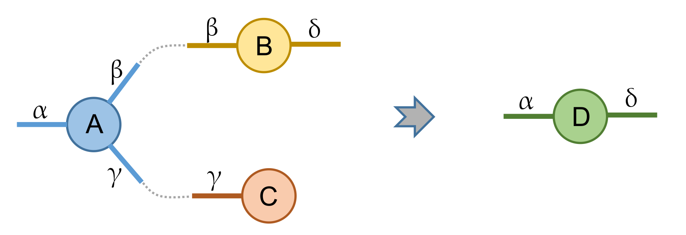
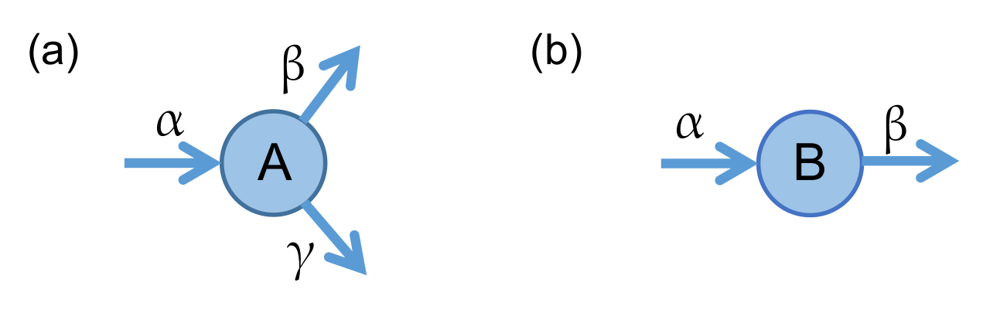

Tensor Notation
==================
Before explaining how to use UniTensor, let's first introduce the very useful graphical notation which is common when dealing with the tensor networks.

A tensor can be though of as a multi-dimensional array. For example, a rank-0 tensor is scalar, a rank-1 tensor is a vector and a rank-2 tensor is a matrix. 
Mathematically, a rank-N tensor can be written in symbolic notation as 

.. math::
    
    T_{i_1,i_2 \cdots, i_N}

The :math:`i_1` to :math:`i_N` represent the (values of the) indices of a tensor, while :math:`T_{i_1,i_2 \cdots, i_N}` represents the elements of the tensor. 

This notation is standard, but when considering many tensors multiplied together in a tensor network, the expressions can become difficult to read and not easy to understand. Therefore, a graphical tensor notation was established, which is commonly used in tensor network literature. We explain our conventions in the following. 

Each tensor is represented by a node (sometimes also called vertex in graph theory) and several bonds (legs or links) attached to it. 
The number of bonds represents the *rank* of the tensor. 

.. image:: image/Not.png
    :width: 600
    :align: center

For example, the above tensors represent (a) a rank-0 tensor, which is a scalar, (b) a rank-1 tensor, which is a *vector*, (c) a rank-2 tensor, which is *matrix* and (d) a rank-3 tensor. 

Tensor Contraction 
------------------------
A powerful operation with tensors is the tensor multiplication. It is used in tensor networks, which consist of several tensors that get multiplied in a specific way. Let us consider a multiplication of three tensors as an example, a rank-3 tensor :math:`A_{\alpha\beta\gamma}`, a rank-2 tensor (matrix) :math:`B_{\beta\delta}` and a rank-1 tensor (vector) :math:`C_{\gamma}`. They are multiplied by summing over the common indices :math:`\beta` and :math:`\gamma` which results in a rank-2 tensor :math:`D_{\alpha\delta}` . With Einstein notation:

.. math::
    
    D_{\alpha\delta} = A_{\alpha\beta\gamma}B_{\beta\delta}C_{\gamma}

In the graphical notation, this is equivalent to the following diagram:

where the dashed lines indicate connections of two bonds with the same indices. Summing over an index is simply represented by the connection of the corresponding bonds. The multiplication of two (or more) tensors is called a *contraction* of tensors. 

Direction of bond
-----------------------
Above, we have introduced the graphical notation which can represent any tensors and index summations and is equivalent to a certain mathematical expression. 

Each bond of a tensor can be interpreted as a vectors space. In quantum systems, we often want to indicate the physical space with a *bra* (:math:`<\psi|`) or *ket* (:math:`|\psi>`). For example, a matrix can generally be represented as :math:`A = |\alpha><\beta|`. A *ket* can only be multiplied (contracted) with a *bra*.  

To distinguish these two kinds of bonds and ensure that only compatible indices get contracted, we introduce a **direction** (arrow) for each bond in the graphical notation. A bond with an arrow pointing towards the node indicates a *ket* and an arrow pointing away from the node indicates a *bra*:

These represent (a) a rank-3 tensor :math:`A = |\alpha><\beta|<\delta|` and (b) a rank-2 tensor :math:`B = |\alpha><\beta|`. 

Just like in physics, a *ket* bond cannot be multiplied with a *bra* bond. In the tensor notation, this means that two bonds with conflicting directions cannot be contracted with each other:

.. note:: 

    Generally, all bonds represent different vector spaces which are not interchangeable, especially in the more complicated cases where each bond carries different quantum numbers. Therefore, even if the dimension of a bond is the same, bonds can only be multiplied if they are compatible and the directions match. 

.. toctree::

