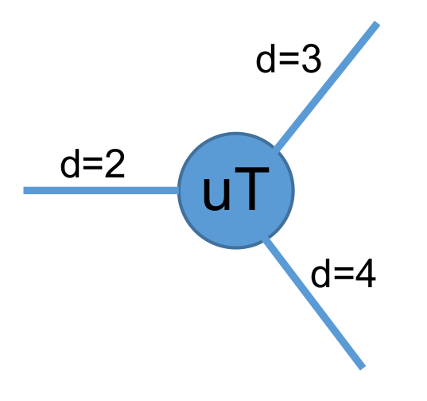

Create UniTensor
------------------
As mentioned in the intro, a UniTensor = Block(s) + Bond(s) + Label(s). For which Block(s) are the place holder for data, while Bond(s) and Label(s) are the meta data that describe the properties of the UniTensor. 

.. image:: image/utcomp.png
    :width: 600
    :align: center

Generally, there are two types of UniTensor: **un-tagged** and **tagged** UniTensor, depending on whether the bond has *direction*. In a more advanced application, the underlying UniTensor may have block diagonalize or other more complicated structure when Symmetries are invoved, in that case, the UniTensor can further categorized into **non-symmetry** and **with symmetry (block form)**, which we summarized by the table in the following. 

+-----------+-----------------+-----------------------------------+
|           |     non-sym     |  with Symmetry(block-diagonalize) |
+-----------+-----------------+-----------------------------------+
| tagged    |     **O**       |              **O**                |
+-----------+-----------------+-----------------------------------+
| untagged  |     **O**       |              **X**                |
+-----------+-----------------+-----------------------------------+

   
In the following, we will introduce how to construct a UniTensor. 

Construct from Tensor 
************************

Before going into more complicated UniTensor structure, first of all let's start with the most simple example, for which we convert a Tensor into a UniTensor, and use this to introduce the first type of UniTensor we encounter: **untagged** UniTensor.  

In the following, let's use a simple rank-3 tensor as example to give you a glance on some basic properties of UniTensor. The tensor notation (diagram) looks like:

.. code-block:: python
    :linenos:

    import cytnx as cy

    # create a rank-3 tensor with shape [2,3,4]
    T = cy.arange(2*3*4).reshape(2,3,4) 

    # convert to UniTensor:
    uT = cy.UniTensor(T)

    
Here, we simply convert a Tensor **T** into a UniTensor **uT** simply by wrapping it with constructor *cy.UniTensor()*. Formally, we should think of this as we constructing a UniTensor **uT** with **T** being **uT**'s *block* (data). 

We can use **print_diagram()** to visualize the UniTensor in a more straightforward way as a diagram: 

.. code-block:: python 
    :linenos:
        
    uT.print_diagram()

Output >> 

.. code-block:: text
    
    tensor Name : 
    tensor Rank : 3
    block_form  : false
    is_diag     : False
    on device   : cytnx device: CPU
                -------------      
               /             \     
         0 ____| 2         3 |____ 1  
               |             |     
               |           4 |____ 2  
               \             /     
                -------------      

There are a lot of information provided in this output which we will explain in details:

1. **Bonds:** They are attach to the left side and/or right side of the center square. Now you might wonder why there are bonds putting on left/right? In cytnx, we use a property called **rowrank** to determine that. The first *rowrank* bonds will be put on the left and the rest will be on the right. We will get back to this property later. But right now, let's just assume it take arbitrary integer 0 < rowrank < rank). The number of bonds indicates the rank of the UniTensor, which also indicates in the second line *tensor Rank*. 

    **Ex:** 
        Here, we have three bonds, indicates it's a rank-3 UniTensor.

2. **Labels&dimensions:** The number on the outside of each bond represent the *label* of that bond, and the numbers indicate the *dimension* (number of elements) of each bond. 

    **Ex:**
        * The bond on the left side   has dimension=2 and label=0.
        * The bond on the upper-right has dimension=3 and label=1.
        * The bond on the lower-right has dimension=4 and label=2. 

.. note::

    The order of the bonds are arranged from left to right and up to down. for this example, the bond with label=0 is the first bond (index=0); the bond with label=1 is the seoncd bond (index=1); the bond with label=2 is the 3rd bond (index=2).

3. **tensor name:** The name (alias) of the UniTensor. User can give UniTensor a name using **UniTensor.set_name()** 

.. code-block:: python 
    :linenos:

    uT.set_name("tensor uT")
    print(uT)

Output >>
 
.. code-block:: text
    :emphasize-lines: 1

    Tensor name: tensor uT
    braket_form : False
    is_diag    : False

    Total elem: 24
    type  : Double (Float64)
    cytnx device: CPU
    Shape : (2,3,4)
    [[[0.00000e+00 0.00000e+00 0.00000e+00 0.00000e+00 ]
      [0.00000e+00 0.00000e+00 0.00000e+00 0.00000e+00 ]
      [0.00000e+00 0.00000e+00 0.00000e+00 0.00000e+00 ]]
     [[0.00000e+00 0.00000e+00 0.00000e+00 0.00000e+00 ]
      [0.00000e+00 0.00000e+00 0.00000e+00 0.00000e+00 ]
      [0.00000e+00 0.00000e+00 0.00000e+00 0.00000e+00 ]]]

.. tip::

    You can use **UniTensor.name()** to get the name property of the UniTensor.  

4. **on device:** This indicates the data of current UniTensor is on which device (cpu or gpu). 

.. note::
    
    The dtype and device of a UniTensor depends on the underlying *block* (data) of the UniTensor. 

.. tip::

    Similar to **cytnx.Tensor**, one can use **.to()** to move a UniTensor between devices! 

From scratch
**************  
Next, let's introduce the complete API for construct a UniTensor:

.. py:function:: UniTensor(bonds, labels, rowrank, dtype, device, is_diag)
     
    :param List[cytnx.Bond] bonds: The list of bonds 
    :param List[string] labels: The list of labels associate to each bond 
    :param int rowrank: the rowrank when flatten into matrix. 
    :param cytnx.Type dtype: the dtype of the block(s). 
    :param cytnx.Device device: the device where the block(s) are hold. 
    :param bool is_diag: whether the UniTensor is diagonal. 

The first argument **bonds** is a list of bond object, which is similar to the *shape* of **cytnx.Tensor** where the elements in *shape* indicates the dimension of the rank. Here, each rank is represent by a **cytnx.Bond** object. In general, **cytnx.Bond** contains three things:

1. The dimension of the bond. 
2. The direction of the bond (it can be BD_REG--undirectional, BD_KET (BD_IN)--inward, BD_BRA (BD_OUT)--outward) 
3. The symmetry and the associate quantum numbers. 

For more details, see **Bond** section. Here, for simplicity, we will use only the dimension property of a Bond. 

Now let's construct the rank-3 UniTensor with the same shape as the above example, and assign those three bonds with labels (a,b,c) and also set name to be "uT2"

.. image:: image/ut2.png
    :width: 300
    :align: center

.. code-block:: python
    :linenos:

    import cytnx as cy
    from cytnx import Bond as bd

    uT2 = cy.UniTensor([bd(2),bd(3),bd(4)],labels=["a","b","c"],rowrank=1).set_name("uT2 scratch")
    uT2.print_diagram()
    print(uT2)

Output >>

.. code-block:: text
    
    -----------------------
    tensor Name : uT2 scratch
    tensor Rank : 3
    block_form  : false
    is_diag     : False
    on device   : cytnx device: CPU
                -------------      
               /             \     
         a ____| 2         3 |____ b
               |             |     
               |           4 |____ c
               \             /     
                -------------  

    Tensor name: uT2 scratch
    braket_form : False
    is_diag    : False

    Total elem: 24
    type  : Double (Float64)
    cytnx device: CPU
    Shape : (2,3,4)
    [[[0.00000e+00 0.00000e+00 0.00000e+00 0.00000e+00 ]
      [0.00000e+00 0.00000e+00 0.00000e+00 0.00000e+00 ]
      [0.00000e+00 0.00000e+00 0.00000e+00 0.00000e+00 ]]
     [[0.00000e+00 0.00000e+00 0.00000e+00 0.00000e+00 ]
      [0.00000e+00 0.00000e+00 0.00000e+00 0.00000e+00 ]
      [0.00000e+00 0.00000e+00 0.00000e+00 0.00000e+00 ]]]

.. note:: 

    The UniTensor will have all the elements in the block initialize to zero. 

Change labels
************** 

Since in Cytnx tensor's leg with same label will be contracted, sometimes we need to change the labels for given bond(s).

To change label associate to a certain leg of a tensor, one can use:

.. py:function:: UniTensor.set_label(index, new_label)

    :param [int] index: the index of the bond in current UniTensor  
    :param [string] new_label: the new label that you want to change to

Alternatively, if we don't know the index of the target bond in the current order, we can also specify with old label:

.. py:function:: UniTensor.set_label(old_label, new_label)

    :param [string] old_label: the current label of the bond. 
    :param [string] new_label: the new label that you want to change to

If we wish to change labels of all the legs, one can use:

.. py:function:: UniTensor.set_labels( new_labels)

    :param List[string] new_labels: a list of new labels 

Note that one cannot have duplicate labels *within* a same UniTensor!

.. code-block:: python 
    :linenos:

    uT.set_label(1,"xx")
    uT.print_diagram()

    uT.set_labels(["i","j","k"])
    uT.print_diagram()

Output >>

.. code-block:: text

    tensor Name : tensor uT
    tensor Rank : 3
    block_form  : false
    is_diag     : False
    on device   : cytnx device: CPU
                -------------      
               /             \     
         a ____| 2         3 |____ xx
               |             |     
               |           4 |____ c 
               \             /     
                -------------   

    tensor Name : tensor uT
    tensor Rank : 3
    block_form  : false
    is_diag     : False
    on device   : cytnx device: CPU
                -------------      
               /             \     
         i ____| 2         3 |____ j
               |             |     
               |           4 |____ k
               \             /     
                -------------   

Create UniTensor with different labels that share data
*********************************************************

In some contraction scenario where we want to create a UniTensor with modified label(s) on each leg(s) but we don't want to create a copy of the actual data (which doubled memory usage). Then one can use function **relabel(s)**. This returns a new UniTensor with different meta (in this case labels are different), but the actual memory block(s) are still refering to the old one. For example:

.. code-block:: python
    :linenos:

    
    uT_new = uT.relabel("a","xx")
    uT.print_diagram()
    uT_new.print_diagram()

    print(uT_new.same_data(uT))

.. code-block:: text

    -----------------------
    tensor Name : 
    tensor Rank : 3
    block_form  : false
    is_diag     : False
    on device   : cytnx device: CPU
              ---------     
             /         \    
       a ____| 2     3 |____ b
             |         |    
             |       4 |____ c
             \         /    
              ---------     
    -----------------------
    tensor Name : 
    tensor Rank : 3
    block_form  : false
    is_diag     : False
    on device   : cytnx device: CPU
               ---------     
              /         \    
       xx ____| 2     3 |____ b
              |         |    
              |       4 |____ c
              \         /    
               ---------     
    True

.. toctree::
