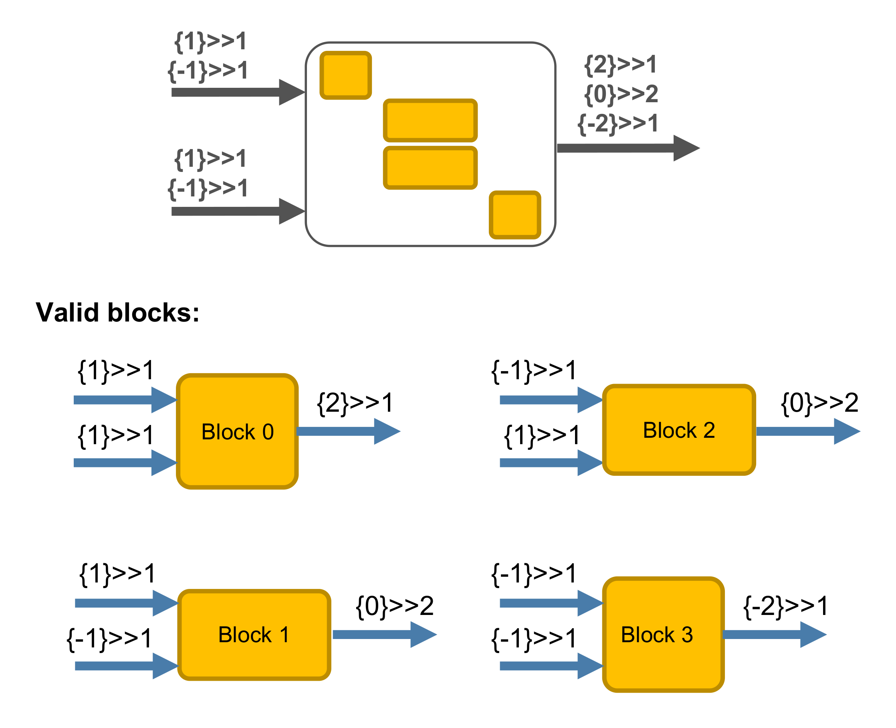

Get element from UniTensor
------------------------

In this section, we will discuss how to get element directly from a UniTensor. Generally, the element can also be access by first getting the block, and then get the element from the block. It is also possible to directly access the element from a UniTensor. 

To get element, one can call **UniTensor.at()**. It returns a *proxy* which can be further operate either as reference, or as a query object for the info about the element. We will see why the design is in place later when dealing with Symmetry UniTensor.   

UniTensor without symmetries
*****************************

Access the element from a UniTensor without symmetries should be straightforward by using *at*

* In python:

.. code-block:: python
    :linenos:

    T = cytnx.UniTensor(cytnx.arange(9).reshape(3,3))
    print(T.at([0,3]).value)
   
* In c++:

.. code-block:: c++
    :linenos:

    auto T = cytnx::UniTensor(cytnx::arange(9).reshape(3,3));
    print(T.at({0,2}));

Output >> 

.. code-block:: text

    2.0

.. Note::

    1. note that in python, using value is nessasary! 

The proxy returns by calling **at** also serves as reference, meaning that you can also assign/modify the value:

* In python:

.. code-block:: python
    :linenos:
    
    T = cytnx.UniTensor(cytnx.arange(9).reshape(3,3))
    print(T.at([0,2]).value)
    T.at([0,2]).value = 7
    print(T.at([0,2]).value)

* In C++:

.. code-block:: c++
    :linenos:
    
    auto T = cytnx::UniTensor(cytnx::arange(9).reshape(3,3));
    print(T.at({0,2}));
    T.at({0,2}) = 7;
    print(T.at({0,2}));

Output >> 

.. code-block:: text

    2.0
    7.0

    
UniTensor with symmetries
*****************************

When the UniTensor is in the block structure, then one need to be careful about accessing elements, since the elements you are accessing may not be valid under the symmetry. 

In such case, one can still use *at* as it is, but the proxy provides a way to help you check it!

Let's consider the following example:

.. code-block:: python
    :linenos:
    
    bond_c = cytnx.Bond(cytnx.BD_IN, [Qs(1)>>1, Qs(-1)>>1],[cytnx.Symmetry.U1()])
    bond_d = cytnx.Bond(cytnx.BD_IN, [Qs(1)>>1, Qs(-1)>>1],[cytnx.Symmetry.U1()])
    bond_e = cytnx.Bond(cytnx.BD_OUT, [Qs(2)>>1, Qs(0)>>2, Qs(-2)>>1],[cytnx.Symmetry.U1()])
    Td = cytnx.UniTensor([bond_c, bond_d, bond_e])

In the case you trying to access the element that exists (in here we access the element at [0,0,0]), it is used the same as the case without symmetries:

* In python:

.. code-block:: python
    :linenos:

    print(Td.at([0,0,0]).value)

* In c++:

.. code-block:: c++
    :linenos:

    print(Td.at({0,0,0}));
        
        

Output>>

.. code-block:: text
    
    0.0

In the case you trying to access element that does NOT allowed by symmetry (for example element at [0,0,1]), then it will throw error:

* In python:

.. code-block:: python
    :linenos:

    print(Td.at([0,0,1]).value)

* In c++:

.. code-block:: c++
    :linenos:

    print(Td.at({0,0,1}));

Output>>

.. code-block:: text
    
    ValueError: [ERROR] trying access an element that is not exists!, using T.if_exists = sth or checking with T.exists() to verify before access element!

So how can we know if the element we are accessing is existing or not by the symmetry? Here is where the proxy coming in to play a crucial role. One can use the **exists()** to check if the element is valid or not before setting element:

* In python:

.. code-block:: python
    :linenos:

    for i in [0,1]:
        tmp = Td.at([0,0,i])
        if(tmp.exists()):
            tmp.value = 8

* In c++:

.. code-block:: c++
    :linenos:

    for(auto i=0;i<2;i++){
        auto tmp = Td.at({0,0,i});
        if(tmp.exists()):
            tmp = 8;
    }

This will set the element at [0,0,0] to 8 while ignore the [0,0,1] element that does not exist. 

.. toctree::
