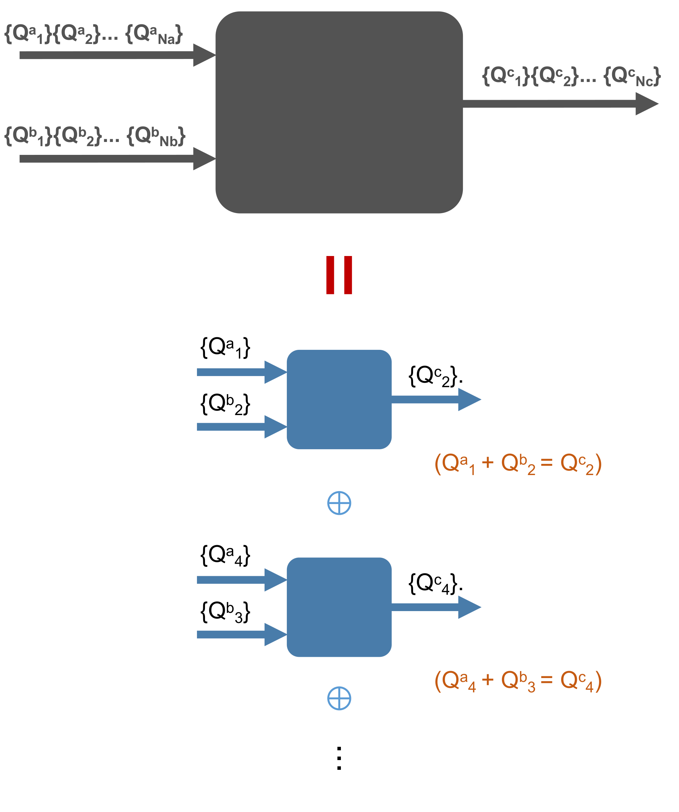

UniTensor with Symmetry
---------------------------

Tensor with symmetries has several advantages in physical simulations. In a system with symmetry, Hamiltonian can be block-diagonalized into symmetry sectors of charge (quantum numbers). When Impose symmetry structure into our tensor, by ultilizing this block-diagonalize structure, we can substantially reduce the number of variational parameters, allowing us to go to larger system sizes/effective virtual bond dimension.  

The quanutm number conserving Tensor can be understanding in a simple way. Each bond (leg) of the Tensor carries quantum numbers and is directional, either pointing in or pointing out. As shown in the following figure:

The conservation of quantum number (symmetry charge) indicates that only elements with **zero flux** will be allow to exist (total quantum number flows into the tensor subject to the combine rule of symmetry is equal to total quantum number flow out), therefore belongs to a valid block. Other elements that belongs to non-zero flux will not be created in our UniTensor.  

To impose the symmetry, there are only two things we need to do:

1. Identify the symmetries in the system (for example, U(1) symmetry)
2. Creat **directional** Bonds that carries quantum numbers flow associate to that symmetries.

As an simple example, lets creat a 3-rank tensor with U(1) symmetry as the following figure:

.. image:: image/u1_tdex.png
    :width: 500
    :align: center

Here, we use the notation *{Qnum}>>dimension*. First, three bonds  **bond_c** (in), **bond_d** (in) and **bond_e** (out) are created with corresponding qnums (see 7.2 for further info related to Bond). Then we initialize our UniTensor **Td** using them:

* In python:
  
.. code-block:: python
    :linenos:

    bond_c = cytnx.Bond(cytnx.BD_IN, [Qs(1)>>1, Qs(-1)>>1],[cytnx.Symmetry.U1()])
    bond_d = cytnx.Bond(cytnx.BD_IN, [Qs(1)>>1, Qs(-1)>>1],[cytnx.Symmetry.U1()])
    bond_e = cytnx.Bond(cytnx.BD_OUT, [Qs(2)>>1, Qs(0)>>2, Qs(-2)>>1],[cytnx.Symmetry.U1()])
    Td = cytnx.UniTensor([bond_c, bond_d, bond_e])
    Td.set_name("Td")
    Td.print_diagram()

Output >> 

.. code-block:: text
 
    -----------------------
    tensor Name : Td
    tensor Rank : 3
    contiguous  : True
    valid blocks : 4
    is diag   : False
    on device   : cytnx device: CPU
          row           col 
             -----------    
             |         |    
       0  -->| 2     4 |-->  2
             |         |    
       1  -->| 2       |        
             |         |    
             -----------  

We note that in this UniTensor, there are only **4** valid blocks** that carries zero-flux, as also shown in the figure. We can use **Td.print_blocks()** to see how many blocks, and their structure:

.. code-block:: text

    -------- start of print ---------
    Tensor name: Td
    braket_form : True
    is_diag    : False
    [OVERALL] contiguous : True
    ========================
    BLOCK [#0]
     |- []   : Qn index 
     |- Sym(): Qnum of correspond symmetry
                     -----------
                     |         |
       [0] U1(1)  -->| 1     1 |-->  [0] U1(2)
                     |         |
       [0] U1(1)  -->| 1       |
                     |         |
                     -----------

    Total elem: 1
    type  : Double (Float64)
    cytnx device: CPU
    Shape : (1,1,1)
    [[[0.00000e+00 ]]]

    ========================
    BLOCK [#1]
     |- []   : Qn index 
     |- Sym(): Qnum of correspond symmetry
                      -----------
                      |         |
       [0] U1(1)   -->| 1     2 |-->  [1] U1(0)
                      |         |
       [1] U1(-1)  -->| 1       |
                      |         |
                      -----------

    Total elem: 2
    type  : Double (Float64)
    cytnx device: CPU
    Shape : (1,1,2)
    [[[0.00000e+00 0.00000e+00 ]]]

    ========================
    BLOCK [#2]
     |- []   : Qn index 
     |- Sym(): Qnum of correspond symmetry
                      -----------
                      |         |
       [1] U1(-1)  -->| 1     2 |-->  [1] U1(0)
                      |         |
       [0] U1(1)   -->| 1       |
                      |         |
                      -----------

    Total elem: 2
    type  : Double (Float64)
    cytnx device: CPU
    Shape : (1,1,2)
    [[[0.00000e+00 0.00000e+00 ]]]

    ========================
    BLOCK [#3]
     |- []   : Qn index 
     |- Sym(): Qnum of correspond symmetry
                      -----------
                      |         |
       [1] U1(-1)  -->| 1     1 |-->  [2] U1(-2)
                      |         |
       [1] U1(-1)  -->| 1       |
                      |         |
                      -----------

    Total elem: 1
    type  : Double (Float64)
    cytnx device: CPU
    Shape : (1,1,1)
    [[[0.00000e+00 ]]]

.. Note::

    Here, the number in the square braket **[]** in print_blocks() indicates the Qn index. A Qn index is the index where the corresponding quantum number (Qnum) resides on given bond. 

.. toctree::
