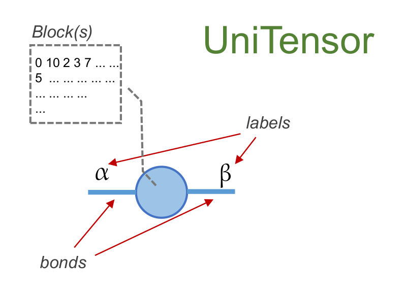

UniTensor class
===============
**UniTensor** is an extension object base on **cytnx.Tensor**. 
A **UniTensor** consist of three important parts: 

1. Block(s), which is a **cytnx.Tensor** (or a list/vector thereof). Block(s) store all the elements of the tensor. 

2. Bonds, which contain the information associated to each index of the tensor. 

3. labels, which give each bond a name with which it can be accessed. 

In the simplest case where no symmetries of the system are considered, a **UniTensor** can be thought of as adding the meta data bonds and labels to a **cytnx.Tensor**. 
A **UniTensor** can be constructed with a **Bond** object, or directly from a **cytnx.Tensor** which gets converted to a **UniTensor**. 

Let's have a look at the details of **UniTensor**:

.. toctree::
    :maxdepth: 1

    UniTensor_create.rst
    UniTensor_labels.rst
    UniTensor_tag.rst
    UniTensor_sym.rst
    UniTensor_getblk.rst
    UniTensor_getele.rst
    UniTensor_manip.rst
