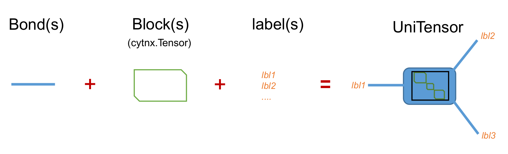
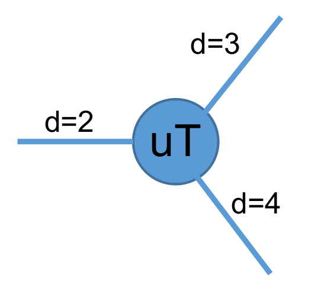
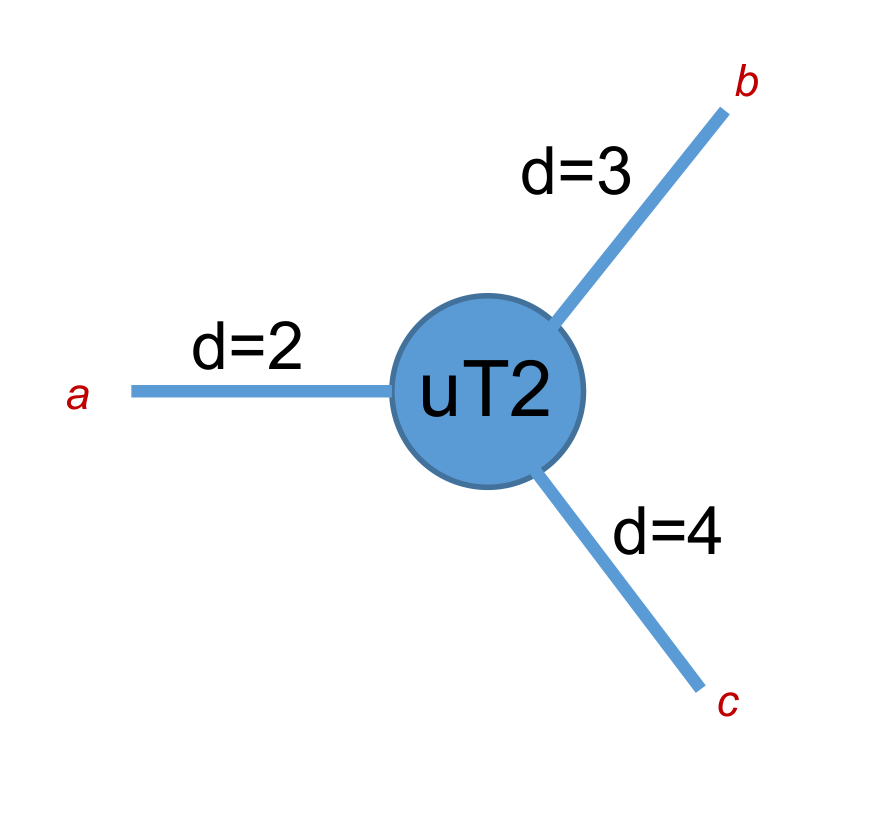

Creating a UniTensor
--------------------
As mentioned in the introduction, a **UniTensor** consists of Block(s), Bond(s) and label(s). The Block(s) contain the data, while Bond(s) and label(s) are the meta data that describe the properties of the UniTensor. 

Generally, there are two types of UniTensor types: **un-tagged** and **tagged**, depending on whether the Bonds have a *direction*. In more advanced applications, a UniTensor may have block diagonal or other more complicated structure when symmetries are involved. Therefore, UniTensors can further be categorized into **non-symmetric** and **symmetric (block form)**:

+-----------+-----------------+-------------------------------+
|           |  non-symmetric  |  symmetric (block-diagonal)   |
+-----------+-----------------+-------------------------------+
| tagged    |     **O**       |            **O**              |
+-----------+-----------------+-------------------------------+
| untagged  |     **O**       |            **X**              |
+-----------+-----------------+-------------------------------+

   
In the following, we will explain how to construct a UniTensor. 

Constructing from Tensor 
************************

Before going into more complicated UniTensor structures, let's start with the most simple example. For this, we convert a **cytnx.Tensor** into a UniTensor. This gives us the first type of a UniTensor: an **untagged** UniTensor.  

In the following, we consider a simple rank-3 tensor as an example. The tensor diagram looks like:

We can convert such a Tensor to a UniTensor:

* In Python:

.. code-block:: python
    :linenos:

    # create a rank-3 tensor with shape [2,3,4]
    T = cytnx.arange(2*3*4).reshape(2,3,4)
    # convert to UniTensor:
    uT = cytnx.UniTensor(T)

    
Here, the Tensor **T** is converted to a UniTensor **uT** simply by wrapping it with constructor *cytnx.UniTensor()*. Formally, we can think of this as constructing a UniTensor **uT** with **T** being its *block* (data). 
If we want to create a UniTensor with different dtype, for example, a complex UniTensor, we can do:

* In Python:

.. code-block:: python
    :linenos:

    # initialize a tensor with complex data type
    T = cytnx.zeros([2,3,4], dtype=cytnx.Type.ComplexDouble)
    # convert to UniTensor
    uT = cytnx.UniTensor(T)
    # randomize the elements with a uniform distribution in the range [low, high]
    cytnx.random.Make_uniform(uT, low = -1., high = 1.)

We can use **print_diagram()** to visualize a UniTensor in a more straightforward way as a diagram: 

* In Python:

.. code-block:: python 
    :linenos:
        
    uT.print_diagram()

Output >> 

.. code-block:: text
    
    -----------------------
    tensor Name : 
    tensor Rank : 3
    block_form  : False
    is_diag     : False
    on device   : cytnx device: CPU
              ---------     
             /         \    
       0 ____| 2     3 |____ 1
             |         |    
             |       4 |____ 2
             \         /    
              ---------   

The information provided by this output is explained in detail in :ref:`print_diagram()`. We see that a UniTensor with the same shape as *T* was created. The bond labels are set to the default values "0", "1" and "2".

From scratch
**************  

Next, let's introduce the complete API for constructing a UniTensor from scratch:

.. py:function:: UniTensor(bonds, labels, rowrank, dtype, device, is_diag)
     
    :param List[cytnx.Bond] bonds: list of bonds 
    :param List[string] labels: list of labels associate to each bond 
    :param int rowrank: rowrank used when flattened into a matrix 
    :param cytnx.Type dtype: the dtype of the block(s) 
    :param cytnx.Device device: the device where the block(s) are held 
    :param bool is_diag: whether the UniTensor is diagonal 

The first argument **bonds** is a list of Bond objects. These correspond to the *shape* of a **cytnx.Tensor** where the elements in *shape* indicate the dimensions of the bonds. Here, each bond is represent by a **cytnx.Bond** object. In general, **cytnx.Bond** contains three things:

1. The dimension of the bond. 
2. The direction of the bond (it can be BD_REG--undirectional, BD_KET (BD_IN)--inward, BD_BRA (BD_OUT)--outward) 
3. The symmetry and the associate quantum numbers. 

For more details, see :ref:`Bond`. Here, for simplicity, we will use only the dimension property of a Bond. 

Now let's construct the rank-3 UniTensor with the same shape as in the above example. We assign the three bonds with labels ("a", "b", "c") and also set name to be "uT2 scratch".

* In Python:

.. code-block:: python
    :linenos:

    uT2 = cytnx.UniTensor([cytnx.Bond(2),cytnx.Bond(3),cytnx.Bond(4)],labels=["a","b","c"],rowrank=1)
    uT2.set_name("uT2 scratch")
    uT2.print_diagram()
    print(uT2)

Output >>

.. code-block:: text
    
    -----------------------
    tensor Name : uT2 scratch
    tensor Rank : 3
    block_form  : False
    is_diag     : False
    on device   : cytnx device: CPU
              ---------     
             /         \    
       a ____| 2     3 |____ b
             |         |    
             |       4 |____ c
             \         /    
              ---------     
    -------- start of print ---------
    Tensor name: uT2 scratch
    is_diag    : False
    contiguous : True
    
    Total elem: 24
    type  : Double (Float64)
    cytnx device: CPU
    Shape : (2,3,4)
    [[[0.00000e+00 0.00000e+00 0.00000e+00 0.00000e+00 ]
      [0.00000e+00 0.00000e+00 0.00000e+00 0.00000e+00 ]
      [0.00000e+00 0.00000e+00 0.00000e+00 0.00000e+00 ]]
     [[0.00000e+00 0.00000e+00 0.00000e+00 0.00000e+00 ]
      [0.00000e+00 0.00000e+00 0.00000e+00 0.00000e+00 ]
      [0.00000e+00 0.00000e+00 0.00000e+00 0.00000e+00 ]]]

.. note:: 

    The UniTensor will have all the elements in the block initialized with zeros. 

Type conversion 
**********************
It is possible to convert a UniTensor to a different data type. To convert the data type, simply use **UniTensor.astype()**.

For example, consider a UniTensor *A* with **dtype=Type.Int64**, which shall be converted to **Type.Double**:

* In Python:

.. code-block:: python 
    :linenos:
    

    A = UniTensor(cytnx.ones([3,4],dtype=cytnx.Type.Int64))
    B = A.astype(cytnx.Type.Double)
    print(A.dtype_str())
    print(B.dtype_str())

>> Output:

.. code-block:: text
    
    Int64
    Double (Float64)

.. Note::
    
    UniTensor.dtype() returns a type-id, while UniTensor.dtype_str() returns the type name. 
.. 1. A complex data type cannot directly be converted to a real data type. Use UniTensor.real() or UniTensor.imag() if you want to get the real or imaginary part.

Transfer between devices
***************************
Moving a UniTensor between different devices is very easy. We can use **UniTensor.to()** to move the UniTensor to a different device.

For example, let's create a UniTensor in the memory accessible by the CPU and transfer it to the GPU with gpu-id=0. 

* In Python:

.. code-block:: python 
    :linenos:

    A = UniTensor(cytnx.ones([2,2])) #on CPU
    B = A.to(cytnx.Device.cuda+0)
    print(A) # on CPU
    print(B) # on GPU

    A.to_(cytnx.Device.cuda) 
    print(A) # on GPU

>> Output:

.. code-block:: text

    -------- start of print ---------
    Tensor name: 
    is_diag    : False
    contiguous : True

    Total elem: 4
    type  : Double (Float64)
    cytnx device: CPU
    Shape : (2,2)
    [[1.00000e+00 1.00000e+00 ]
    [1.00000e+00 1.00000e+00 ]]

    -------- start of print ---------
    Tensor name: 
    is_diag    : False
    contiguous : True

    Total elem: 4
    type  : Double (Float64)
    cytnx device: CUDA/GPU-id:0
    Shape : (2,2)
    [[1.00000e+00 1.00000e+00 ]
    [1.00000e+00 1.00000e+00 ]]

    -------- start of print ---------
    Tensor name: 
    is_diag    : False
    contiguous : True

    Total elem: 4
    type  : Double (Float64)
    cytnx device: CUDA/GPU-id:0
    Shape : (2,2)
    [[1.00000e+00 1.00000e+00 ]
    [1.00000e+00 1.00000e+00 ]]

.. Note::
    
    1. You can use **UniTensor.device()** to get the current device-id (cpu = -1), whereas **UniTensor.device_str()** returns the device name. 

    2. **UniTensor.to()** will return a copy on the target device. If you want to move the current Tensor to another device, use **UniTensor.to_()** (with underscore). 

Tagged UniTensors and UniTensors with Symmetries
********************************************************

The creation of tagged, non-symmetric UniTensors will be explained in :ref:`Tagged UniTensor`. Symmetric UniTensors are discussed in :ref:`UniTensor with Symmetries`.
