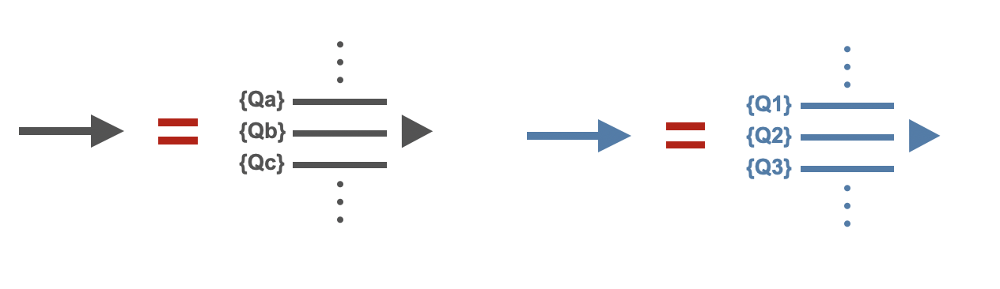
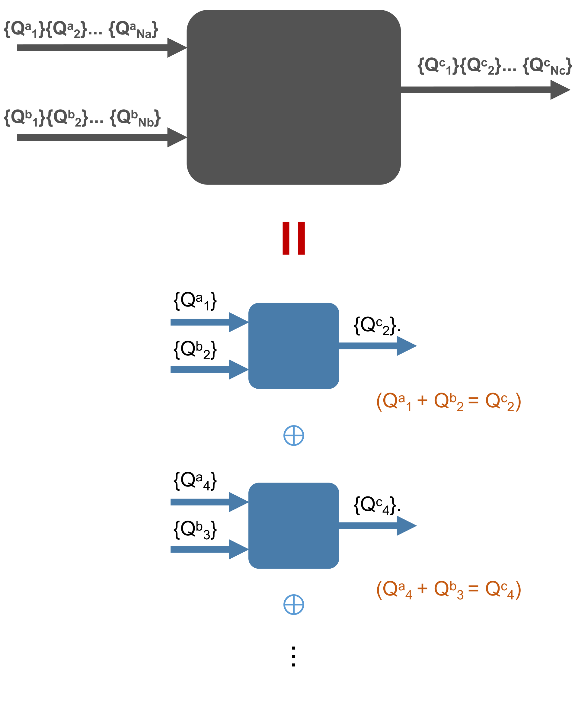

UniTensor with Symmetries
---------------------------

Physical systems are often symmetric under certain transformations. Exploiting such symmetries can be advantageous in many cases. Cytnx allows to incorporate the symmetries on the level of the tensors directly.

In a system with a symmetry, charge is conserved. Therefore, the Hamiltonian can be block-diagonalized into symmetry sectors of defined charge (quantum numbers) -- the charge sectors do not mix. When the symmetric structure is imposed on the level of the tensors, they become block-diagonal as well. This substantially reduces the memory costs and the number of parameters in variational algorithms. Thus, larger system sizes or bond dimensions are accessible with the same computational costs. Moreover, numerical errors due to contributions that do not conserve symmetry and are therefore unphysical can be avoided. Finally, simulations can be restricted to certain symmetry sectors if desired.

A quantum number conserving tensor can be understood in a simple way. Each bond (leg) of the Tensor carries quantum numbers and is directional, as shown in the following figure:

The conservation of charge (quantum numbers) is ensured by restricting the tensors to only have elements with **zero flux**. For these elements, the total quantum number flowing into the tensor has to be equal to the total quantum number flowing out. The combination of quantum numbers in incoming and outgoing links to a total quantum number is defined by the combine rule of the symmetry considered. All other elements, that do not conserve the charge, belong to an invalid block and therefore have to be zero. We do not store these invalid blocks explicitly in a UniTensor.

To impose a symmetry on the tensors, there are only two steps we need to do:

1. Identify the symmetries in the system (for example, *U(1)* symmetry)
2. Create **directional** Bonds that carry quantum numbers associated to these symmetries

As a simple example, lets create a 3-rank tensor with *U(1)* symmetry:

.. image:: image/u1_tdex.png
    :width: 500
    :align: center

Here, we use the notation *{Qnum}>>dimension*. First, three bonds  **bond_c** (in), **bond_d** (in) and **bond_e** (out) are created with corresponding quantum numbers. See :ref:`Bond` for further information related to the bonds and their creation with quantum numbers. We then initialize a UniTensor **Td** using these three bonds:

* In Python:

.. literalinclude:: ../../../code/python/doc_codes/guide_uniten_symmetric_create.py
    :language: python
    :linenos:

Output >>

.. literalinclude:: ../../../code/python/outputs/guide_uniten_symmetric_create.out
    :language: text

As shown in the previous figure, this UniTensor has only **4** valid blocks which carry zero-flux. We can print the blocks explicitly:

* In Python:

.. literalinclude:: ../../../code/python/doc_codes/guide_uniten_symmetric_print_blocks.py
    :language: python
    :linenos:

Output >>

.. literalinclude:: ../../../code/python/outputs/guide_uniten_symmetric_print_blocks.out
    :language: text

.. Note::

    The number in the square braket **[]** in print_blocks() indicates the Qnum index. It refers to the order of the quantum numbers on the corresponding bond. In the previous example, bond *f* contains three quantum numbers. The element with quantum number *U1(2)* has the Qnum index [0] on this link, the *U1(0)* elements have Qnum index [1], and *U1(2)* element has Qnum index [2]. More information on the output can be found in :ref:`print() and print_blocks()`.

.. toctree::
