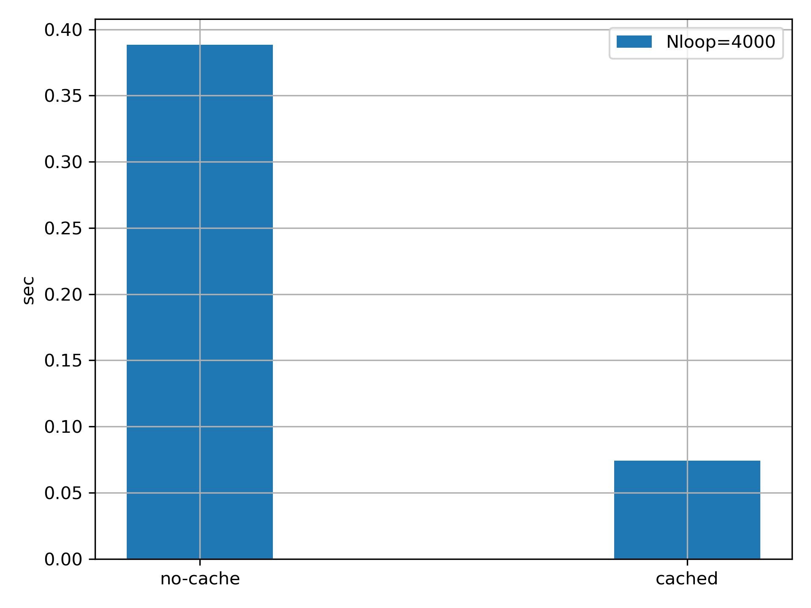

Tensordot with input cache
*****************************
Starting from v0.6.4a, **linalg::Tensordot** provides an additional option *cache* for both input tensors. The feature provides user flexibility to minimize the redundant move of elements when the tensordot is repeatly called on two same Tensors. 

To show how this makes difference, let's consider a scenario where we contract two *A* and *B* Tensors N times:

* In python:

.. code-block:: python
    :linenos:

    import cytnx as cy
    A = cy.arange(24).reshape(2,2,2,3)
    B = A + 4

    for i in range(20):
        C = cy.linalg.Tensordot(A,B,[0,2],[1,0])

    

In the above code, we see that **Tensordot** on *A* and *B* are repeatly evaluated where no change is made on *A* and *B*. Now, inside **Tensordot**, both Tensor *A* and *B* will be first contiguous-permuted to shapes with

.. math::

    A: (0,1,2,3) \rightarrow (1,3,\mathbf{0},\mathbf{2}) 

.. math::
    
    B: (0,1,2,3) \rightarrow (\mathbf{1},\mathbf{0},2,3)

which the data of *A* and *B* are then feed into **Matmul** to get the outcome. Specifically, for each **Tensordot()** call, it is equivalent to (psudo-code)

.. code-block:: python
    :linenos:
    :emphasize-lines: 3,4

    #inside linalg.Tensordot(A,B,[0,2],[1,0]):

    tA = A.permute(1,3,0,2).contiguous() #move elements
    tB = B.permute(1,0,2,3).contiguous() #move elements

    call *gemm with tA's data and tB's data  ->tC

    permute tC to right shape -> output

We can clearly see the downside of this: every time **Tensordot()** is called, we have to move elements of *A* and *B* to the right place (highlight lines). Since *A* and *B* are not changed within the for loop, we can ask Tensordot to *cache* the input tensor(s) using the optional argument *cacheL/R*. That is to say, the first time **Tensordot()** is called, we directly move the elements within *A* and *B* themselves and memorize it. The next time it is called, we don't have to move elements again.

* In python:

.. code-block:: python 
    :linenos:
    :emphasize-lines: 6

    import cytnx as cy
    A = cy.arange(24).reshape(2,2,2,3)
    B = A + 4

    for i in range(20):
        C = cy.linalg.Tensordot(A,B,[0,2],[1,0],cacheL=True,cacheR=True)

.. Note::

    1. Here, we use the word "memorize". Technically, we just move the internal data to it's direct gemm place, and modify the meta data of Tensor to be the same as original input. Note that this will put the *A* and *B* in their non-contiguous status. In terms of user's perspective point of view,  there is no differece of using API than we used to do without cache.

    2. The two input Tensors cannot have same_data()=True. This will be check inside **Tensordot**. 

.. Tip::
    
    You can also choose to only cache either one of the tensor, for example, setting *cacheL=True* and *cacheR=False* will only cache *A* Tensor. 

In the following we show the performance benchmark with the above code running with Nloop=4000 and average over 10 times of runs.

